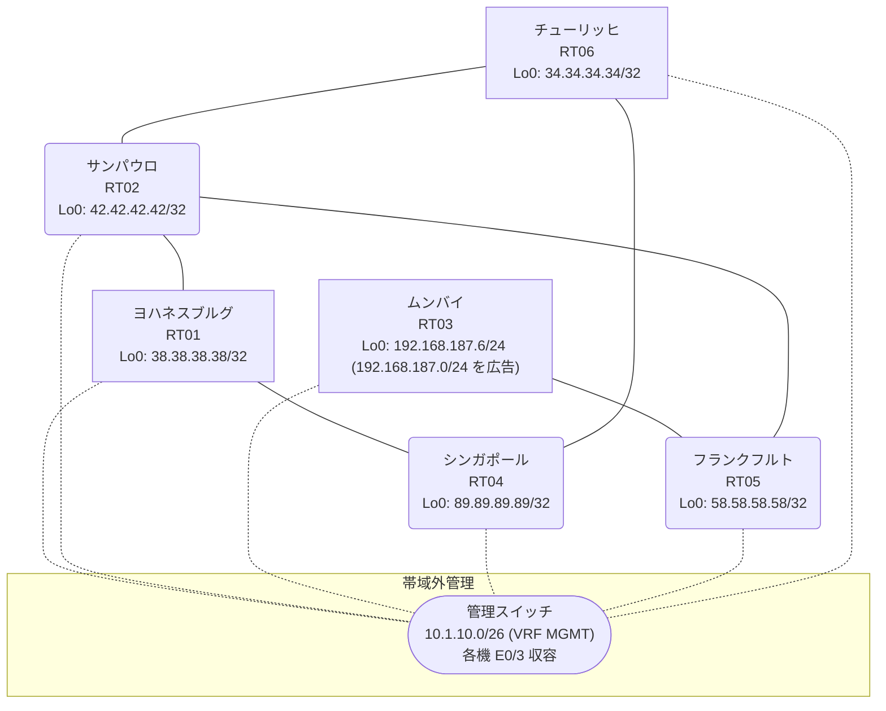

# 問題 20260814-011

> **本問は機器に接続せずに解答すること。追加の show 実行は認めない。**

## トポロジ

あなたの組織は、下記に示されているところのネットワークを運用しています。あなたの会社のネットワークは、OSPF のドメインと EIGRP のドメインとが、2 つの境界のルータによって接続され、そして、それらは境界において接続されています。顧客のネットワーク `192.168.187.0/24` は、ムンバイ のサイトにおいて、別のルーティング・プロトコルによって学習され、そして、再配送によって、社内へ持ち込まれています。ルーティングの設計の詳細は、示されているところのコンフィギュレーションから、読み取られることが、期待されています。



| 拠点 | ルータ | 拠点網 / 広告網 |
|------|--------|------------------|
| サンパウロ | RT02 | 42.42.42.42/32 |
| シンガポール | RT04 | 89.89.89.89/32 |
| チューリッヒ | RT06 | 34.34.34.34/32 |
| フランクフルト | RT05 | 58.58.58.58/32 |
| ムンバイ | RT03 | 192.168.187.6/24 (`192.168.187.0/24` を広告) |
| ヨハネスブルグ | RT01 | 38.38.38.38/32 |

リンク一覧:
```
  RT04:E0/0(.1) ── RT01:E0/0(.2)   172.16.17.0/24
  RT04:E0/1(.1) ── RT06:E0/0(.3)   172.16.154.0/24
  RT01:E0/1(.2) ── RT02:E0/0(.4)   172.16.139.0/24
  RT06:E0/1(.3) ── RT02:E0/1(.4)   172.16.197.0/24
  RT02:E0/2(.4) ── RT05:E0/0(.5)   172.16.71.0/24
  RT05:E0/1(.5) ── RT03:E0/0(.6)   172.16.13.0/24
```

## 要件

1. スタティック・ルートおよび既定のルートによる迂回は、実施されてはなりません。
2. すべてのサイトから、`192.168.187.0/24` を含むところのすべての宛先へ、到達することができること。
3. `192.168.187.0/24` 宛のパケットが、広告元である RT03 の方向へ転送され、そして、転送のループが存在していないこと。
4. 既存の相互再配送の設計が、削除または停止されることはできません。
5. スタティック ルートおよび既定のルートによる迂回は、実施されることはできません。
6. インタフェースの IP アドレッシングは、変更されてはなりません。

## 現在の状態

一部の通信が、意図されているとおりに動作していない、という報告があります。示されているところの出力および構成に基づいて、要求されているところの動作が得られていない理由が、判断されなければなりません。

```
RT02# show ip route
Gateway of last resort is not set
      34.0.0.0/32 is subnetted, 1 subnets
D EX     34.34.34.34 [170/281856] via 172.16.197.3, 00:04:04, Ethernet0/1
                     [170/281856] via 172.16.139.2, 00:04:04, Ethernet0/0
      38.0.0.0/32 is subnetted, 1 subnets
D EX     38.38.38.38 [170/281856] via 172.16.197.3, 00:04:07, Ethernet0/1
                     [170/281856] via 172.16.139.2, 00:04:07, Ethernet0/0
      42.0.0.0/32 is subnetted, 1 subnets
C        42.42.42.42 is directly connected, Loopback0
      58.0.0.0/32 is subnetted, 1 subnets
D        58.58.58.58 [90/409600] via 172.16.71.5, 00:04:52, Ethernet0/2
      89.0.0.0/32 is subnetted, 1 subnets
D EX     89.89.89.89 [170/281856] via 172.16.197.3, 00:04:07, Ethernet0/1
                     [170/281856] via 172.16.139.2, 00:04:07, Ethernet0/0
      172.16.0.0/16 is variably subnetted, 9 subnets, 2 masks
D        172.16.13.0/24 [90/307200] via 172.16.71.5, 00:04:52, Ethernet0/2
D EX     172.16.17.0/24 [170/281856] via 172.16.197.3, 00:04:07, Ethernet0/1
                        [170/281856] via 172.16.139.2, 00:04:07, Ethernet0/0
C        172.16.71.0/24 is directly connected, Ethernet0/2
L        172.16.71.4/32 is directly connected, Ethernet0/2
C        172.16.139.0/24 is directly connected, Ethernet0/0
L        172.16.139.4/32 is directly connected, Ethernet0/0
D EX     172.16.154.0/24 [170/281856] via 172.16.197.3, 00:04:12, Ethernet0/1
                         [170/281856] via 172.16.139.2, 00:04:12, Ethernet0/0
C        172.16.197.0/24 is directly connected, Ethernet0/1
L        172.16.197.4/32 is directly connected, Ethernet0/1
D EX  192.168.187.0/24 [170/281856] via 172.16.197.3, 00:04:07, Ethernet0/1
```
```
RT02# show ip eigrp topology 192.168.187.0 255.255.255.0
EIGRP-IPv4 Topology Entry for AS(64)/ID(42.42.42.42) for 192.168.187.0/24
  State is Passive, Query origin flag is 1, 1 Successor(s), FD is 281856
  Descriptor Blocks:
  172.16.197.3 (Ethernet0/1), from 172.16.197.3, Send flag is 0x0
      Composite metric is (281856/2816), route is External
      Vector metric:
        Minimum bandwidth is 10000 Kbit
        Total delay is 1010 microseconds
        Reliability is 255/255
        Load is 1/255
        Minimum MTU is 1500
        Hop count is 1
        Originating router is 34.34.34.34
      External data:
        AS number of route is 62
        External protocol is OSPF, external metric is 20
        Administrator tag is 0 (0x00000000)
  172.16.71.5 (Ethernet0/2), from 172.16.71.5, Send flag is 0x0
      Composite metric is (307456/281856), route is External
      Vector metric:
        Minimum bandwidth is 10000 Kbit
        Total delay is 2010 microseconds
        Reliability is 255/255
        Load is 1/255
        Minimum MTU is 1500
        Hop count is 2
        Originating router is 192.168.187.6
      External data:
        AS number of route is 0
        External protocol is RIP, external metric is 0
        Administrator tag is 0 (0x00000000)
```
```
RT05# show ip route
Gateway of last resort is not set
      34.0.0.0/32 is subnetted, 1 subnets
D EX     34.34.34.34 [170/307456] via 172.16.71.4, 00:04:22, Ethernet0/0
      38.0.0.0/32 is subnetted, 1 subnets
D EX     38.38.38.38 [170/307456] via 172.16.71.4, 00:05:06, Ethernet0/0
      42.0.0.0/32 is subnetted, 1 subnets
D        42.42.42.42 [90/409600] via 172.16.71.4, 00:05:15, Ethernet0/0
      58.0.0.0/32 is subnetted, 1 subnets
C        58.58.58.58 is directly connected, Loopback0
      89.0.0.0/32 is subnetted, 1 subnets
D EX     89.89.89.89 [170/307456] via 172.16.71.4, 00:04:29, Ethernet0/0
      172.16.0.0/16 is variably subnetted, 8 subnets, 2 masks
C        172.16.13.0/24 is directly connected, Ethernet0/1
L        172.16.13.5/32 is directly connected, Ethernet0/1
D EX     172.16.17.0/24 [170/307456] via 172.16.71.4, 00:05:06, Ethernet0/0
C        172.16.71.0/24 is directly connected, Ethernet0/0
L        172.16.71.5/32 is directly connected, Ethernet0/0
D        172.16.139.0/24 [90/307200] via 172.16.71.4, 00:05:15, Ethernet0/0
D EX     172.16.154.0/24 [170/307456] via 172.16.71.4, 00:04:29, Ethernet0/0
D        172.16.197.0/24 [90/307200] via 172.16.71.4, 00:05:15, Ethernet0/0
D EX  192.168.187.0/24 [170/281856] via 172.16.13.6, 00:04:25, Ethernet0/1
```
```
RT04# show ip route
Gateway of last resort is not set
      34.0.0.0/32 is subnetted, 1 subnets
O        34.34.34.34 [110/11] via 172.16.154.3, 00:04:43, Ethernet0/1
      38.0.0.0/32 is subnetted, 1 subnets
O        38.38.38.38 [110/11] via 172.16.17.2, 00:04:47, Ethernet0/0
      42.0.0.0/32 is subnetted, 1 subnets
O E2     42.42.42.42 [110/20] via 172.16.154.3, 00:04:43, Ethernet0/1
                     [110/20] via 172.16.17.2, 00:04:47, Ethernet0/0
      58.0.0.0/32 is subnetted, 1 subnets
O E2     58.58.58.58 [110/20] via 172.16.154.3, 00:04:43, Ethernet0/1
                     [110/20] via 172.16.17.2, 00:04:47, Ethernet0/0
      89.0.0.0/32 is subnetted, 1 subnets
C        89.89.89.89 is directly connected, Loopback0
      172.16.0.0/16 is variably subnetted, 8 subnets, 2 masks
O E2     172.16.13.0/24 [110/20] via 172.16.154.3, 00:04:43, Ethernet0/1
                        [110/20] via 172.16.17.2, 00:04:47, Ethernet0/0
C        172.16.17.0/24 is directly connected, Ethernet0/0
L        172.16.17.1/32 is directly connected, Ethernet0/0
O E2     172.16.71.0/24 [110/20] via 172.16.154.3, 00:04:43, Ethernet0/1
                        [110/20] via 172.16.17.2, 00:04:47, Ethernet0/0
O E2     172.16.139.0/24 [110/20] via 172.16.154.3, 00:04:43, Ethernet0/1
                         [110/20] via 172.16.17.2, 00:04:47, Ethernet0/0
C        172.16.154.0/24 is directly connected, Ethernet0/1
L        172.16.154.1/32 is directly connected, Ethernet0/1
O E2     172.16.197.0/24 [110/20] via 172.16.154.3, 00:04:43, Ethernet0/1
                         [110/20] via 172.16.17.2, 00:04:47, Ethernet0/0
O E2  192.168.187.0/24 [110/20] via 172.16.17.2, 00:04:47, Ethernet0/0
```
```
RT04# traceroute 192.168.187.6 probe 1 timeout 1 ttl 1 8
Type escape sequence to abort.
Tracing the route to 192.168.187.6
VRF info: (vrf in name/id, vrf out name/id)
  1 172.16.17.2 12 msec
  2 172.16.139.4 1 msec
  3 172.16.197.3 2 msec
  4 172.16.154.1 0 msec
  5 172.16.17.2 1 msec
  6 172.16.139.4 2 msec
  7 172.16.197.3 3 msec
  8 172.16.154.1 18 msec
```

## 設定抜粋

```
RT04# show running-config | section router
router ospf 62
 router-id 89.89.89.89
 network 89.89.89.89 0.0.0.0 area 0
 network 172.16.17.0 0.0.0.255 area 0
 network 172.16.154.0 0.0.0.255 area 0
```
```
RT01# show running-config | section router
router eigrp 64
 network 172.16.139.0 0.0.0.255
 redistribute ospf 62 metric 1000000 1 255 1 1500
router ospf 62
 router-id 38.38.38.38
 redistribute eigrp 64
 network 38.38.38.38 0.0.0.0 area 0
 network 172.16.17.0 0.0.0.255 area 0
```
```
RT06# show running-config | section router
router eigrp 64
 network 172.16.197.0 0.0.0.255
 redistribute ospf 62 metric 1000000 1 255 1 1500
router ospf 62
 router-id 34.34.34.34
 redistribute eigrp 64
 network 34.34.34.34 0.0.0.0 area 0
 network 172.16.154.0 0.0.0.255 area 0
```
```
RT02# show running-config | section router
router eigrp 64
 network 42.42.42.42 0.0.0.0
 network 172.16.71.0 0.0.0.255
 network 172.16.139.0 0.0.0.255
 network 172.16.197.0 0.0.0.255
```
```
RT05# show running-config | section router
router eigrp 64
 network 58.58.58.58 0.0.0.0
 network 172.16.13.0 0.0.0.255
 network 172.16.71.0 0.0.0.255
```
```
RT03# show running-config | section router
router eigrp 64
 network 172.16.13.0 0.0.0.255
 redistribute rip metric 1000000 1 255 1 1500
router rip
 version 2
 network 192.168.187.0
 no auto-summary
```

## 設問

次のうち、正しいものは、どれですか。

## 選択肢
A. 当該プレフィックスの経路が収束せず、境界の間で振動している

B. RT02 と境界の間で等コストの複数経路が成立し、パケットが分散されている

C. RT02 において当該プレフィックスの外部経路タイプが誤っている

D. RT03 からの再配送に seed metric が指定されておらず、経路が広告されていない

E. RT02 が、境界から再注入された経路を正規の経路より良いものとして選択している

F. RT02 において、再注入された経路の管理距離が正規の経路より小さい
