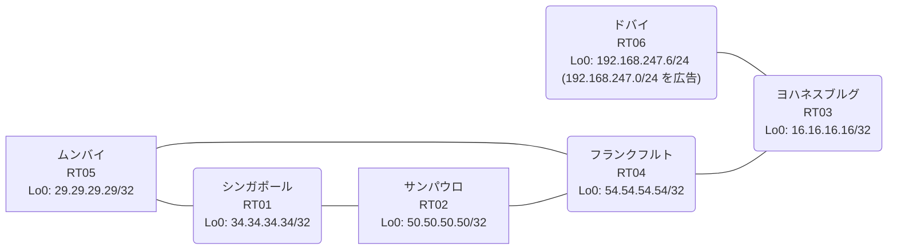

# 問題 20260814-012

> **本問は機器に接続せずに解答すること。追加の show 実行は認めない。**

## トポロジ

あなたの組織は、下記に示されているところのネットワークを運用しています。あなたの会社のネットワークは、OSPF のドメインと EIGRP のドメインとが、2 つの境界のルータによって接続され、そして、それらは境界において接続されています。顧客のネットワーク `192.168.247.0/24` は、ドバイ のサイトにおいて、別のルーティング・プロトコルによって学習され、そして、再配送によって、社内へ持ち込まれています。ルーティングの設計の詳細は、示されているところのコンフィギュレーションから、読み取られることが、期待されています。



| 拠点 | ルータ | 拠点網 / 広告網 |
|------|--------|------------------|
| サンパウロ | RT02 | 50.50.50.50/32 |
| シンガポール | RT01 | 34.34.34.34/32 |
| ドバイ | RT06 | 192.168.247.6/24 (`192.168.247.0/24` を広告) |
| フランクフルト | RT04 | 54.54.54.54/32 |
| ムンバイ | RT05 | 29.29.29.29/32 |
| ヨハネスブルグ | RT03 | 16.16.16.16/32 |

リンク一覧:
```
  RT01:E0/0(.1) ── RT05:E0/0(.2)   172.16.104.0/24
  RT01:E0/1(.1) ── RT02:E0/0(.3)   172.16.124.0/24
  RT05:E0/1(.2) ── RT04:E0/0(.4)   172.16.60.0/24
  RT02:E0/1(.3) ── RT04:E0/1(.4)   172.16.83.0/24
  RT04:E0/2(.4) ── RT03:E0/0(.5)   172.16.58.0/24
  RT03:E0/1(.5) ── RT06:E0/0(.6)   172.16.65.0/24
```

## 要件

1. 既存の相互再配送の設計が、削除または停止されてはなりません。
2. `192.168.247.0/24` 宛のトラフィックが RT06 へ配送され、経路の周回が、発生していないこと。
3. インタフェースの IP アドレッシングは、変更されてはなりません。
4. 顧客のネットワーク `192.168.247.0/24` への到達可能性が、すべてのサイトにおいて、確保されていること。
5. 本作業は、日中の時間帯において実施されるという理由により、対象外であるところのデバイスに対する構成の変更は、許可されていません。
6. スタティック ルートおよび既定のルートによる迂回は、実施されてはなりません。
7. 是正は、番号付き標準アクセス リストと、再配送点における distribute-list によって、実装されなければなりません。

## 現在の状態

ユーザーから、通信に関する事象が、報告されています。あなたは、提示されているところの情報のみを使用して、要求されている状態が満たされていない理由を、特定しなければなりません。

```
RT04# show ip route
Gateway of last resort is not set
      16.0.0.0/32 is subnetted, 1 subnets
D        16.16.16.16 [90/409600] via 172.16.58.5, 00:05:00, Ethernet0/2
      29.0.0.0/32 is subnetted, 1 subnets
D EX     29.29.29.29 [170/281856] via 172.16.83.3, 00:04:08, Ethernet0/1
                     [170/281856] via 172.16.60.2, 00:04:08, Ethernet0/0
      34.0.0.0/32 is subnetted, 1 subnets
D EX     34.34.34.34 [170/281856] via 172.16.83.3, 00:04:12, Ethernet0/1
                     [170/281856] via 172.16.60.2, 00:04:12, Ethernet0/0
      50.0.0.0/32 is subnetted, 1 subnets
D EX     50.50.50.50 [170/281856] via 172.16.83.3, 00:04:12, Ethernet0/1
                     [170/281856] via 172.16.60.2, 00:04:12, Ethernet0/0
      54.0.0.0/32 is subnetted, 1 subnets
C        54.54.54.54 is directly connected, Loopback0
      172.16.0.0/16 is variably subnetted, 9 subnets, 2 masks
C        172.16.58.0/24 is directly connected, Ethernet0/2
L        172.16.58.4/32 is directly connected, Ethernet0/2
C        172.16.60.0/24 is directly connected, Ethernet0/0
L        172.16.60.4/32 is directly connected, Ethernet0/0
D        172.16.65.0/24 [90/307200] via 172.16.58.5, 00:05:00, Ethernet0/2
C        172.16.83.0/24 is directly connected, Ethernet0/1
L        172.16.83.4/32 is directly connected, Ethernet0/1
D EX     172.16.104.0/24 [170/281856] via 172.16.83.3, 00:04:18, Ethernet0/1
                         [170/281856] via 172.16.60.2, 00:04:18, Ethernet0/0
D EX     172.16.124.0/24 [170/281856] via 172.16.83.3, 00:04:12, Ethernet0/1
                         [170/281856] via 172.16.60.2, 00:04:12, Ethernet0/0
D EX  192.168.247.0/24 [170/281856] via 172.16.60.2, 00:04:12, Ethernet0/0
```
```
RT04# show ip eigrp topology 192.168.247.0 255.255.255.0
EIGRP-IPv4 Topology Entry for AS(40)/ID(54.54.54.54) for 192.168.247.0/24
  State is Passive, Query origin flag is 1, 1 Successor(s), FD is 281856
  Descriptor Blocks:
  172.16.60.2 (Ethernet0/0), from 172.16.60.2, Send flag is 0x0
      Composite metric is (281856/2816), route is External
      Vector metric:
        Minimum bandwidth is 10000 Kbit
        Total delay is 1010 microseconds
        Reliability is 255/255
        Load is 1/255
        Minimum MTU is 1500
        Hop count is 1
        Originating router is 29.29.29.29
      External data:
        AS number of route is 79
        External protocol is OSPF, external metric is 20
        Administrator tag is 0 (0x00000000)
  172.16.58.5 (Ethernet0/2), from 172.16.58.5, Send flag is 0x0
      Composite metric is (307456/281856), route is External
      Vector metric:
        Minimum bandwidth is 10000 Kbit
        Total delay is 2010 microseconds
        Reliability is 255/255
        Load is 1/255
        Minimum MTU is 1500
        Hop count is 2
        Originating router is 192.168.247.6
      External data:
        AS number of route is 0
        External protocol is RIP, external metric is 0
        Administrator tag is 0 (0x00000000)
```
```
RT03# show ip route
Gateway of last resort is not set
      16.0.0.0/32 is subnetted, 1 subnets
C        16.16.16.16 is directly connected, Loopback0
      29.0.0.0/32 is subnetted, 1 subnets
D EX     29.29.29.29 [170/307456] via 172.16.58.4, 00:05:06, Ethernet0/0
      34.0.0.0/32 is subnetted, 1 subnets
D EX     34.34.34.34 [170/307456] via 172.16.58.4, 00:04:31, Ethernet0/0
      50.0.0.0/32 is subnetted, 1 subnets
D EX     50.50.50.50 [170/307456] via 172.16.58.4, 00:04:31, Ethernet0/0
      54.0.0.0/32 is subnetted, 1 subnets
D        54.54.54.54 [90/409600] via 172.16.58.4, 00:05:22, Ethernet0/0
      172.16.0.0/16 is variably subnetted, 8 subnets, 2 masks
C        172.16.58.0/24 is directly connected, Ethernet0/0
L        172.16.58.5/32 is directly connected, Ethernet0/0
D        172.16.60.0/24 [90/307200] via 172.16.58.4, 00:05:22, Ethernet0/0
C        172.16.65.0/24 is directly connected, Ethernet0/1
L        172.16.65.5/32 is directly connected, Ethernet0/1
D        172.16.83.0/24 [90/307200] via 172.16.58.4, 00:05:22, Ethernet0/0
D EX     172.16.104.0/24 [170/307456] via 172.16.58.4, 00:05:06, Ethernet0/0
D EX     172.16.124.0/24 [170/307456] via 172.16.58.4, 00:04:31, Ethernet0/0
D EX  192.168.247.0/24 [170/281856] via 172.16.65.6, 00:04:31, Ethernet0/1
```
```
RT01# show ip route
Gateway of last resort is not set
      16.0.0.0/32 is subnetted, 1 subnets
O E2     16.16.16.16 [110/20] via 172.16.124.3, 00:04:55, Ethernet0/1
                     [110/20] via 172.16.104.2, 00:04:49, Ethernet0/0
      29.0.0.0/32 is subnetted, 1 subnets
O        29.29.29.29 [110/11] via 172.16.104.2, 00:04:49, Ethernet0/0
      34.0.0.0/32 is subnetted, 1 subnets
C        34.34.34.34 is directly connected, Loopback0
      50.0.0.0/32 is subnetted, 1 subnets
O        50.50.50.50 [110/11] via 172.16.124.3, 00:04:55, Ethernet0/1
      54.0.0.0/32 is subnetted, 1 subnets
O E2     54.54.54.54 [110/20] via 172.16.124.3, 00:04:55, Ethernet0/1
                     [110/20] via 172.16.104.2, 00:04:49, Ethernet0/0
      172.16.0.0/16 is variably subnetted, 8 subnets, 2 masks
O E2     172.16.58.0/24 [110/20] via 172.16.124.3, 00:04:55, Ethernet0/1
                        [110/20] via 172.16.104.2, 00:04:49, Ethernet0/0
O E2     172.16.60.0/24 [110/20] via 172.16.124.3, 00:04:55, Ethernet0/1
                        [110/20] via 172.16.104.2, 00:04:49, Ethernet0/0
O E2     172.16.65.0/24 [110/20] via 172.16.124.3, 00:04:55, Ethernet0/1
                        [110/20] via 172.16.104.2, 00:04:49, Ethernet0/0
O E2     172.16.83.0/24 [110/20] via 172.16.124.3, 00:04:55, Ethernet0/1
                        [110/20] via 172.16.104.2, 00:04:49, Ethernet0/0
C        172.16.104.0/24 is directly connected, Ethernet0/0
L        172.16.104.1/32 is directly connected, Ethernet0/0
C        172.16.124.0/24 is directly connected, Ethernet0/1
L        172.16.124.1/32 is directly connected, Ethernet0/1
O E2  192.168.247.0/24 [110/20] via 172.16.124.3, 00:04:55, Ethernet0/1
```
```
RT01# traceroute 192.168.247.6 probe 1 timeout 1 ttl 1 8
Type escape sequence to abort.
Tracing the route to 192.168.247.6
VRF info: (vrf in name/id, vrf out name/id)
  1 172.16.124.3 2 msec
  2 172.16.83.4 1 msec
  3 172.16.60.2 3 msec
  4 172.16.104.1 1 msec
  5 172.16.124.3 4 msec
  6 172.16.83.4 2 msec
  7 172.16.60.2 2 msec
  8 172.16.104.1 3 msec
```

## 設定抜粋

```
RT01# show running-config | section router
router ospf 79
 router-id 34.34.34.34
 network 34.34.34.34 0.0.0.0 area 0
 network 172.16.104.0 0.0.0.255 area 0
 network 172.16.124.0 0.0.0.255 area 0
```
```
RT05# show running-config | section router
router eigrp 40
 network 172.16.60.0 0.0.0.255
 redistribute ospf 79 metric 1000000 1 255 1 1500
router ospf 79
 router-id 29.29.29.29
 redistribute eigrp 40
 network 29.29.29.29 0.0.0.0 area 0
 network 172.16.104.0 0.0.0.255 area 0
```
```
RT02# show running-config | section router
router eigrp 40
 network 172.16.83.0 0.0.0.255
 redistribute ospf 79 metric 1000000 1 255 1 1500
router ospf 79
 router-id 50.50.50.50
 redistribute eigrp 40
 network 50.50.50.50 0.0.0.0 area 0
 network 172.16.124.0 0.0.0.255 area 0
```
```
RT04# show running-config | section router
router eigrp 40
 network 54.54.54.54 0.0.0.0
 network 172.16.58.0 0.0.0.255
 network 172.16.60.0 0.0.0.255
 network 172.16.83.0 0.0.0.255
```
```
RT03# show running-config | section router
router eigrp 40
 network 16.16.16.16 0.0.0.0
 network 172.16.58.0 0.0.0.255
 network 172.16.65.0 0.0.0.255
```
```
RT06# show running-config | section router
router eigrp 40
 network 172.16.65.0 0.0.0.255
 redistribute rip metric 1000000 1 255 1 1500
router rip
 version 2
 network 192.168.247.0
 no auto-summary
```

## 設問

次のうち、正しいものは、どれですか。

## 選択肢
A. RT04 の router eigrp 40 配下に `distance eigrp 90 200` を設定する

B. RT06 の router eigrp 40 配下の `redistribute rip` の seed metric をより小さい値へ変更する

C. RT04 で `clear ip route *` を実行する

D. RT05 と RT02 の両方で、`access-list 53 deny 192.168.247.0 0.0.0.255` / `permit any` を作成し、router eigrp 40 配下に `distribute-list 53 out ospf 79` を適用する

E. RT05 と RT02 の両方で、router ospf 79 配下に `distance ospf external 180` を設定する

F. RT05 でのみ、`access-list 53 deny 192.168.247.0 0.0.0.255` / `permit any` を作成し、router eigrp 40 配下に `distribute-list 53 out ospf 79` を適用する
