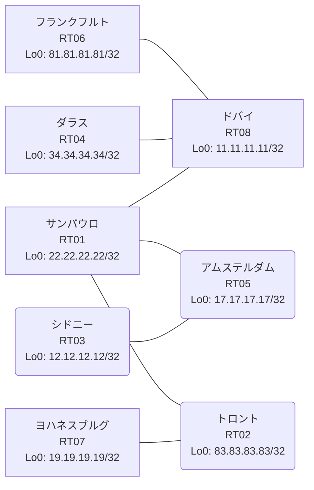

# 問題 20260814-013

> **本問は機器に接続せずに解答すること。追加の show 実行は認めない。**

## トポロジ

あなたは、ネットワークの運用を担当しています。あなたの会社のネットワークは、複数のルーティング・ドメインが、境界のルータによって接続され、そして、すべての拠点のリーチアビリティが提供されている、というものです。ルーティングの設計の詳細は、示されているところの構成から、読み取られることが、期待されています。各拠点のルータと、拠点の網との対応は、下記の表に示されているとおりです。



| 拠点 | ルータ | 拠点網 |
|------|--------|----------------------|
| アムステルダム | RT05 | `17.17.17.17/32` |
| サンパウロ | RT01 | `22.22.22.22/32` |
| シドニー | RT03 | `12.12.12.12/32` |
| ダラス | RT04 | `34.34.34.34/32` |
| トロント | RT02 | `83.83.83.83/32` |
| ドバイ | RT08 | `11.11.11.11/32` |
| フランクフルト | RT06 | `81.81.81.81/32` |
| ヨハネスブルグ | RT07 | `19.19.19.19/32` |

リンク一覧:
```
  RT01:E0/0(.1) ── RT08:E0/0(.2)   10.197.226.0/30
  RT01:E0/1(.1) ── RT05:E0/0(.2)   10.212.90.0/30
  RT01:E0/2(.1) ── RT02:E0/0(.2)   10.43.16.0/30
  RT05:E0/1(.1) ── RT03:E0/0(.2)   10.197.74.0/30
  RT08:E0/1(.1) ── RT06:E0/0(.2)   10.225.87.0/30
  RT02:E0/1(.1) ── RT07:E0/0(.2)   10.198.247.0/30
  RT08:E0/2(.1) ── RT04:E0/0(.2)   10.41.176.0/30
```

## 要件

1. redistribute によって参照されるところのプロセス ID / AS 番号は、その境界に実在する隣接のドメインのものと一致させられ、そして、実在しないプロセスへの参照が、残置されてはなりません。
2. ルーティング プロトコルの種別およびプロセスの配置は、変更されてはなりません。
3. 再配送される経路の、選択的な制限は、実施されてはなりません。
4. EIGRP へのルートの注入におけるシード・メトリックは、プロセスの配下の default-metric `1000000 100 255 1 1500` によって、与えられなければなりません。
5. 本作業は、日中の時間帯において実施されるという理由により、対象外であるところのデバイスに対する構成の変更は、許可されていません。
6. 各サイトのネットワークは、ドメインをまたいで、すべてのサイトから、到達されることができること。

## 現在の状態

ユーザーから、通信に関する事象が、報告されています。あなたは、示されているところの出力および構成に基づいて、その構成が、下記において記述されているとおりに動作していない理由を、判断する必要があります。

```
RT08# show ip route
Gateway of last resort is not set
      10.0.0.0/8 is variably subnetted, 10 subnets, 2 masks
C        10.41.176.0/30 is directly connected, Ethernet0/2
L        10.41.176.1/32 is directly connected, Ethernet0/2
D EX     10.43.16.0/30 [170/307200] via 10.197.226.1, 00:06:29, Ethernet0/0
D        10.197.74.0/30 [90/332800] via 10.197.226.1, 00:06:08, Ethernet0/0
C        10.197.226.0/30 is directly connected, Ethernet0/0
L        10.197.226.2/32 is directly connected, Ethernet0/0
D EX     10.198.247.0/30 [170/307200] via 10.197.226.1, 00:05:36, Ethernet0/0
D        10.212.90.0/30 [90/307200] via 10.197.226.1, 00:06:29, Ethernet0/0
C        10.225.87.0/30 is directly connected, Ethernet0/1
L        10.225.87.1/32 is directly connected, Ethernet0/1
      11.0.0.0/32 is subnetted, 1 subnets
C        11.11.11.11 is directly connected, Loopback0
      12.0.0.0/32 is subnetted, 1 subnets
D        12.12.12.12 [90/460800] via 10.197.226.1, 00:06:04, Ethernet0/0
      17.0.0.0/32 is subnetted, 1 subnets
D        17.17.17.17 [90/435200] via 10.197.226.1, 00:06:08, Ethernet0/0
      19.0.0.0/32 is subnetted, 1 subnets
D EX     19.19.19.19 [170/307200] via 10.197.226.1, 00:05:12, Ethernet0/0
      22.0.0.0/32 is subnetted, 1 subnets
D        22.22.22.22 [90/409600] via 10.197.226.1, 00:06:29, Ethernet0/0
      34.0.0.0/32 is subnetted, 1 subnets
O        34.34.34.34 [110/11] via 10.41.176.2, 00:05:26, Ethernet0/2
      81.0.0.0/32 is subnetted, 1 subnets
O        81.81.81.81 [110/11] via 10.225.87.2, 00:05:22, Ethernet0/1
      83.0.0.0/32 is subnetted, 1 subnets
D EX     83.83.83.83 [170/307200] via 10.197.226.1, 00:05:36, Ethernet0/0
```
```
RT01# show ip prefix-list
ip prefix-list PL-LEGACY2: 2 entries
   seq 5 deny 19.19.19.19/32
   seq 10 permit 0.0.0.0/0 le 32
ip prefix-list PL-STG1: 2 entries
   seq 5 deny 22.22.22.22/32
   seq 10 permit 0.0.0.0/0 le 32
```
```
RT04# show ip route
Gateway of last resort is not set
      10.0.0.0/8 is variably subnetted, 8 subnets, 2 masks
C        10.41.176.0/30 is directly connected, Ethernet0/0
L        10.41.176.2/32 is directly connected, Ethernet0/0
O E2     10.43.16.0/30 [110/20] via 10.41.176.1, 00:05:08, Ethernet0/0
O E2     10.197.74.0/30 [110/20] via 10.41.176.1, 00:05:08, Ethernet0/0
O E2     10.197.226.0/30 [110/20] via 10.41.176.1, 00:05:08, Ethernet0/0
O E2     10.198.247.0/30 [110/20] via 10.41.176.1, 00:05:08, Ethernet0/0
O E2     10.212.90.0/30 [110/20] via 10.41.176.1, 00:05:08, Ethernet0/0
O        10.225.87.0/30 [110/20] via 10.41.176.1, 00:05:05, Ethernet0/0
      11.0.0.0/32 is subnetted, 1 subnets
O        11.11.11.11 [110/11] via 10.41.176.1, 00:05:08, Ethernet0/0
      12.0.0.0/32 is subnetted, 1 subnets
O E2     12.12.12.12 [110/20] via 10.41.176.1, 00:05:08, Ethernet0/0
      17.0.0.0/32 is subnetted, 1 subnets
O E2     17.17.17.17 [110/20] via 10.41.176.1, 00:05:08, Ethernet0/0
      19.0.0.0/32 is subnetted, 1 subnets
O E2     19.19.19.19 [110/20] via 10.41.176.1, 00:04:55, Ethernet0/0
      22.0.0.0/32 is subnetted, 1 subnets
O E2     22.22.22.22 [110/20] via 10.41.176.1, 00:05:08, Ethernet0/0
      34.0.0.0/32 is subnetted, 1 subnets
C        34.34.34.34 is directly connected, Loopback0
      81.0.0.0/32 is subnetted, 1 subnets
O        81.81.81.81 [110/21] via 10.41.176.1, 00:05:00, Ethernet0/0
      83.0.0.0/32 is subnetted, 1 subnets
O E2     83.83.83.83 [110/20] via 10.41.176.1, 00:05:08, Ethernet0/0
```
```
RT01# show route-map
route-map RM-STG1, deny, sequence 10
  Match clauses:
    ip address prefix-lists: PL-STG1 
  Set clauses:
  Policy routing matches: 0 packets, 0 bytes
route-map RM-STG1, permit, sequence 20
  Match clauses:
  Set clauses:
  Policy routing matches: 0 packets, 0 bytes
route-map RM-LEGACY2, deny, sequence 10
  Match clauses:
    ip address prefix-lists: PL-LEGACY2 
  Set clauses:
  Policy routing matches: 0 packets, 0 bytes
route-map RM-LEGACY2, permit, sequence 20
  Match clauses:
  Set clauses:
  Policy routing matches: 0 packets, 0 bytes
```
```
RT02# show ip route
Gateway of last resort is not set
      10.0.0.0/8 is variably subnetted, 4 subnets, 2 masks
C        10.43.16.0/30 is directly connected, Ethernet0/0
L        10.43.16.2/32 is directly connected, Ethernet0/0
C        10.198.247.0/30 is directly connected, Ethernet0/1
L        10.198.247.1/32 is directly connected, Ethernet0/1
      19.0.0.0/32 is subnetted, 1 subnets
O        19.19.19.19 [110/11] via 10.198.247.2, 00:04:41, Ethernet0/1
      22.0.0.0/32 is subnetted, 1 subnets
O        22.22.22.22 [110/11] via 10.43.16.1, 00:05:00, Ethernet0/0
      83.0.0.0/32 is subnetted, 1 subnets
C        83.83.83.83 is directly connected, Loopback0
```
```
RT01# show access-lists
Standard IP access list 38
    10 deny   19.19.19.19
    20 permit any
Standard IP access list 50
    10 deny   22.22.22.22
    20 permit any
```

## 設定抜粋

```
RT01# show running-config | section router
router eigrp 341
 default-metric 1000000 100 255 1 1500
 network 10.197.226.0 0.0.0.3
 network 10.212.90.0 0.0.0.3
 network 22.22.22.22 0.0.0.0
 redistribute ospf 17 match internal external 1 external 2
router ospf 17
 router-id 22.22.22.22
 passive-interface Loopback0
 network 10.43.16.0 0.0.0.3 area 0
 network 22.22.22.22 0.0.0.0 area 0
```
```
RT02# show running-config | section router
router ospf 17
 router-id 83.83.83.83
 network 10.43.16.0 0.0.0.3 area 0
 network 10.198.247.0 0.0.0.3 area 0
 network 83.83.83.83 0.0.0.0 area 0
```
```
RT03# show running-config | section router
router eigrp 341
 network 10.197.74.0 0.0.0.3
 network 12.12.12.12 0.0.0.0
```
```
RT04# show running-config | section router
router ospf 61
 router-id 34.34.34.34
 passive-interface Loopback0
 network 10.41.176.0 0.0.0.3 area 0
 network 34.34.34.34 0.0.0.0 area 0
```
```
RT05# show running-config | section router
router eigrp 341
 network 10.197.74.0 0.0.0.3
 network 10.212.90.0 0.0.0.3
 network 17.17.17.17 0.0.0.0
```
```
RT06# show running-config | section router
router ospf 61
 router-id 81.81.81.81
 network 10.225.87.0 0.0.0.3 area 0
 network 81.81.81.81 0.0.0.0 area 0
```
```
RT07# show running-config | section router
router ospf 17
 router-id 19.19.19.19
 network 10.198.247.0 0.0.0.3 area 0
 network 19.19.19.19 0.0.0.0 area 0
```
```
RT08# show running-config | section router
router eigrp 341
 default-metric 1000000 100 255 1 1500
 network 10.197.226.0 0.0.0.3
 network 11.11.11.11 0.0.0.0
 redistribute ospf 61 match internal external 1 external 2
 passive-interface Loopback0
router ospf 61
 router-id 11.11.11.11
 redistribute eigrp 341
 network 10.41.176.0 0.0.0.3 area 0
 network 10.225.87.0 0.0.0.3 area 0
 network 11.11.11.11 0.0.0.0 area 0
```

## 設問

次のうち、正しいものは、どれですか。

## 選択肢
A. RT01 の redistribute に適用された route-map が特定の拠点網を deny している

B. RT01 の router ospf 17 配下に redistribute が設定されていない

C. RT01 の route-map RM-STG1 が対象の経路を拒否している

D. RT01 の router ospf 17 配下の redistribute が、実在しないプロセス/AS を参照している

E. RT02 の router ospf 17 に Loopback0 の network 文が設定されていない

F. RT02 の router ospf 17 で、上流側インタフェースが passive-interface に設定されている
