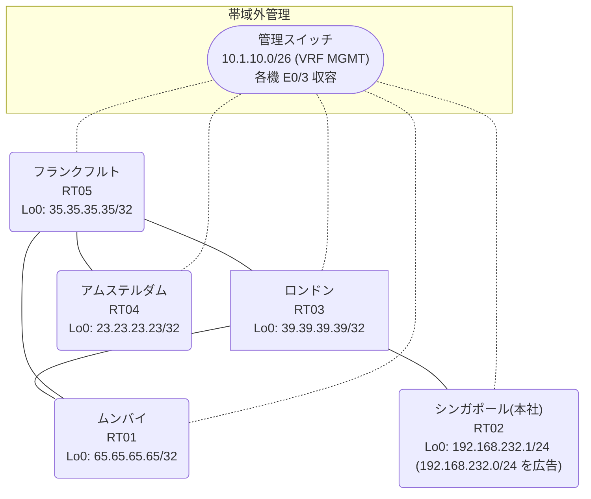

# 問題 20260814-014

> **本問は機器に接続せずに解答すること。追加の show 実行は認めない。**

## シナリオ

あなたの組織は、下記に示されているところのネットワークを運用しています。本社の顧客のネットワークは、BGP AS 65048 の RT02 によって、広告されています。あなたの会社の内部は、BGP / EIGRP / OSPF という 3 つのドメインから構成されています。サイトと、ルータおよびアドレスとの対応は、下記の表に示されているとおりです。いくつかの宛先への通信について、報告が上がっています。示されているところの出力および構成に基づいて、要求されているところの動作が得られていない理由が、判断されなければなりません。ルーティング・プロトコルの種別およびプロセスの配置は、変更されることはできません。インタフェースの IP アドレッシングは、変更されてはなりません。それぞれのドメインの間の再配送の設計は、維持されなければなりません。`192.168.232.0/24` 宛のトラフィックが RT02 へ配送され、経路の周回が、発生していないこと。管理距離の変更は、監査のポリシーによって、禁止されているところのものです。顧客のネットワーク `192.168.232.0/24` を含むすべての宛先への到達可能性が、すべてのサイトにおいて、確保されていること。



| 拠点 | ルータ | 拠点網 / 広告網 |
|------|--------|------------------|
| アムステルダム | RT04 | 23.23.23.23/32 |
| シンガポール(本社) | RT02 | 192.168.232.1/24 (`192.168.232.0/24` を広告) |
| フランクフルト | RT05 | 35.35.35.35/32 |
| ムンバイ | RT01 | 65.65.65.65/32 |
| ロンドン | RT03 | 39.39.39.39/32 |

リンク一覧:
```
  RT02:E0/0(.1) ── RT03:E0/0(.2)   10.248.27.0/30
  RT03:E0/1(.1) ── RT05:E0/0(.2)   10.85.1.0/30
  RT03:E0/2(.1) ── RT01:E0/0(.2)   10.62.110.0/30
  RT05:E0/1(.1) ── RT01:E0/1(.2)   10.167.132.0/30
  RT05:E0/2(.1) ── RT04:E0/0(.2)   10.167.191.0/30
```

## 出力

```
RT03# show route-map
route-map RM-OLD1, deny, sequence 10
  Match clauses:
    ip address prefix-lists: PL-OLD1 
  Set clauses:
  Policy routing matches: 0 packets, 0 bytes
route-map RM-OLD1, permit, sequence 20
  Match clauses:
  Set clauses:
  Policy routing matches: 0 packets, 0 bytes
```
```
RT02# show running-config | section router
router bgp 65048
 bgp router-id 192.168.232.1
 bgp log-neighbor-changes
 network 192.168.232.0
 neighbor 10.248.27.2 remote-as 65048
```
```
RT03# show running-config | section router
router eigrp 568
 network 10.85.1.0 0.0.0.3
 passive-interface Loopback0
router ospf 36
 router-id 39.39.39.39
 redistribute eigrp 568
 redistribute bgp 65048
 network 10.62.110.0 0.0.0.3 area 0
 network 39.39.39.39 0.0.0.0 area 0
router bgp 65048
 bgp router-id 39.39.39.39
 bgp log-neighbor-changes
 bgp redistribute-internal
 network 39.39.39.39 mask 255.255.255.255
 redistribute ospf 36
 neighbor 10.248.27.1 remote-as 65048
```
```
RT03# show ip route
Gateway of last resort is not set
      10.0.0.0/8 is variably subnetted, 8 subnets, 2 masks
C        10.62.110.0/30 is directly connected, Ethernet0/2
L        10.62.110.1/32 is directly connected, Ethernet0/2
C        10.85.1.0/30 is directly connected, Ethernet0/1
L        10.85.1.1/32 is directly connected, Ethernet0/1
O        10.167.132.0/30 [110/20] via 10.62.110.2, 00:03:59, Ethernet0/2
O        10.167.191.0/30 [110/30] via 10.62.110.2, 00:03:54, Ethernet0/2
C        10.248.27.0/30 is directly connected, Ethernet0/0
L        10.248.27.2/32 is directly connected, Ethernet0/0
      23.0.0.0/32 is subnetted, 1 subnets
O        23.23.23.23 [110/31] via 10.62.110.2, 00:03:47, Ethernet0/2
      35.0.0.0/32 is subnetted, 1 subnets
O        35.35.35.35 [110/21] via 10.62.110.2, 00:03:54, Ethernet0/2
      39.0.0.0/32 is subnetted, 1 subnets
C        39.39.39.39 is directly connected, Loopback0
      65.0.0.0/32 is subnetted, 1 subnets
O        65.65.65.65 [110/11] via 10.62.110.2, 00:03:59, Ethernet0/2
D EX  192.168.232.0/24 [170/307200] via 10.85.1.2, 00:03:37, Ethernet0/1
```
```
RT03# show access-lists
Standard IP access list 24
    10 deny   23.23.23.23
    20 permit any
```
```
RT01# show running-config | section router
router ospf 36
 router-id 65.65.65.65
 timers throttle spf 50 200 5000
 passive-interface Loopback0
 network 10.62.110.0 0.0.0.3 area 0
 network 10.167.132.0 0.0.0.3 area 0
 network 65.65.65.65 0.0.0.0 area 0
```
```
RT03# show ip prefix-list
ip prefix-list PL-OLD1: 2 entries
   seq 5 deny 23.23.23.23/32
   seq 10 permit 0.0.0.0/0 le 32
```
```
RT05# show running-config | section router
router eigrp 568
 network 10.85.1.0 0.0.0.3
 redistribute ospf 36 metric 100000 100 255 1 1500
router ospf 36
 router-id 35.35.35.35
 redistribute eigrp 568
 network 10.167.132.0 0.0.0.3 area 0
 network 10.167.191.0 0.0.0.3 area 0
 network 35.35.35.35 0.0.0.0 area 0
```
```
RT04# traceroute 192.168.232.1 probe 1 timeout 1 ttl 1 8
Type escape sequence to abort.
Tracing the route to 192.168.232.1
VRF info: (vrf in name/id, vrf out name/id)
  1 10.167.191.1 1 msec
  2 10.167.132.2 2 msec
  3 10.62.110.1 2 msec
  4 10.85.1.2 6 msec
  5 10.167.132.2 22 msec
  6 10.62.110.1 2 msec
  7 10.85.1.2 3 msec
  8 10.167.132.2 2 msec
```
```
RT03# show ip bgp
BGP table version is 10, local router ID is 39.39.39.39
Status codes: s suppressed, d damped, h history, * valid, > best, i - internal, 
              r RIB-failure, S Stale, m multipath, b backup-path, f RT-Filter, 
              x best-external, a additional-path, c RIB-compressed, 
              t secondary path, L long-lived-stale,
Origin codes: i - IGP, e - EGP, ? - incomplete
RPKI validation codes: V valid, I invalid, N Not found

     Network          Next Hop            Metric LocPrf Weight Path
 *>   10.62.110.0/30   0.0.0.0                  0         32768 ?
 *>   10.167.132.0/30  10.62.110.2             20         32768 ?
 *>   10.167.191.0/30  10.62.110.2             30         32768 ?
 *>   23.23.23.23/32   10.62.110.2             31         32768 ?
 *>   35.35.35.35/32   10.62.110.2             21         32768 ?
 *>   39.39.39.39/32   0.0.0.0                  0         32768 i
 *>   65.65.65.65/32   10.62.110.2             11         32768 ?
 r>i  192.168.232.0    10.248.27.1              0    100      0 i
```

## 設問

次のうち、正しいものは、どれですか。

## 選択肢
A. RT03 の router ospf 36 配下の「redistribute bgp 65048 ...」に `192.168.232.0/24` を deny する route-map を適用する

B. RT05 の相互再配送(redistribute)の両方向に `192.168.232.0/24` を deny する route-map を適用する

C. RT03 で「clear ip bgp *」および「clear ip route *」を実行する

D. RT03 の router bgp 65048 配下に「distance bgp 20 165 165」を設定し、clear ip route * を実行する

E. RT03 で `192.168.232.0/24` のみ deny(他は permit)の prefix-list PL-BLOCK を作成し、router eigrp 568 配下に「distribute-list prefix PL-BLOCK in」を適用する

F. RT03 の router bgp 65048 配下から「bgp redistribute-internal」を削除する
