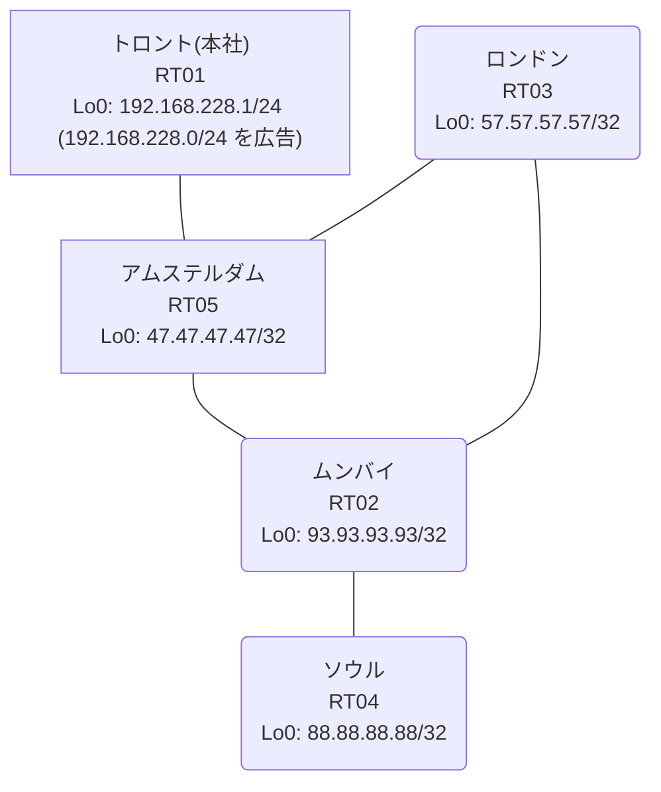

# 問題 20260815-001

> **本問は機器に接続せずに解答すること。追加の show 実行は認めない。**

## トポロジ

あなたは、下記のネットワークの保守を担当する技術者です。本社の顧客のネットワークは、BGP AS 65450 の RT01 によって、広告されています。あなたの会社の内部は、BGP / EIGRP / OSPF という 3 つのドメインから構成されています。サイトと、ルータおよびアドレスとの対応は、下記の表に示されているとおりです。



| 拠点 | ルータ | 拠点網 / 広告網 |
|------|--------|------------------|
| アムステルダム | RT05 | 47.47.47.47/32 |
| ソウル | RT04 | 88.88.88.88/32 |
| トロント(本社) | RT01 | 192.168.228.1/24 (`192.168.228.0/24` を広告) |
| ムンバイ | RT02 | 93.93.93.93/32 |
| ロンドン | RT03 | 57.57.57.57/32 |

リンク一覧:
```
  RT01:E0/0(.1) ── RT05:E0/0(.2)   10.140.6.0/30
  RT05:E0/1(.1) ── RT02:E0/0(.2)   10.122.14.0/30
  RT05:E0/2(.1) ── RT03:E0/0(.2)   10.89.237.0/30
  RT02:E0/1(.1) ── RT03:E0/1(.2)   10.10.129.0/30
  RT02:E0/2(.1) ── RT04:E0/0(.2)   10.156.9.0/30
```

## 要件

1. 本作業は、日中の時間帯において実施されるという理由により、対象外であるところのデバイスに対する構成の変更は、許可されていません。
2. 以前の障害の対応の際に追加された設定が、一部のルータにおいて、そのまま残されています。当該の設定の棚卸しは、行われていません。
3. `192.168.228.0/24` 宛のパケットが、広告元である RT01 の方向へ転送され、そして、転送のループが存在していないこと。
4. ルーティング プロトコルの種別およびプロセスの配置は、変更されてはなりません。
5. それぞれのドメインの間の再配送の設計は、維持されなければなりません。
6. 顧客のネットワーク `192.168.228.0/24` を含むすべての宛先への到達可能性が、すべてのサイトにおいて、確保されていること。

## 現在の状態

通信の一部において、想定されていない挙動が、観測されています。示されているところの出力および構成に基づいて、要求されているところの動作が得られていない理由が、判断されなければなりません。

```
RT05# show ip route
Gateway of last resort is not set
      10.0.0.0/8 is variably subnetted, 8 subnets, 2 masks
O        10.10.129.0/30 [110/20] via 10.89.237.2, 00:03:50, Ethernet0/2
C        10.89.237.0/30 is directly connected, Ethernet0/2
L        10.89.237.1/32 is directly connected, Ethernet0/2
C        10.122.14.0/30 is directly connected, Ethernet0/1
L        10.122.14.1/32 is directly connected, Ethernet0/1
C        10.140.6.0/30 is directly connected, Ethernet0/0
L        10.140.6.2/32 is directly connected, Ethernet0/0
O        10.156.9.0/30 [110/30] via 10.89.237.2, 00:03:50, Ethernet0/2
      47.0.0.0/32 is subnetted, 1 subnets
C        47.47.47.47 is directly connected, Loopback0
      57.0.0.0/32 is subnetted, 1 subnets
O        57.57.57.57 [110/11] via 10.89.237.2, 00:03:55, Ethernet0/2
      88.0.0.0/32 is subnetted, 1 subnets
O        88.88.88.88 [110/31] via 10.89.237.2, 00:03:45, Ethernet0/2
      93.0.0.0/32 is subnetted, 1 subnets
O        93.93.93.93 [110/21] via 10.89.237.2, 00:03:50, Ethernet0/2
D EX  192.168.228.0/24 [170/307200] via 10.122.14.2, 00:03:42, Ethernet0/1
```
```
RT05# show route-map
route-map RM-OLD1, deny, sequence 10
  Match clauses:
    ip address prefix-lists: PL-OLD1 
  Set clauses:
  Policy routing matches: 0 packets, 0 bytes
route-map RM-OLD1, permit, sequence 20
  Match clauses:
  Set clauses:
  Policy routing matches: 0 packets, 0 bytes
route-map RM-BACKUP2, deny, sequence 10
  Match clauses:
    ip address prefix-lists: PL-BACKUP2 
  Set clauses:
  Policy routing matches: 0 packets, 0 bytes
route-map RM-BACKUP2, permit, sequence 20
  Match clauses:
  Set clauses:
  Policy routing matches: 0 packets, 0 bytes
```
```
RT05# show ip prefix-list
ip prefix-list PL-BACKUP2: 2 entries
   seq 5 deny 57.57.57.57/32
   seq 10 permit 0.0.0.0/0 le 32
ip prefix-list PL-OLD1: 2 entries
   seq 5 deny 88.88.88.88/32
   seq 10 permit 0.0.0.0/0 le 32
```
```
RT05# show access-lists
Standard IP access list 21
    10 deny   57.57.57.57
    20 permit any
Standard IP access list 55
    10 deny   88.88.88.88
    20 permit any
```
```
RT05# show ip bgp
BGP table version is 10, local router ID is 47.47.47.47
Status codes: s suppressed, d damped, h history, * valid, > best, i - internal, 
              r RIB-failure, S Stale, m multipath, b backup-path, f RT-Filter, 
              x best-external, a additional-path, c RIB-compressed, 
              t secondary path, L long-lived-stale,
Origin codes: i - IGP, e - EGP, ? - incomplete
RPKI validation codes: V valid, I invalid, N Not found

     Network          Next Hop            Metric LocPrf Weight Path
 *>   10.10.129.0/30   10.89.237.2             20         32768 ?
 *>   10.89.237.0/30   0.0.0.0                  0         32768 ?
 *>   10.156.9.0/30    10.89.237.2             30         32768 ?
 *>   47.47.47.47/32   0.0.0.0                  0         32768 i
 *>   57.57.57.57/32   10.89.237.2             11         32768 ?
 *>   88.88.88.88/32   10.89.237.2             31         32768 ?
 *>   93.93.93.93/32   10.89.237.2             21         32768 ?
 r>i  192.168.228.0    10.140.6.1               0    100      0 i
```
```
RT05# show ip protocols | include Routing Protocol|Distance
Routing Protocol is "application"
    Gateway         Distance      Last Update
  Distance: (default is 4)
Routing Protocol is "eigrp 493"
      Distance: internal 90 external 170
    Gateway         Distance      Last Update
  Distance: internal 90 external 170
Routing Protocol is "ospf 60"
    Gateway         Distance      Last Update
  Distance: intra-area 110 inter-area 110 external 212
Routing Protocol is "bgp 65450"
    Gateway         Distance      Last Update
  Distance: external 20 internal 200 local 200
```
```
RT04# traceroute 192.168.228.1 probe 1 timeout 1 ttl 1 8
Type escape sequence to abort.
Tracing the route to 192.168.228.1
VRF info: (vrf in name/id, vrf out name/id)
  1 10.156.9.1 15 msec
  2 10.10.129.2 2 msec
  3 10.89.237.1 2 msec
  4 10.122.14.2 2 msec
  5 10.10.129.2 2 msec
  6 10.89.237.1 2 msec
  7 10.122.14.2 3 msec
  8 10.10.129.2 21 msec
```

## 設定抜粋

```
RT05# show running-config | section router
router eigrp 493
 timers active-time 5
 network 10.122.14.0 0.0.0.3
 passive-interface Loopback0
router ospf 60
 router-id 47.47.47.47
 redistribute eigrp 493
 redistribute bgp 65450
 network 10.89.237.0 0.0.0.3 area 0
 network 47.47.47.47 0.0.0.0 area 0
 distance ospf external 212
router bgp 65450
 bgp router-id 47.47.47.47
 bgp log-neighbor-changes
 bgp redistribute-internal
 network 47.47.47.47 mask 255.255.255.255
 redistribute ospf 60
 neighbor 10.140.6.1 remote-as 65450
```
```
RT02# show running-config | section router
router eigrp 493
 network 10.122.14.0 0.0.0.3
 redistribute ospf 60 metric 100000 100 255 1 1500
router ospf 60
 router-id 93.93.93.93
 redistribute eigrp 493
 network 10.10.129.0 0.0.0.3 area 0
 network 10.156.9.0 0.0.0.3 area 0
 network 93.93.93.93 0.0.0.0 area 0
```
```
RT03# show running-config | section router
router ospf 60
 router-id 57.57.57.57
 passive-interface Loopback0
 network 10.10.129.0 0.0.0.3 area 0
 network 10.89.237.0 0.0.0.3 area 0
 network 57.57.57.57 0.0.0.0 area 0
```
```
RT01# show running-config | section router
router bgp 65450
 bgp router-id 192.168.228.1
 bgp log-neighbor-changes
 network 192.168.228.0
 neighbor 10.140.6.2 remote-as 65450
```

## 設問

次のうち、正しいものは、どれですか。

## 選択肢
**A.**
```
router eigrp 493
 distance eigrp 90 205
```

**B.**
```
clear ip bgp *
clear ip route *
```

**C.**
```
ip prefix-list PL-X seq 5 deny 192.168.228.0/24
ip prefix-list PL-X seq 10 permit 0.0.0.0/0 le 32
route-map RM-INJ permit 10
 match ip address prefix-list PL-X
router ospf 60
 redistribute bgp 65450 route-map RM-INJ
```

**D.**
```
router ospf 60
 distance ospf external 232
end
clear ip route *
```

**E.**
```
router bgp 65450
 no bgp redistribute-internal
```

**F.**
```
router bgp 65450
 distance bgp 20 165 165
end
clear ip route *
```
