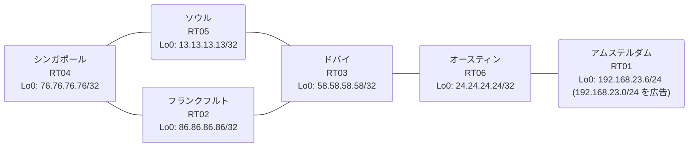

# 問題 20260815-002

> **本問は機器に接続せずに解答すること。追加の show 実行は認めない。**

## トポロジ

あなたは、ネットワークの運用を担当しています。あなたの会社のネットワークは、OSPF のドメインと EIGRP のドメインとが、2 つの境界のルータによって接続され、そして、それらは境界において接続されています。顧客のネットワーク `192.168.23.0/24` は、アムステルダム のサイトにおいて、別のルーティング・プロトコルによって学習され、そして、再配送によって、社内へ持ち込まれています。ルーティングの設計の詳細は、示されているところのコンフィギュレーションから、読み取られることが、期待されています。



| 拠点 | ルータ | 拠点網 / 広告網 |
|------|--------|------------------|
| アムステルダム | RT01 | 192.168.23.6/24 (`192.168.23.0/24` を広告) |
| オースティン | RT06 | 24.24.24.24/32 |
| シンガポール | RT04 | 76.76.76.76/32 |
| ソウル | RT05 | 13.13.13.13/32 |
| ドバイ | RT03 | 58.58.58.58/32 |
| フランクフルト | RT02 | 86.86.86.86/32 |

リンク一覧:
```
  RT04:E0/0(.1) ── RT02:E0/0(.2)   172.16.150.0/24
  RT04:E0/1(.1) ── RT05:E0/0(.3)   172.16.165.0/24
  RT02:E0/1(.2) ── RT03:E0/0(.4)   172.16.114.0/24
  RT05:E0/1(.3) ── RT03:E0/1(.4)   172.16.63.0/24
  RT03:E0/2(.4) ── RT06:E0/0(.5)   172.16.121.0/24
  RT06:E0/1(.5) ── RT01:E0/0(.6)   172.16.11.0/24
```

## 要件

1. 顧客のネットワーク `192.168.23.0/24` への到達可能性が、すべてのサイトにおいて、確保されていること。
2. スタティック・ルートおよび既定のルートによる迂回は、実施されることはできません。
3. 管理のための構成に対して、変更が加えられてはなりません。
4. 既存の相互再配送の設計が、削除または停止されてはなりません。
5. `192.168.23.0/24` 宛のトラフィックが RT01 へ配送され、経路の周回が、発生していないこと。
6. スタティック ルートおよび既定のルートによる迂回は、実施されてはなりません。

## 現在の状態

通信の一部において、想定されていない挙動が、観測されています。示されているところの出力および構成に基づいて、要求されているところの動作が得られていない理由が、判断されなければなりません。

```
RT03# show ip eigrp topology 192.168.23.0 255.255.255.0
EIGRP-IPv4 Topology Entry for AS(63)/ID(58.58.58.58) for 192.168.23.0/24
  State is Passive, Query origin flag is 1, 1 Successor(s), FD is 281856
  Descriptor Blocks:
  172.16.63.3 (Ethernet0/1), from 172.16.63.3, Send flag is 0x0
      Composite metric is (281856/2816), route is External
      Vector metric:
        Minimum bandwidth is 10000 Kbit
        Total delay is 1010 microseconds
        Reliability is 255/255
        Load is 1/255
        Minimum MTU is 1500
        Hop count is 1
        Originating router is 13.13.13.13
      External data:
        AS number of route is 45
        External protocol is OSPF, external metric is 20
        Administrator tag is 0 (0x00000000)
  172.16.121.5 (Ethernet0/2), from 172.16.121.5, Send flag is 0x0
      Composite metric is (307456/281856), route is External
      Vector metric:
        Minimum bandwidth is 10000 Kbit
        Total delay is 2010 microseconds
        Reliability is 255/255
        Load is 1/255
        Minimum MTU is 1500
        Hop count is 2
        Originating router is 192.168.23.6
      External data:
        AS number of route is 0
        External protocol is RIP, external metric is 0
        Administrator tag is 0 (0x00000000)
```
```
RT04# traceroute 192.168.23.6 probe 1 timeout 1 ttl 1 8
Type escape sequence to abort.
Tracing the route to 192.168.23.6
VRF info: (vrf in name/id, vrf out name/id)
  1 172.16.150.2 1 msec
  2 172.16.114.4 11 msec
  3 172.16.63.3 1 msec
  4 172.16.165.1 1 msec
  5 172.16.150.2 2 msec
  6 172.16.114.4 2 msec
  7 172.16.63.3 2 msec
  8 172.16.165.1 2 msec
```
```
RT06# show ip route
Gateway of last resort is not set
      13.0.0.0/32 is subnetted, 1 subnets
D EX     13.13.13.13 [170/307456] via 172.16.121.4, 00:08:11, Ethernet0/0
      24.0.0.0/32 is subnetted, 1 subnets
C        24.24.24.24 is directly connected, Loopback0
      58.0.0.0/32 is subnetted, 1 subnets
D        58.58.58.58 [90/409600] via 172.16.121.4, 00:08:25, Ethernet0/0
      76.0.0.0/32 is subnetted, 1 subnets
D EX     76.76.76.76 [170/307456] via 172.16.121.4, 00:07:34, Ethernet0/0
      86.0.0.0/32 is subnetted, 1 subnets
D EX     86.86.86.86 [170/307456] via 172.16.121.4, 00:07:34, Ethernet0/0
      172.16.0.0/16 is variably subnetted, 8 subnets, 2 masks
C        172.16.11.0/24 is directly connected, Ethernet0/1
L        172.16.11.5/32 is directly connected, Ethernet0/1
D        172.16.63.0/24 [90/307200] via 172.16.121.4, 00:08:25, Ethernet0/0
D        172.16.114.0/24 [90/307200] via 172.16.121.4, 00:08:25, Ethernet0/0
C        172.16.121.0/24 is directly connected, Ethernet0/0
L        172.16.121.5/32 is directly connected, Ethernet0/0
D EX     172.16.150.0/24 [170/307456] via 172.16.121.4, 00:07:34, Ethernet0/0
D EX     172.16.165.0/24 [170/307456] via 172.16.121.4, 00:08:11, Ethernet0/0
D EX  192.168.23.0/24 [170/281856] via 172.16.11.6, 00:07:34, Ethernet0/1
```
```
RT03# show ip route
Gateway of last resort is not set
      13.0.0.0/32 is subnetted, 1 subnets
D EX     13.13.13.13 [170/281856] via 172.16.114.2, 00:07:15, Ethernet0/0
                     [170/281856] via 172.16.63.3, 00:07:15, Ethernet0/1
      24.0.0.0/32 is subnetted, 1 subnets
D        24.24.24.24 [90/409600] via 172.16.121.5, 00:08:02, Ethernet0/2
      58.0.0.0/32 is subnetted, 1 subnets
C        58.58.58.58 is directly connected, Loopback0
      76.0.0.0/32 is subnetted, 1 subnets
D EX     76.76.76.76 [170/281856] via 172.16.114.2, 00:07:15, Ethernet0/0
                     [170/281856] via 172.16.63.3, 00:07:15, Ethernet0/1
      86.0.0.0/32 is subnetted, 1 subnets
D EX     86.86.86.86 [170/281856] via 172.16.114.2, 00:07:15, Ethernet0/0
                     [170/281856] via 172.16.63.3, 00:07:15, Ethernet0/1
      172.16.0.0/16 is variably subnetted, 9 subnets, 2 masks
D        172.16.11.0/24 [90/307200] via 172.16.121.5, 00:08:02, Ethernet0/2
C        172.16.63.0/24 is directly connected, Ethernet0/1
L        172.16.63.4/32 is directly connected, Ethernet0/1
C        172.16.114.0/24 is directly connected, Ethernet0/0
L        172.16.114.4/32 is directly connected, Ethernet0/0
C        172.16.121.0/24 is directly connected, Ethernet0/2
L        172.16.121.4/32 is directly connected, Ethernet0/2
D EX     172.16.150.0/24 [170/281856] via 172.16.114.2, 00:07:15, Ethernet0/0
                         [170/281856] via 172.16.63.3, 00:07:15, Ethernet0/1
D EX     172.16.165.0/24 [170/281856] via 172.16.114.2, 00:07:18, Ethernet0/0
                         [170/281856] via 172.16.63.3, 00:07:18, Ethernet0/1
D EX  192.168.23.0/24 [170/281856] via 172.16.63.3, 00:07:15, Ethernet0/1
```
```
RT04# show ip route
Gateway of last resort is not set
      13.0.0.0/32 is subnetted, 1 subnets
O        13.13.13.13 [110/11] via 172.16.165.3, 00:07:52, Ethernet0/1
      24.0.0.0/32 is subnetted, 1 subnets
O E2     24.24.24.24 [110/20] via 172.16.165.3, 00:07:52, Ethernet0/1
                     [110/20] via 172.16.150.2, 00:07:56, Ethernet0/0
      58.0.0.0/32 is subnetted, 1 subnets
O E2     58.58.58.58 [110/20] via 172.16.165.3, 00:07:52, Ethernet0/1
                     [110/20] via 172.16.150.2, 00:07:56, Ethernet0/0
      76.0.0.0/32 is subnetted, 1 subnets
C        76.76.76.76 is directly connected, Loopback0
      86.0.0.0/32 is subnetted, 1 subnets
O        86.86.86.86 [110/11] via 172.16.150.2, 00:07:56, Ethernet0/0
      172.16.0.0/16 is variably subnetted, 8 subnets, 2 masks
O E2     172.16.11.0/24 [110/20] via 172.16.165.3, 00:07:52, Ethernet0/1
                        [110/20] via 172.16.150.2, 00:07:56, Ethernet0/0
O E2     172.16.63.0/24 [110/20] via 172.16.165.3, 00:07:52, Ethernet0/1
                        [110/20] via 172.16.150.2, 00:07:56, Ethernet0/0
O E2     172.16.114.0/24 [110/20] via 172.16.165.3, 00:07:52, Ethernet0/1
                         [110/20] via 172.16.150.2, 00:07:56, Ethernet0/0
O E2     172.16.121.0/24 [110/20] via 172.16.165.3, 00:07:52, Ethernet0/1
                         [110/20] via 172.16.150.2, 00:07:56, Ethernet0/0
C        172.16.150.0/24 is directly connected, Ethernet0/0
L        172.16.150.1/32 is directly connected, Ethernet0/0
C        172.16.165.0/24 is directly connected, Ethernet0/1
L        172.16.165.1/32 is directly connected, Ethernet0/1
O E2  192.168.23.0/24 [110/20] via 172.16.150.2, 00:07:56, Ethernet0/0
```
```
RT03# show ip protocols | include Routing Protocol|Distance
Routing Protocol is "application"
    Gateway         Distance      Last Update
  Distance: (default is 4)
Routing Protocol is "eigrp 63"
      Distance: internal 90 external 170
    Gateway         Distance      Last Update
  Distance: internal 90 external 170
```

## 設定抜粋

```
RT04# show running-config | section router
router ospf 45
 router-id 76.76.76.76
 network 76.76.76.76 0.0.0.0 area 0
 network 172.16.150.0 0.0.0.255 area 0
 network 172.16.165.0 0.0.0.255 area 0
```
```
RT02# show running-config | section router
router eigrp 63
 network 172.16.114.0 0.0.0.255
 redistribute ospf 45 metric 1000000 1 255 1 1500
router ospf 45
 router-id 86.86.86.86
 redistribute eigrp 63
 network 86.86.86.86 0.0.0.0 area 0
 network 172.16.150.0 0.0.0.255 area 0
```
```
RT05# show running-config | section router
router eigrp 63
 network 172.16.63.0 0.0.0.255
 redistribute ospf 45 metric 1000000 1 255 1 1500
router ospf 45
 router-id 13.13.13.13
 redistribute eigrp 63
 network 13.13.13.13 0.0.0.0 area 0
 network 172.16.165.0 0.0.0.255 area 0
```
```
RT03# show running-config | section router
router eigrp 63
 network 58.58.58.58 0.0.0.0
 network 172.16.63.0 0.0.0.255
 network 172.16.114.0 0.0.0.255
 network 172.16.121.0 0.0.0.255
```
```
RT06# show running-config | section router
router eigrp 63
 network 24.24.24.24 0.0.0.0
 network 172.16.11.0 0.0.0.255
 network 172.16.121.0 0.0.0.255
```
```
RT01# show running-config | section router
router eigrp 63
 network 172.16.11.0 0.0.0.255
 redistribute rip metric 1000000 1 255 1 1500
router rip
 version 2
 network 192.168.23.0
 no auto-summary
```

## 設問

次のうち、正しいものは、どれですか。

## 選択肢
A. RT06 が当該プレフィックスを広告しておらず、正規の経路が存在しない

B. RT01 からの再配送に seed metric が指定されておらず、経路が広告されていない

C. 当該プレフィックスの経路が収束せず、境界の間で振動している

D. RT03 が、境界から再注入された経路を正規の経路より良いものとして選択している

E. RT02 と RT05 の間で OSPF の隣接が確立しておらず、経路情報が同期していない

F. RT03 と境界の間で等コストの複数経路が成立し、パケットが分散されている
