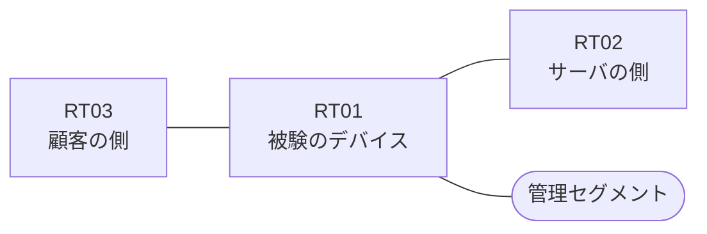

# 問題 20260815-004

> **本問は機器に接続せずに解答すること。追加の show 実行は認めない。**

## シナリオ

あなたは、下記のネットワークの保守を担当する技術者です。ある企業のネットワークにおいて、RT01 は、顧客の側のネットワークと、サーバの側のネットワークとの間に、配置されています。要求されているところの動作が、得られていない、ということが、報告されています。原因として、**インターフェイスに対して、アクセス・リストが in ではなく out の方向に適用されている** と **戻りの通信を許可するアクセス・リストに、established のキーワードを伴うエントリが存在しない** と **established のキーワードが、戻りの側ではなく、通信を開始する側のアクセス・リストに記述されている** の 3 つが、想定されています。機器の構成は、まだ取得されていません。`10.138.69.0/24` からの通信は、許可されることはできません。`10.138.68.0/24` からの通信は、許可されてはなりません。アクセス・リストのエントリは、1行で構成されなければなりません。RT01 において、`10.138.64.0/24`、`10.138.65.0/24`、`10.138.66.0/24`、`10.138.67.0/24` のネットワークからの通信のみが、サーバである `172.16.154.13` の TCP ポート 3389 に到達できなければなりません。当該のサーバの他のポートへの通信、および当該のサーバ以外の宛先への通信は、許可されてはなりません。アクセス リストは、顧客の側のインターフェイスである `Ethernet0/0` において、着信の方向に適用される必要があります。ルーティング プロトコルの種別およびプロセスの配置は、変更されてはなりません。

| 区間 | 被験デバイス側のインターフェイス | ネットワーク |
|------|----------------------------------|--------------|
| RT03（顧客の側） ⇔ RT01 | `Ethernet0/0` | 10.138.253.0/24 |
| RT01 ⇔ RT02（サーバの側） | `Ethernet0/1` | 10.138.254.0/24 |
| RT01 ⇔ 管理セグメント | `Ethernet0/2` | 10.138.255.0/24 |

## 出力

観測 | サーバへの到達
--- | ---
送信元が 10.138.64.0/24 のネットワークにあるホストから、172.16.154.13 の TCP ポート 3389 宛ての通信 | 到達不可
送信元が 10.138.65.0/24 のネットワークにあるホストから、172.16.154.13 の TCP ポート 3389 宛ての通信 | 到達不可
送信元が 10.138.66.0/24 のネットワークにあるホストから、172.16.154.13 の TCP ポート 3389 宛ての通信 | 到達不可
送信元が 10.138.67.0/24 のネットワークにあるホストから、172.16.154.13 の TCP ポート 3389 宛ての通信 | 到達不可
送信元が 10.138.68.0/24 のネットワークにあるホストから、172.16.154.13 の TCP ポート 3389 宛ての通信 | 到達不可
送信元が 10.138.69.0/24 のネットワークにあるホストから、172.16.154.13 の TCP ポート 3389 宛ての通信 | 到達不可
送信元が 10.138.250.0/24 のネットワークにあるホストから、172.16.154.13 の TCP ポート 3389 宛ての通信 | 到達不可
送信元が 10.138.64.0/24 のネットワークにあるホストから、172.16.154.13 の TCP ポート 21 宛ての通信 | 到達不可
送信元が 10.138.64.0/24 のネットワークにあるホストから、172.16.154.104 の TCP ポート 3389 宛ての通信 | 到達不可

## 設問

この事象の原因を特定するために、次に取得するべき出力として、最も多くの候補を除外できるものは、どれですか。(1つを選択してください)

## 選択肢
A. RT01 における `show ip interface Ethernet0/0 | include access list`

B. RT01 における `show ip access-lists`

C. RT01 における `show running-config | section ^interface`

D. RT01 における `show ip route`

E. RT01 における `show interfaces Ethernet0/0 | include packets`
