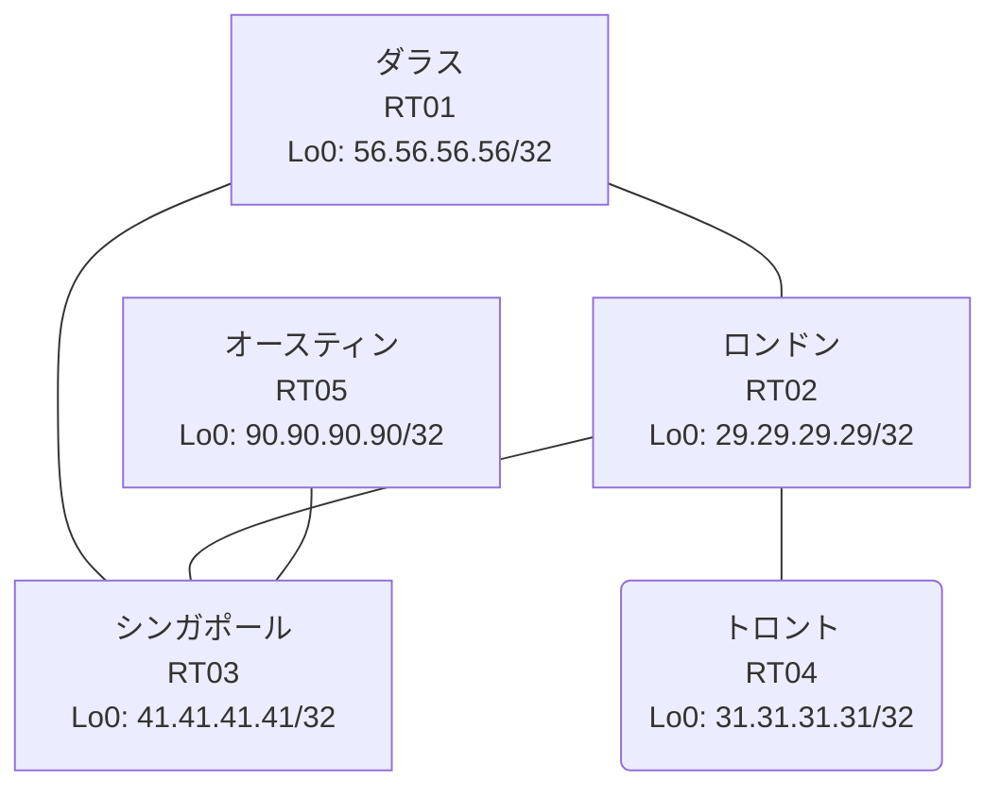

# 問題 20260815-005

> **本問は機器に接続せずに解答すること。追加の show 実行は認めない。**

## トポロジ

あなたは、ネットワークの運用を担当しています。あなたの会社のネットワークは、複数のルーティング・ドメインが、境界のルータによって接続され、そして、すべてのサイトのリーチアビリティが提供されている、というものです。ルーティングの設計の詳細は、示されているところの構成から、読み取られることが、期待されています。各サイトのルータと、サイトのネットワークとの対応は、下記の表に示されているとおりです。



| 拠点 | ルータ | 拠点網 |
|------|--------|----------------------|
| オースティン | RT05 | `90.90.90.90/32` |
| シンガポール | RT03 | `41.41.41.41/32` |
| ダラス | RT01 | `56.56.56.56/32` |
| トロント | RT04 | `31.31.31.31/32` |
| ロンドン | RT02 | `29.29.29.29/32` |

リンク一覧:
```
  RT03:E0/0(.1) ── RT02:E0/0(.2)   10.27.225.0/30
  RT02:E0/1(.1) ── RT01:E0/0(.2)   10.139.140.0/30
  RT02:E0/2(.1) ── RT04:E0/0(.2)   10.207.37.0/30
  RT03:E0/1(.1) ── RT01:E0/1(.2)   10.65.219.0/30
  RT03:E0/2(.1) ── RT05:E0/0(.2)   10.3.136.0/30
```

## 要件

1. 本作業は、日中の時間帯において実施されるという理由により、対象外であるところのデバイスに対する構成の変更は、許可されていません。
2. redistribute の参照先は、実在する隣接のプロセス/AS に限定され、無効な参照のステートメントが、コンフィギュレーションに残されてはなりません。
3. シード メトリック `10000 10 255 1 1500` の付与は、default-metric の方式に統一されなければなりません。
4. ルートの再配送に対して、フィルターが、適用されることはできません。
5. いずれのサイトからも、他のすべてのサイトのネットワークへの、IP リーチアビリティが、確保されていること。

## 現在の状態

通信の一部において、想定されていない挙動が、観測されています。あなたは、提示されているところの情報のみを使用して、要求されている状態が満たされていない理由を、特定しなければなりません。

```
RT02# show ip route
Gateway of last resort is not set
      10.0.0.0/8 is variably subnetted, 7 subnets, 2 masks
C        10.27.225.0/30 is directly connected, Ethernet0/0
L        10.27.225.2/32 is directly connected, Ethernet0/0
O        10.65.219.0/30 [110/20] via 10.139.140.2, 00:03:56, Ethernet0/1
                        [110/20] via 10.27.225.1, 00:03:55, Ethernet0/0
C        10.139.140.0/30 is directly connected, Ethernet0/1
L        10.139.140.1/32 is directly connected, Ethernet0/1
C        10.207.37.0/30 is directly connected, Ethernet0/2
L        10.207.37.1/32 is directly connected, Ethernet0/2
      29.0.0.0/32 is subnetted, 1 subnets
C        29.29.29.29 is directly connected, Loopback0
      31.0.0.0/32 is subnetted, 1 subnets
O        31.31.31.31 [110/11] via 10.207.37.2, 00:03:52, Ethernet0/2
      41.0.0.0/32 is subnetted, 1 subnets
O        41.41.41.41 [110/11] via 10.27.225.1, 00:04:16, Ethernet0/0
      56.0.0.0/32 is subnetted, 1 subnets
O        56.56.56.56 [110/11] via 10.139.140.2, 00:03:56, Ethernet0/1
```
```
RT03# show ip prefix-list
ip prefix-list PL-BACKUP1: 2 entries
   seq 5 deny 29.29.29.29/32
   seq 10 permit 0.0.0.0/0 le 32
ip prefix-list PL-BACKUP2: 2 entries
   seq 5 deny 90.90.90.90/32
   seq 10 permit 0.0.0.0/0 le 32
```
```
RT03# show access-lists
Standard IP access list 16
    10 deny   29.29.29.29
    20 permit any
Standard IP access list 49
    10 deny   90.90.90.90
    20 permit any
```
```
RT05# show ip route
Gateway of last resort is not set
      10.0.0.0/8 is variably subnetted, 6 subnets, 2 masks
C        10.3.136.0/30 is directly connected, Ethernet0/0
L        10.3.136.2/32 is directly connected, Ethernet0/0
O E2     10.27.225.0/30 [110/10] via 10.3.136.1, 00:04:06, Ethernet0/0
O E2     10.65.219.0/30 [110/10] via 10.3.136.1, 00:04:06, Ethernet0/0
O E2     10.139.140.0/30 [110/20] via 10.3.136.1, 00:04:06, Ethernet0/0
O E2     10.207.37.0/30 [110/20] via 10.3.136.1, 00:04:06, Ethernet0/0
      29.0.0.0/32 is subnetted, 1 subnets
O E2     29.29.29.29 [110/11] via 10.3.136.1, 00:04:06, Ethernet0/0
      31.0.0.0/32 is subnetted, 1 subnets
O E2     31.31.31.31 [110/21] via 10.3.136.1, 00:04:05, Ethernet0/0
      41.0.0.0/32 is subnetted, 1 subnets
O E2     41.41.41.41 [110/1] via 10.3.136.1, 00:04:06, Ethernet0/0
      56.0.0.0/32 is subnetted, 1 subnets
O E2     56.56.56.56 [110/11] via 10.3.136.1, 00:04:06, Ethernet0/0
      90.0.0.0/32 is subnetted, 1 subnets
C        90.90.90.90 is directly connected, Loopback0
```
```
RT04# show ip route
Gateway of last resort is not set
      10.0.0.0/8 is variably subnetted, 5 subnets, 2 masks
O        10.27.225.0/30 [110/20] via 10.207.37.1, 00:04:28, Ethernet0/0
O        10.65.219.0/30 [110/30] via 10.207.37.1, 00:04:28, Ethernet0/0
O        10.139.140.0/30 [110/20] via 10.207.37.1, 00:04:28, Ethernet0/0
C        10.207.37.0/30 is directly connected, Ethernet0/0
L        10.207.37.2/32 is directly connected, Ethernet0/0
      29.0.0.0/32 is subnetted, 1 subnets
O        29.29.29.29 [110/11] via 10.207.37.1, 00:04:28, Ethernet0/0
      31.0.0.0/32 is subnetted, 1 subnets
C        31.31.31.31 is directly connected, Loopback0
      41.0.0.0/32 is subnetted, 1 subnets
O        41.41.41.41 [110/21] via 10.207.37.1, 00:04:28, Ethernet0/0
      56.0.0.0/32 is subnetted, 1 subnets
O        56.56.56.56 [110/21] via 10.207.37.1, 00:04:28, Ethernet0/0
```
```
RT03# show route-map
route-map RM-BACKUP1, deny, sequence 10
  Match clauses:
    ip address prefix-lists: PL-BACKUP1 
  Set clauses:
  Policy routing matches: 0 packets, 0 bytes
route-map RM-BACKUP1, permit, sequence 20
  Match clauses:
  Set clauses:
  Policy routing matches: 0 packets, 0 bytes
route-map RM-BACKUP2, deny, sequence 10
  Match clauses:
    ip address prefix-lists: PL-BACKUP2 
  Set clauses:
  Policy routing matches: 0 packets, 0 bytes
route-map RM-BACKUP2, permit, sequence 20
  Match clauses:
  Set clauses:
  Policy routing matches: 0 packets, 0 bytes
```

## 設定抜粋

```
RT01# show running-config | section router
router ospf 92
 router-id 56.56.56.56
 network 10.65.219.0 0.0.0.3 area 0
 network 10.139.140.0 0.0.0.3 area 0
 network 56.56.56.56 0.0.0.0 area 0
```
```
RT02# show running-config | section router
router ospf 92
 router-id 29.29.29.29
 passive-interface Loopback0
 network 10.27.225.0 0.0.0.3 area 0
 network 10.139.140.0 0.0.0.3 area 0
 network 10.207.37.0 0.0.0.3 area 0
 network 29.29.29.29 0.0.0.0 area 0
```
```
RT03# show running-config | section router
router ospf 92
 router-id 41.41.41.41
 passive-interface Loopback0
 network 10.27.225.0 0.0.0.3 area 0
 network 10.65.219.0 0.0.0.3 area 0
 network 41.41.41.41 0.0.0.0 area 0
router ospf 21
 redistribute ospf 92 match internal external 1 external 2
 network 10.3.136.0 0.0.0.3 area 0
```
```
RT04# show running-config | section router
router ospf 92
 router-id 31.31.31.31
 passive-interface Loopback0
 network 10.207.37.0 0.0.0.3 area 0
 network 31.31.31.31 0.0.0.0 area 0
```
```
RT05# show running-config | section router
router ospf 21
 router-id 90.90.90.90
 network 10.3.136.0 0.0.0.3 area 0
 network 90.90.90.90 0.0.0.0 area 0
```

## 設問

次のうち、正しいものは、どれですか。

## 選択肢
**A.**
```
router ospf 92
 redistribute ospf 28 match internal external 1 external 2 subnets
```

**B.**
```
router ospf 92
 redistribute ospf 21 match internal external 1 external 2 subnets
```

**C.**
```
clear ip route *
```

**D.**
```
router ospf 21
 redistribute ospf 92 match internal external 1 external 2 subnets
```

**E.**
```
router ospf 92
 default-metric 20
```

**F.**
```
router ospf 92
 no passive-interface <上流IF>
```
