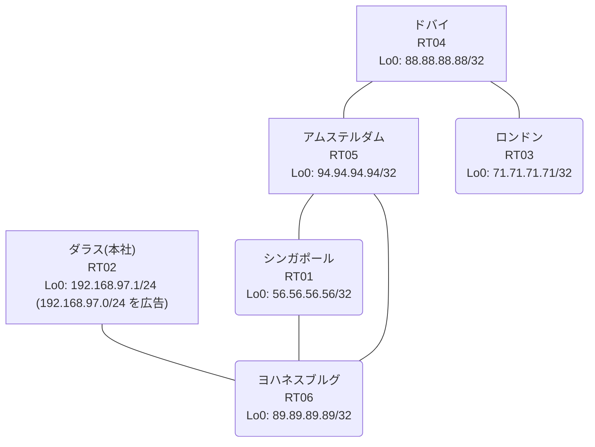

# 問題 20260815-007

> **本問は機器に接続せずに解答すること。追加の show 実行は認めない。**

## トポロジ

あなたは、下記のネットワークの保守を担当する技術者です。本社の顧客のネットワークは、BGP AS 65076 の RT02 によって、広告されています。あなたの会社の内部は、BGP / EIGRP / OSPF という 3 つのドメインから構成されています。サイトと、ルータおよびアドレスとの対応は、下記の表に示されているとおりです。



| 拠点 | ルータ | 拠点網 / 広告網 |
|------|--------|------------------|
| アムステルダム | RT05 | 94.94.94.94/32 |
| シンガポール | RT01 | 56.56.56.56/32 |
| ダラス(本社) | RT02 | 192.168.97.1/24 (`192.168.97.0/24` を広告) |
| ドバイ | RT04 | 88.88.88.88/32 |
| ヨハネスブルグ | RT06 | 89.89.89.89/32 |
| ロンドン | RT03 | 71.71.71.71/32 |

リンク一覧:
```
  RT02:E0/0(.1) ── RT06:E0/0(.2)   10.163.190.0/30
  RT06:E0/1(.1) ── RT01:E0/0(.2)   10.163.127.0/30
  RT06:E0/2(.1) ── RT05:E0/0(.2)   10.228.172.0/30
  RT01:E0/1(.1) ── RT05:E0/1(.2)   10.223.105.0/30
  RT05:E0/2(.1) ── RT04:E0/0(.2)   10.186.39.0/30
  RT04:E0/1(.1) ── RT03:E0/0(.2)   10.59.91.0/30
```

## 要件

1. `192.168.97.0/24` 宛のパケットが、広告元である RT02 の方向へ転送され、そして、転送のループが存在していないこと。
2. 既存の再配送の設計が、変更または撤去されることはできません。スタティック・ルートによる回避も、許可されていません。
3. すべてのルーターが、`192.168.97.0/24` を含むところのすべての宛先へ、到達することができること。
4. 本作業は、日中の時間帯において実施されるという理由により、対象外であるところのデバイスに対する構成の変更は、許可されていません。

## 現在の状態

ユーザーから、通信に関する事象が、報告されています。あなたは、提示されているところの情報のみを使用して、要求されている状態が満たされていない理由を、特定しなければなりません。

```
RT06# show ip route
Gateway of last resort is not set
      10.0.0.0/8 is variably subnetted, 9 subnets, 2 masks
O        10.59.91.0/30 [110/30] via 10.228.172.2, 00:04:11, Ethernet0/2
C        10.163.127.0/30 is directly connected, Ethernet0/1
L        10.163.127.1/32 is directly connected, Ethernet0/1
C        10.163.190.0/30 is directly connected, Ethernet0/0
L        10.163.190.2/32 is directly connected, Ethernet0/0
O        10.186.39.0/30 [110/20] via 10.228.172.2, 00:04:39, Ethernet0/2
O        10.223.105.0/30 [110/20] via 10.228.172.2, 00:04:39, Ethernet0/2
C        10.228.172.0/30 is directly connected, Ethernet0/2
L        10.228.172.1/32 is directly connected, Ethernet0/2
      56.0.0.0/32 is subnetted, 1 subnets
O        56.56.56.56 [110/21] via 10.228.172.2, 00:04:10, Ethernet0/2
      71.0.0.0/32 is subnetted, 1 subnets
O        71.71.71.71 [110/31] via 10.228.172.2, 00:04:00, Ethernet0/2
      88.0.0.0/32 is subnetted, 1 subnets
O        88.88.88.88 [110/21] via 10.228.172.2, 00:04:11, Ethernet0/2
      89.0.0.0/32 is subnetted, 1 subnets
C        89.89.89.89 is directly connected, Loopback0
      94.0.0.0/32 is subnetted, 1 subnets
O        94.94.94.94 [110/11] via 10.228.172.2, 00:04:39, Ethernet0/2
D EX  192.168.97.0/24 [170/307200] via 10.163.127.2, 00:03:44, Ethernet0/1
```
```
RT06# show route-map
route-map RM-OLD1, deny, sequence 10
  Match clauses:
    ip address prefix-lists: PL-OLD1 
  Set clauses:
  Policy routing matches: 0 packets, 0 bytes
route-map RM-OLD1, permit, sequence 20
  Match clauses:
  Set clauses:
  Policy routing matches: 0 packets, 0 bytes
```
```
RT06# show ip prefix-list
ip prefix-list PL-OLD1: 2 entries
   seq 5 deny 89.89.89.89/32
   seq 10 permit 0.0.0.0/0 le 32
```
```
RT06# show access-lists
Standard IP access list 67
    10 deny   89.89.89.89
    20 permit any
```
```
RT06# show ip bgp
BGP table version is 12, local router ID is 89.89.89.89
Status codes: s suppressed, d damped, h history, * valid, > best, i - internal, 
              r RIB-failure, S Stale, m multipath, b backup-path, f RT-Filter, 
              x best-external, a additional-path, c RIB-compressed, 
              t secondary path, L long-lived-stale,
Origin codes: i - IGP, e - EGP, ? - incomplete
RPKI validation codes: V valid, I invalid, N Not found

     Network          Next Hop            Metric LocPrf Weight Path
 *>   10.59.91.0/30    10.228.172.2            30         32768 ?
 *>   10.186.39.0/30   10.228.172.2            20         32768 ?
 *>   10.223.105.0/30  10.228.172.2            20         32768 ?
 *>   10.228.172.0/30  0.0.0.0                  0         32768 ?
 *>   56.56.56.56/32   10.228.172.2            21         32768 ?
 *>   71.71.71.71/32   10.228.172.2            31         32768 ?
 *>   88.88.88.88/32   10.228.172.2            21         32768 ?
 *>   89.89.89.89/32   0.0.0.0                  0         32768 i
 *>   94.94.94.94/32   10.228.172.2            11         32768 ?
 r>i  192.168.97.0     10.163.190.1             0    100      0 i
```
```
RT06# show ip protocols | include Routing Protocol|Distance
Routing Protocol is "application"
    Gateway         Distance      Last Update
  Distance: (default is 4)
Routing Protocol is "eigrp 736"
      Distance: internal 90 external 170
    Gateway         Distance      Last Update
  Distance: internal 90 external 170
Routing Protocol is "ospf 95"
    Gateway         Distance      Last Update
  Distance: (default is 110)
Routing Protocol is "bgp 65076"
    Gateway         Distance      Last Update
  Distance: external 20 internal 200 local 200
```
```
RT03# traceroute 192.168.97.1 probe 1 timeout 1 ttl 1 8
Type escape sequence to abort.
Tracing the route to 192.168.97.1
VRF info: (vrf in name/id, vrf out name/id)
  1 10.59.91.1 23 msec
  2 10.186.39.1 8 msec
  3 10.228.172.1 2 msec
  4 10.163.127.2 15 msec
  5 10.223.105.2 1 msec
  6 10.228.172.1 25 msec
  7 10.163.127.2 3 msec
  8 10.223.105.2 2 msec
```

## 設定抜粋

```
RT06# show running-config | section router
router eigrp 736
 timers active-time 5
 network 10.163.127.0 0.0.0.3
 passive-interface Loopback0
router ospf 95
 router-id 89.89.89.89
 redistribute eigrp 736
 redistribute bgp 65076
 network 10.228.172.0 0.0.0.3 area 0
 network 89.89.89.89 0.0.0.0 area 0
router bgp 65076
 bgp router-id 89.89.89.89
 bgp log-neighbor-changes
 bgp redistribute-internal
 network 89.89.89.89 mask 255.255.255.255
 redistribute ospf 95
 neighbor 10.163.190.1 remote-as 65076
```
```
RT01# show running-config | section router
router eigrp 736
 network 10.163.127.0 0.0.0.3
 redistribute ospf 95 metric 100000 100 255 1 1500
router ospf 95
 router-id 56.56.56.56
 redistribute eigrp 736
 network 10.223.105.0 0.0.0.3 area 0
 network 56.56.56.56 0.0.0.0 area 0
```
```
RT05# show running-config | section router
router ospf 95
 router-id 94.94.94.94
 timers throttle spf 50 200 5000
 passive-interface Loopback0
 network 10.186.39.0 0.0.0.3 area 0
 network 10.223.105.0 0.0.0.3 area 0
 network 10.228.172.0 0.0.0.3 area 0
 network 94.94.94.94 0.0.0.0 area 0
```
```
RT02# show running-config | section router
router bgp 65076
 bgp router-id 192.168.97.1
 bgp log-neighbor-changes
 network 192.168.97.0
 neighbor 10.163.190.2 remote-as 65076
```

## 設問

次のうち、正しいものは、どれですか。

## 選択肢
A. RT06 が、一周して戻ってきた外部経路を iBGP の経路より優先して採用している

B. RT01 と RT05 の間で等コストの複数経路が成立し、パケットが分散されている

C. RT01 の相互再配送において経路が収束せず、振動している

D. RT06 において当該プレフィックスの外部経路タイプが E2 であり、内部コストが加算されていない

E. RT06 の BGP テーブルにおいて当該経路が RIB-failure となり、ベストパスが選出できていない

F. RT02 からの広告が RT06 に到達していない
