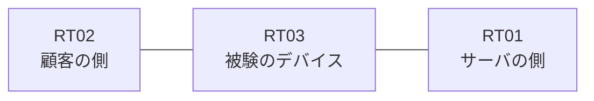

# 問題 20260815-008

> **本問は機器に接続せずに解答すること。追加の show 実行は認めない。**

## シナリオ

あなたは、下記のネットワークの保守を担当する技術者です。ある企業のネットワークにおいて、RT03 は、顧客の側のネットワークと、サーバの側のネットワークとの間に配置されており、IPv6 によって運用されています。RT03 において、`2001:DB8:51:10::/64`、`2001:DB8:51:11::/64`、`2001:DB8:51:12::/64` のネットワークからの通信のみが、`2001:DB8:51:FF::10` の TCP ポート 80 に到達できなければなりません。`2001:DB8:51:15::/64` からの通信は、許可されることはできません。対象としていないネットワークが、一致の対象に含まれてはなりません。また、拒否のエントリを使用してはなりません。本作業は、日中の時間帯において実施されるという理由により、対象外であるところのデバイスに対する構成の変更は、許可されていません。



## 出力

```
RT03# show ipv6 access-list
IPv6 access list V6-FILTER-IN
    permit ipv6 2001:DB8:51:10::/64 any sequence 10
```
```
RT03# show running-config | section ipv6 access-list|traffic-filter
ipv6 access-list V6-FILTER-IN
 sequence 10 permit ipv6 2001:DB8:51:10::/64 any
interface Ethernet0/0
 ipv6 traffic-filter V6-FILTER-IN in
```

## 設問

示されているところの構成において、転送されるものは、どれですか。(1つを選択してください)

## 選択肢
A. 送信元が 2001:DB8:51:10::/64 のネットワークにあるホストから、2001:DB8:51:FF::10 の TCP ポート 80 宛ての通信

B. 送信元が 2001:DB8:51:11::/64 のネットワークにあるホストから、2001:DB8:51:FF::10 の TCP ポート 80 宛ての通信

C. 送信元が 2001:DB8:51:13::/64 のネットワークにあるホストから、2001:DB8:51:FF::10 の TCP ポート 80 宛ての通信

D. 送信元が 2001:DB8:51:12::/64 のネットワークにあるホストから、2001:DB8:51:FF::10 の TCP ポート 80 宛ての通信

E. 送信元が 2001:DB8:51:15::/64 のネットワークにあるホストから、2001:DB8:51:FF::10 の TCP ポート 80 宛ての通信
