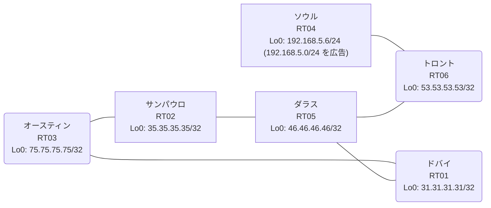

# 問題 20260815-009

> **本問は機器に接続せずに解答すること。追加の show 実行は認めない。**

## トポロジ

あなたは、下記のネットワークの保守を担当する技術者です。あなたの会社のネットワークは、OSPF のドメインと EIGRP のドメインとが、2 つの境界のルーターによって接続され、そして、それらは境界において接続されています。顧客のネットワーク `192.168.5.0/24` は、ソウル のサイトにおいて、別のルーティング・プロトコルによって学習され、そして、再配送によって、社内へ持ち込まれています。ルーティングの設計の詳細は、示されているところのコンフィギュレーションから、読み取られることが、期待されています。



| 拠点 | ルータ | 拠点網 / 広告網 |
|------|--------|------------------|
| オースティン | RT03 | 75.75.75.75/32 |
| サンパウロ | RT02 | 35.35.35.35/32 |
| ソウル | RT04 | 192.168.5.6/24 (`192.168.5.0/24` を広告) |
| ダラス | RT05 | 46.46.46.46/32 |
| トロント | RT06 | 53.53.53.53/32 |
| ドバイ | RT01 | 31.31.31.31/32 |

リンク一覧:
```
  RT03:E0/0(.1) ── RT02:E0/0(.2)   172.16.29.0/24
  RT03:E0/1(.1) ── RT01:E0/0(.3)   172.16.88.0/24
  RT02:E0/1(.2) ── RT05:E0/0(.4)   172.16.172.0/24
  RT01:E0/1(.3) ── RT05:E0/1(.4)   172.16.179.0/24
  RT05:E0/2(.4) ── RT06:E0/0(.5)   172.16.157.0/24
  RT06:E0/1(.5) ── RT04:E0/0(.6)   172.16.37.0/24
```

## 要件

1. 是正は、経路の出自に対するマーキングによって、実装されなければなりません。
2. `192.168.5.0/24` 宛のパケットが、広告元である RT04 の方向へ転送され、そして、転送のループが存在していないこと。
3. スタティック・ルートおよび既定のルートによる迂回は、実施されてはなりません。
4. 管理のための構成に対して、変更が加えられてはなりません。
5. 既存の相互再配送の設計が、削除または停止されることはできません。
6. すべてのサイトから、`192.168.5.0/24` を含むところのすべての宛先へ、到達することができること。
7. スタティック・ルートおよび既定のルートによる迂回は、実施されることはできません。

## 現在の状態

通信の一部において、想定されていない挙動が、観測されています。あなたは、提示されているところの情報のみを使用して、要求されている状態が満たされていない理由を、特定しなければなりません。

```
RT05# show ip protocols | include Routing Protocol|Distance
Routing Protocol is "application"
    Gateway         Distance      Last Update
  Distance: (default is 4)
Routing Protocol is "eigrp 92"
      Distance: internal 90 external 170
    Gateway         Distance      Last Update
  Distance: internal 90 external 170
```
```
RT06# show ip route
Gateway of last resort is not set
      31.0.0.0/32 is subnetted, 1 subnets
D EX     31.31.31.31 [170/307456] via 172.16.157.4, 00:07:17, Ethernet0/0
      35.0.0.0/32 is subnetted, 1 subnets
D EX     35.35.35.35 [170/307456] via 172.16.157.4, 00:08:01, Ethernet0/0
      46.0.0.0/32 is subnetted, 1 subnets
D        46.46.46.46 [90/409600] via 172.16.157.4, 00:08:11, Ethernet0/0
      53.0.0.0/32 is subnetted, 1 subnets
C        53.53.53.53 is directly connected, Loopback0
      75.0.0.0/32 is subnetted, 1 subnets
D EX     75.75.75.75 [170/307456] via 172.16.157.4, 00:07:22, Ethernet0/0
      172.16.0.0/16 is variably subnetted, 8 subnets, 2 masks
D EX     172.16.29.0/24 [170/307456] via 172.16.157.4, 00:08:01, Ethernet0/0
C        172.16.37.0/24 is directly connected, Ethernet0/1
L        172.16.37.5/32 is directly connected, Ethernet0/1
D EX     172.16.88.0/24 [170/307456] via 172.16.157.4, 00:07:22, Ethernet0/0
C        172.16.157.0/24 is directly connected, Ethernet0/0
L        172.16.157.5/32 is directly connected, Ethernet0/0
D        172.16.172.0/24 [90/307200] via 172.16.157.4, 00:08:11, Ethernet0/0
D        172.16.179.0/24 [90/307200] via 172.16.157.4, 00:08:11, Ethernet0/0
D EX  192.168.5.0/24 [170/281856] via 172.16.37.6, 00:07:17, Ethernet0/1
```
```
RT03# traceroute 192.168.5.6 probe 1 timeout 1 ttl 1 8
Type escape sequence to abort.
Tracing the route to 192.168.5.6
VRF info: (vrf in name/id, vrf out name/id)
  1 172.16.29.2 1 msec
  2 172.16.172.4 1 msec
  3 172.16.179.3 14 msec
  4 172.16.88.1 1 msec
  5 172.16.29.2 2 msec
  6 172.16.172.4 2 msec
  7 172.16.179.3 23 msec
  8 172.16.88.1 1 msec
```
```
RT05# show ip route
Gateway of last resort is not set
      31.0.0.0/32 is subnetted, 1 subnets
D EX     31.31.31.31 [170/281856] via 172.16.179.3, 00:07:00, Ethernet0/1
                     [170/281856] via 172.16.172.2, 00:07:00, Ethernet0/0
      35.0.0.0/32 is subnetted, 1 subnets
D EX     35.35.35.35 [170/281856] via 172.16.179.3, 00:07:00, Ethernet0/1
                     [170/281856] via 172.16.172.2, 00:07:00, Ethernet0/0
      46.0.0.0/32 is subnetted, 1 subnets
C        46.46.46.46 is directly connected, Loopback0
      53.0.0.0/32 is subnetted, 1 subnets
D        53.53.53.53 [90/409600] via 172.16.157.5, 00:07:48, Ethernet0/2
      75.0.0.0/32 is subnetted, 1 subnets
D EX     75.75.75.75 [170/281856] via 172.16.179.3, 00:07:04, Ethernet0/1
                     [170/281856] via 172.16.172.2, 00:07:04, Ethernet0/0
      172.16.0.0/16 is variably subnetted, 9 subnets, 2 masks
D EX     172.16.29.0/24 [170/281856] via 172.16.179.3, 00:07:04, Ethernet0/1
                        [170/281856] via 172.16.172.2, 00:07:04, Ethernet0/0
D        172.16.37.0/24 [90/307200] via 172.16.157.5, 00:07:48, Ethernet0/2
D EX     172.16.88.0/24 [170/281856] via 172.16.179.3, 00:07:04, Ethernet0/1
                        [170/281856] via 172.16.172.2, 00:07:04, Ethernet0/0
C        172.16.157.0/24 is directly connected, Ethernet0/2
L        172.16.157.4/32 is directly connected, Ethernet0/2
C        172.16.172.0/24 is directly connected, Ethernet0/0
L        172.16.172.4/32 is directly connected, Ethernet0/0
C        172.16.179.0/24 is directly connected, Ethernet0/1
L        172.16.179.4/32 is directly connected, Ethernet0/1
D EX  192.168.5.0/24 [170/281856] via 172.16.179.3, 00:07:00, Ethernet0/1
```
```
RT05# show ip eigrp topology 192.168.5.0 255.255.255.0
EIGRP-IPv4 Topology Entry for AS(92)/ID(46.46.46.46) for 192.168.5.0/24
  State is Passive, Query origin flag is 1, 1 Successor(s), FD is 281856
  Descriptor Blocks:
  172.16.179.3 (Ethernet0/1), from 172.16.179.3, Send flag is 0x0
      Composite metric is (281856/2816), route is External
      Vector metric:
        Minimum bandwidth is 10000 Kbit
        Total delay is 1010 microseconds
        Reliability is 255/255
        Load is 1/255
        Minimum MTU is 1500
        Hop count is 1
        Originating router is 31.31.31.31
      External data:
        AS number of route is 9
        External protocol is OSPF, external metric is 20
        Administrator tag is 0 (0x00000000)
  172.16.157.5 (Ethernet0/2), from 172.16.157.5, Send flag is 0x0
      Composite metric is (307456/281856), route is External
      Vector metric:
        Minimum bandwidth is 10000 Kbit
        Total delay is 2010 microseconds
        Reliability is 255/255
        Load is 1/255
        Minimum MTU is 1500
        Hop count is 2
        Originating router is 192.168.5.6
      External data:
        AS number of route is 0
        External protocol is RIP, external metric is 0
        Administrator tag is 0 (0x00000000)
```
```
RT03# show ip route
Gateway of last resort is not set
      31.0.0.0/32 is subnetted, 1 subnets
O        31.31.31.31 [110/11] via 172.16.88.3, 00:07:40, Ethernet0/1
      35.0.0.0/32 is subnetted, 1 subnets
O        35.35.35.35 [110/11] via 172.16.29.2, 00:07:39, Ethernet0/0
      46.0.0.0/32 is subnetted, 1 subnets
O E2     46.46.46.46 [110/20] via 172.16.88.3, 00:07:40, Ethernet0/1
                     [110/20] via 172.16.29.2, 00:07:39, Ethernet0/0
      53.0.0.0/32 is subnetted, 1 subnets
O E2     53.53.53.53 [110/20] via 172.16.88.3, 00:07:40, Ethernet0/1
                     [110/20] via 172.16.29.2, 00:07:39, Ethernet0/0
      75.0.0.0/32 is subnetted, 1 subnets
C        75.75.75.75 is directly connected, Loopback0
      172.16.0.0/16 is variably subnetted, 8 subnets, 2 masks
C        172.16.29.0/24 is directly connected, Ethernet0/0
L        172.16.29.1/32 is directly connected, Ethernet0/0
O E2     172.16.37.0/24 [110/20] via 172.16.88.3, 00:07:40, Ethernet0/1
                        [110/20] via 172.16.29.2, 00:07:39, Ethernet0/0
C        172.16.88.0/24 is directly connected, Ethernet0/1
L        172.16.88.1/32 is directly connected, Ethernet0/1
O E2     172.16.157.0/24 [110/20] via 172.16.88.3, 00:07:40, Ethernet0/1
                         [110/20] via 172.16.29.2, 00:07:39, Ethernet0/0
O E2     172.16.172.0/24 [110/20] via 172.16.88.3, 00:07:40, Ethernet0/1
                         [110/20] via 172.16.29.2, 00:07:39, Ethernet0/0
O E2     172.16.179.0/24 [110/20] via 172.16.88.3, 00:07:40, Ethernet0/1
                         [110/20] via 172.16.29.2, 00:07:39, Ethernet0/0
O E2  192.168.5.0/24 [110/20] via 172.16.29.2, 00:07:39, Ethernet0/0
```

## 設定抜粋

```
RT03# show running-config | section router
router ospf 9
 router-id 75.75.75.75
 network 75.75.75.75 0.0.0.0 area 0
 network 172.16.29.0 0.0.0.255 area 0
 network 172.16.88.0 0.0.0.255 area 0
```
```
RT02# show running-config | section router
router eigrp 92
 network 172.16.172.0 0.0.0.255
 redistribute ospf 9 metric 1000000 1 255 1 1500
router ospf 9
 router-id 35.35.35.35
 redistribute eigrp 92
 network 35.35.35.35 0.0.0.0 area 0
 network 172.16.29.0 0.0.0.255 area 0
```
```
RT01# show running-config | section router
router eigrp 92
 network 172.16.179.0 0.0.0.255
 redistribute ospf 9 metric 1000000 1 255 1 1500
router ospf 9
 router-id 31.31.31.31
 redistribute eigrp 92
 network 31.31.31.31 0.0.0.0 area 0
 network 172.16.88.0 0.0.0.255 area 0
```
```
RT05# show running-config | section router
router eigrp 92
 network 46.46.46.46 0.0.0.0
 network 172.16.157.0 0.0.0.255
 network 172.16.172.0 0.0.0.255
 network 172.16.179.0 0.0.0.255
```
```
RT06# show running-config | section router
router eigrp 92
 network 53.53.53.53 0.0.0.0
 network 172.16.37.0 0.0.0.255
 network 172.16.157.0 0.0.0.255
```
```
RT04# show running-config | section router
router eigrp 92
 network 172.16.37.0 0.0.0.255
 redistribute rip metric 1000000 1 255 1 1500
router rip
 version 2
 network 192.168.5.0
 no auto-summary
```

## 設問

次のうち、正しいものは、どれですか。

## 選択肢
A. RT05 の router eigrp 92 配下に `distance eigrp 90 200` を設定する

B. RT02 と RT01 の両方で、EIGRP→OSPF 再配送で `set tag 277` を付与し、OSPF→EIGRP 再配送で `match tag 277` を deny する

C. RT02 と RT01 の両方で、`PL-NO-FEEDBACK` に `192.168.5.0/24` を deny・他を permit で作成し、router eigrp 92 配下に `distribute-list prefix PL-NO-FEEDBACK out ospf 9` を適用する

D. RT04 の router eigrp 92 配下の `redistribute rip` の seed metric をより小さい値へ変更する

E. RT05 で `clear ip route *` を実行する

F. RT02 でのみ、EIGRP→OSPF 再配送で `set tag 277` を付与し、OSPF→EIGRP 再配送で `match tag 277` を deny する
