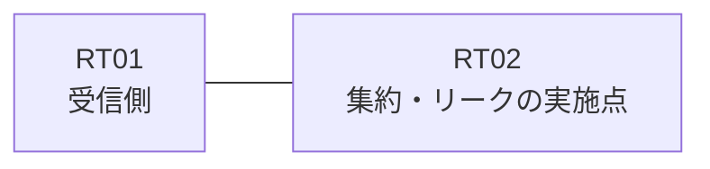

# 問題 20260815-010

> **本問は機器に接続せずに解答すること。追加の show 実行は認めない。**

## シナリオ

あなたの組織は、下記に示されているところのネットワークを運用しています。拠点のルータ RT02 は、複数のループバック インターフェイスによって、サービスのためのアドレスのブロック 10.142.157.4/30 を収容しています。RT02 と RT01 は、1本のリンクによって直接に接続されており、そして、EIGRP 12766 が構成されています。ユーザーから、通信に関する事象が、報告されています。示されているところの出力および構成に基づいて、要求されているところの動作が得られていない理由が、判断されなければなりません。運用のためのループバック 10.248.107.179 (/32) は、引き続き受信される必要があります。RT01 に対して、ブロック 10.142.157.4/30 は、集約のルートとして広告される必要があります。ただし、監視のためのホストである 10.142.157.7 (/32) の明細のルートは、集約とともに、受信されなければなりません。集約のルートおよび明細のルートは、いずれも、EIGRP の内部のルートとして受信されなければなりません。ルーティング・プロトコルの種別およびプロセスの配置は、変更されてはなりません。ブロックの内部の明細のルートは、広告されてはなりません。



| 対象 | 内容 |
|------|------|
| RT02 のループバック | 10.142.157.5, 10.142.157.6, 10.142.157.7 |
| RT02 の運用系ループバック | 10.248.107.179 |
| RT02 ⇔ RT01 のリンク | 10.119.67.0/24（RT02=10.119.67.1 / RT01=10.119.67.2・Ethernet0/0） |

## 出力

```
RT02# show running-config
Building configuration...
!
interface Loopback0
 ip address 10.142.157.5 255.255.255.255
interface Loopback1
 ip address 10.142.157.6 255.255.255.255
interface Loopback2
 ip address 10.142.157.7 255.255.255.255
interface Loopback10
 ip address 10.248.107.179 255.255.255.255
interface Ethernet0/0
 description === to RT01 ===
 ip address 10.119.67.1 255.255.255.252
 ip summary-address eigrp 12766 10.142.157.4 255.255.255.252 leak-map RM-LEAK
!
router eigrp 12766
 network 10.248.107.179 0.0.0.0
 network 10.119.67.0 0.0.0.3
 redistribute connected route-map RM-LEAK
!
ip prefix-list MON32 seq 5 permit 10.142.157.7/32
ip prefix-list PL-LEAK seq 5 permit 10.142.157.4/30 le 32
ip prefix-list PL01 seq 5 permit 10.142.157.5/32
access-list 10 permit 10.142.157.5
!
route-map MON-LEAK permit 10
 match ip address prefix-list PL-LEAK
route-map RM-LEAK permit 10
 match ip address prefix-list PL01
!
```
```
RT01# show ip route eigrp | begin Gateway
Gateway of last resort is not set
      10.0.0.0/8 is variably subnetted, 3 subnets, 2 masks
D        10.142.157.4/30 [90/409600] via 10.119.67.1, 00:01:16, Ethernet0/0
D EX     10.142.157.5/32 [170/409600] via 10.119.67.1, 00:01:16, Ethernet0/0
D        10.248.107.179/32 [90/409600] via 10.119.67.1, 00:01:16, Ethernet0/0
```

## 設問

次のうち、正しいものは、どれですか。

## 選択肢
A. distribute-list によって、当該のインターフェイスからの広告がフィルタされている

B. 再配布が参照しているところのリストにおいて、対象のループバックのアドレスが許可されていない

C. EIGRP のスタブ・ルーティングの構成によって、広告が制限されている

D. leak-map が参照しているところの名前のルート・マップが、定義されていない

E. ルート・マップの permit のエントリに、match のステートメントが存在しない

F. ルート・マップが参照しているところの名前のリストが、定義されていない
