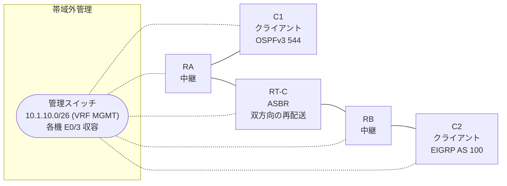

# 問題 20260815-011

> **本問は機器に接続せずに解答すること。追加の show 実行は認めない。**

## トポロジ

あなたは、下記のネットワークの保守を担当する技術者です。クライアントである C1 は OSPFv3 の ドメイン に、そして、C2 は EIGRP の ドメイン に、それぞれ収容されています。RT-C は、2 つの ドメイン の境界に位置しており、双方向の 再配送 が構成されています。



| ルータ | 位置づけ | 参加プロトコル |
|--------|----------|----------------|
| C1 | クライアント | OSPFv3 544 area 0 |
| RA | 中継 | OSPFv3 544 area 0 |
| RT-C | **ASBR(2 つの ドメイン の 境界)** | 双方向の 再配送 |
| RB | 中継 | EIGRP NAMED AS 100 |
| C2 | クライアント | EIGRP NAMED AS 100 |

リンク一覧:
```
  (a) C1:Et0/0         ── RA:Et0/1                  2001:DB8:1A:1C::/64   C1 = 2001:DB8:1A:1C::2
  (b) RA:Et0/0         ── RT-C:GigabitEthernet0/0   2001:DB8:1:1:C::/64
  (c) RT-C:Ethernet0/1 ── RB:Et0/0                  2001:DB8:AA:2::/64
  (d) RB:Et0/1         ── C2:Et0/0                  2001:DB8:1:1C::/64    C2 = 2001:DB8:1:1C::2
```

OSPFv3 の ドメイン には、RA によって注入されたところの 外部の ルート `2001:DB8:1:1:1:1::/64` が存在する。

## 要件

1. C1 と C2 は、相互に 通信 できなければなりません。
2. EIGRP の ドメイン において、2001:DB8:1:1:C::/64 は、EIGRP の 内部の ルートとして受信されなければなりません。
3. 本作業は、日中の時間帯において実施されるという理由により、対象外であるところのデバイスに対する構成の変更は、許可されていません。

## 現在の状態

ユーザーから、通信に関する事象が、報告されています。示されているところの出力および構成に基づいて、要求されているところの動作が得られていない理由が、判断されなければなりません。

```
C1# show ipv6 route ospf | include ^O|via
OE2 2001:DB8:1:1:1:1::/64 [110/20]
     via FE80::A8BB:CCFF:FE01:8B00, Ethernet0/0
OE2 2001:DB8:1:1C::/64 [110/20]
     via FE80::A8BB:CCFF:FE01:8B00, Ethernet0/0
OE2 2001:DB8:AA:2::/64 [110/20]
     via FE80::A8BB:CCFF:FE01:8B00, Ethernet0/0
```
```
RB# show ipv6 route eigrp | include ^D|^EX|via
(no entries)
```
```
C1# ping 2001:DB8:1:1C::2
Type escape sequence to abort.
Sending 5, 100-byte ICMP Echos to 2001:DB8:1:1C::2, timeout is 2 seconds:
.....
Success rate is 0 percent (0/5)

C2# ping 2001:DB8:1A:1C::2
Type escape sequence to abort.
Sending 5, 100-byte ICMP Echos to 2001:DB8:1A:1C::2, timeout is 2 seconds:

% No valid route for destination
Success rate is 0 percent (0/1)
```

## 設定抜粋

```
RT-C# show running-config
Building configuration...
!
interface GigabitEthernet0/0
 description === to RA ===
 no ip address
 ipv6 address 2001:DB8:1:1:C::1/64
 ipv6 enable
 ipv6 ospf 544 area 0
!
interface Ethernet0/1
 description === to RB ===
 no ip address
 ipv6 address 2001:DB8:AA:2::1/64
 ipv6 enable
!
router eigrp NAMED
 !
 address-family ipv6 unicast autonomous-system 100
  !
  af-interface GigabitEthernet0/0
   shutdown
  exit-af-interface
  !
  topology base
   redistribute ospf 544 match internal route-map RM-OSPF include-connected
  exit-af-topology
  eigrp router-id 9.9.4.7
 exit-address-family
!
router ospfv3 544
 router-id 7.7.9.2
 !
 address-family ipv6 unicast
  redistribute eigrp 100 route-map REDIST-MAP include-connected
 exit-address-family
!
ipv6 prefix-list O544 seq 5 permit 2001:DB8:1A:1C::/64
ipv6 prefix-list O544 seq 10 permit 2001:DB8:1:1C::/64
ipv6 prefix-list PL-CORE seq 5 permit ::/0 le 64
ipv6 prefix-list PL-EIGRP seq 5 permit 2001:DB8:AA:2::/64
ipv6 prefix-list PL-EIGRP seq 10 permit 2001:DB8:1:1C::/64
ipv6 prefix-list PL-REDIST seq 5 permit 2001:DB8:1:1:C::/64
ipv6 prefix-list PL-REDIST seq 10 permit 2001:DB8:1A:1C::/64
!
route-map MAP-IN permit 10
 match ipv6 address prefix-list PL-CORE
route-map REDIST-MAP permit 10
 match ipv6 address prefix-list PL-EIGRP
route-map RM-OSPF permit 10
 match ipv6 address prefix-list PL-REDIST
!
```

## 設問

次のうち、正しいものは、どれですか。

## 選択肢
**A.**
```
no ipv6 prefix-list PL-EIGRP
no ipv6 prefix-list PL-REDIST
```

**B.**
```
router eigrp NAMED
 address-family ipv6 unicast autonomous-system 100
  af-interface GigabitEthernet0/0
   no shutdown
  exit-af-interface
  topology base
   no redistribute ospf 544
   redistribute ospf 544 match internal metric 1000 10 255 1 1500 route-map RM-OSPF include-connected
  exit-af-topology
 exit-address-family
exit
```

**C.**
```
no ipv6 prefix-list PL-EIGRP
ipv6 prefix-list PL-EIGRP seq 5 permit 2001:DB8:1:1C::/64
no ipv6 prefix-list PL-REDIST
ipv6 prefix-list PL-REDIST seq 5 permit 2001:DB8:1A:1C::/64
router eigrp NAMED
 address-family ipv6 unicast autonomous-system 100
  topology base
   no redistribute ospf 544
   redistribute ospf 544 match internal metric 1000 10 255 1 1500 route-map RM-OSPF include-connected
  exit-af-topology
 exit-address-family
exit
```

**D.**
```
router eigrp NAMED
 address-family ipv6 unicast autonomous-system 100
  topology base
   no redistribute ospf 544
   redistribute ospf 544 match internal include-connected
  exit-af-topology
 exit-address-family
exit
router ospfv3 544
 address-family ipv6 unicast
  no redistribute eigrp 100
  redistribute eigrp 100 include-connected
 exit-address-family
exit
```

**E.**
```
router eigrp NAMED
 address-family ipv6 unicast autonomous-system 100
  topology base
   no redistribute ospf 544
   redistribute ospf 544 match internal metric 1000 10 255 1 1500 include-connected
  exit-af-topology
 exit-address-family
exit
router ospfv3 544
 address-family ipv6 unicast
  no redistribute eigrp 100
  redistribute eigrp 100 include-connected
 exit-address-family
exit
```
