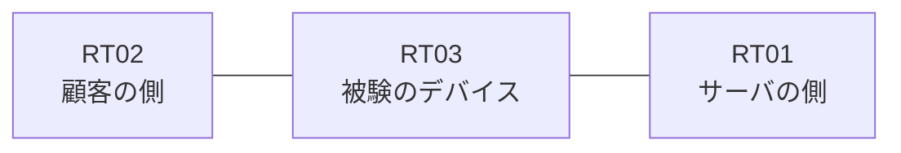

# 問題 20260815-013

> **本問は機器に接続せずに解答すること。追加の show 実行は認めない。**

## シナリオ

あなたは、ネットワークの運用を担当しています。ある企業のネットワークにおいて、RT03 は、顧客の側のネットワークと、サーバの側のネットワークとの間に配置されており、IPv6 によって運用されています。一部の通信が、意図されているとおりに動作していない、という報告があります。あなたは、示されているところの出力および構成に基づいて、その構成が、下記において記述されているとおりに動作していない理由を、判断する必要があります。RT03 において、`2001:DB8:4F:18::/64`、`2001:DB8:4F:19::/64`、`2001:DB8:4F:1A::/64` のネットワークからの通信のみが、`2001:DB8:4F:FF::10` の TCP ポート 22 に到達できなければなりません。`2001:DB8:4F:1B::/64` からの通信は、許可されることはできません。対象としていないネットワークが、一致の対象に含まれてはなりません。また、拒否のエントリを使用してはなりません。`2001:DB8:4F:1D::/64` からの通信は、許可されることはできません。ルーティング プロトコルの種別およびプロセスの配置は、変更されてはなりません。



## 出力

観測 | サーバへの到達
--- | ---
送信元が 2001:DB8:4F:18::/64 のネットワークにあるホストから、2001:DB8:4F:FF::10 の TCP ポート 22 宛ての通信 | 到達可
送信元が 2001:DB8:4F:19::/64 のネットワークにあるホストから、2001:DB8:4F:FF::10 の TCP ポート 22 宛ての通信 | 到達可
送信元が 2001:DB8:4F:1A::/64 のネットワークにあるホストから、2001:DB8:4F:FF::10 の TCP ポート 22 宛ての通信 | 到達可
送信元が 2001:DB8:4F:1B::/64 のネットワークにあるホストから、2001:DB8:4F:FF::10 の TCP ポート 22 宛ての通信 | 到達可
送信元が 2001:DB8:4F:1D::/64 のネットワークにあるホストから、2001:DB8:4F:FF::10 の TCP ポート 22 宛ての通信 | 到達可
送信元が 2001:DB8:4F:FA::/64 のネットワークにあるホストから、2001:DB8:4F:FF::10 の TCP ポート 22 宛ての通信 | 到達不可

```
RT03# show ipv6 neighbors
IPv6 Address                              Age Link-layer Addr State Interface
2001:DB8:4F:18::3                           0 aabb.cc02.4f00  REACH Et0/0
```
```
RT03# show ipv6 access-list
IPv6 access list V6-CUST-IN
    permit ipv6 2001:DB8:4F:18::/61 any sequence 10
```
```
RT03# show running-config | section ipv6 access-list|traffic-filter
ipv6 access-list V6-CUST-IN
 sequence 10 permit ipv6 2001:DB8:4F:18::/61 any
interface Ethernet0/0
 ipv6 traffic-filter V6-CUST-IN in
```

## 設問

次のうち、正しいものは、どれですか。

## 選択肢
A. プレフィックスの長さが短く、対象としていないネットワークまでが一致の対象に含まれている

B. 先行するエントリが広い範囲を許可しており、後続のエントリが評価されない

C. プレフィックスの長さが長く、対象としているネットワークの一部が一致の対象から外れている

D. 末尾に明示の拒否のエントリが記述されているため、近隣探索に対する暗黙の許可が失われ、隣接のアドレスが解決できていない

E. アクセス・リストが `ip access-group` によって適用されている

F. インターフェイスにおいて IPv6 が有効にされていない
