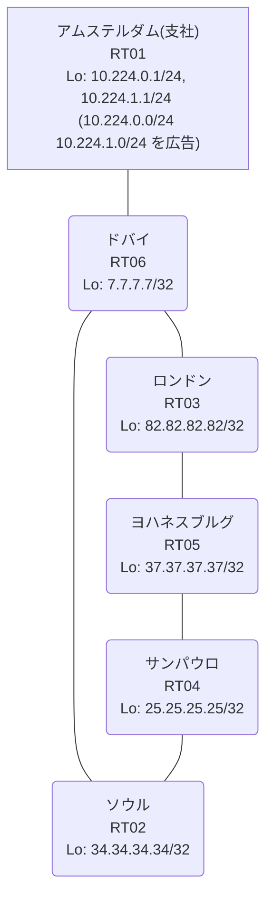

# 問題 20260815-016

> **本問は機器に接続せずに解答すること。追加の show 実行は認めない。**

## トポロジ

あなたの組織は、下記に示されているところのネットワークを運用しています。あなたの会社のネットワークは、支社のドメインと、本社のコアのドメイン(OSPF)とが、2 台の境界のルーターによって接続され、そして、それらは境界において接続されています。支社のネットワーク `10.224.0.0/24` および `10.224.1.0/24` は、RT01 によって、広告されています。どちらの境界が失われた場合においても、通信が継続されることができるように、設計されています。ルーティングの設計の詳細は、示されているところの出力から、読み取られることが、期待されています。



| 拠点 | ルータ | Loopback / 広告網 |
|------|--------|--------------------|
| アムステルダム(支社) | RT01 | 10.224.0.1/24, 10.224.1.1/24 (`10.224.0.0/24` `10.224.1.0/24` を広告) |
| サンパウロ | RT04 | 25.25.25.25/32 |
| ソウル | RT02 | 34.34.34.34/32 |
| ドバイ | RT06 | 7.7.7.7/32 |
| ヨハネスブルグ | RT05 | 37.37.37.37/32 |
| ロンドン | RT03 | 82.82.82.82/32 |

リンク一覧:
```
  RT01:E0/0(.2) ── RT06:E0/0(.1)   10.99.188.0/30
  RT06:E0/1(.1) ── RT03:E0/0(.2)   10.115.152.0/30
  RT06:E0/2(.1) ── RT02:E0/0(.2)   10.158.21.0/30
  RT03:E0/1(.1) ── RT05:E0/0(.2)   172.16.116.0/30
  RT05:E0/1(.1) ── RT04:E0/0(.2)   172.16.97.0/30
  RT02:E0/1(.1) ── RT04:E0/1(.2)   172.16.110.0/30
```

## 要件

1. 二点相互再配送による、冗長の設計が、維持される必要があります。
2. 経路は、最短の転送パスを取ること。
3. すべてのサイトから、支社のネットワーク `10.224.0.0/24` および `10.224.1.0/24` を含むところの、すべての宛先へ、到達することができること。
4. 本作業は、日中の時間帯において実施されるという理由により、対象外であるところのデバイスに対する構成の変更は、許可されていません。
5. 支社のネットワーク宛のトラフィックが RT01 へ配送され、経路の周回が、発生していないこと。
6. ルーティング プロトコルの種別およびプロセスの配置は、変更されてはなりません。
7. スタティック・ルートおよび既定のルートによる迂回は、実施されてはなりません。
8. フィルタおよび route-map の新設は、変更の凍結により、使用することができません。

## 現在の状態

通信の一部において、想定されていない挙動が、観測されています。あなたは、示されているところの出力および構成に基づいて、その構成が、下記において記述されているとおりに動作していない理由を、判断する必要があります。

```
RT03# show ip route 10.224.0.0
Routing entry for 10.224.0.0/24
  Known via "rip", distance 120, metric 2
  Redistributing via ospf 1, rip
  Advertised by ospf 1 subnets route-map RIP2OSPF
  Last update from 10.115.152.1 on Ethernet0/0, 00:00:27 ago
  Routing Descriptor Blocks:
  * 10.115.152.1, from 10.115.152.1, 00:00:27 ago, via Ethernet0/0
      Route metric is 2, traffic share count is 1
```
```
RT06# show ip route 37.37.37.37
Routing entry for 37.37.37.37/32
  Known via "rip", distance 120, metric 5
  Tag 50
  Redistributing via rip
  Last update from 10.158.21.2 on Ethernet0/2, 00:00:15 ago
  Routing Descriptor Blocks:
  * 10.158.21.2, from 10.158.21.2, 00:00:15 ago, via Ethernet0/2
      Route metric is 5, traffic share count is 1
      Route tag 50
    10.115.152.2, from 10.115.152.2, 00:00:17 ago, via Ethernet0/1
      Route metric is 5, traffic share count is 1
      Route tag 50
```
```
RT02# show ip route
Gateway of last resort is not set
      7.0.0.0/32 is subnetted, 1 subnets
O E2     7.7.7.7 [110/20] via 172.16.110.2, 00:03:57, Ethernet0/1
      10.0.0.0/8 is variably subnetted, 6 subnets, 3 masks
O E2     10.99.188.0/30 [110/20] via 172.16.110.2, 00:03:57, Ethernet0/1
O E2     10.115.152.0/30 [110/20] via 172.16.110.2, 00:03:57, Ethernet0/1
C        10.158.21.0/30 is directly connected, Ethernet0/0
L        10.158.21.2/32 is directly connected, Ethernet0/0
O E2     10.224.0.0/24 [110/20] via 172.16.110.2, 00:03:57, Ethernet0/1
O E2     10.224.1.0/24 [110/20] via 172.16.110.2, 00:03:57, Ethernet0/1
      25.0.0.0/32 is subnetted, 1 subnets
O        25.25.25.25 [110/11] via 172.16.110.2, 00:04:09, Ethernet0/1
      34.0.0.0/32 is subnetted, 1 subnets
C        34.34.34.34 is directly connected, Loopback0
      37.0.0.0/32 is subnetted, 1 subnets
O        37.37.37.37 [110/21] via 172.16.110.2, 00:04:07, Ethernet0/1
      82.0.0.0/32 is subnetted, 1 subnets
O        82.82.82.82 [110/31] via 172.16.110.2, 00:03:57, Ethernet0/1
      172.16.0.0/16 is variably subnetted, 4 subnets, 2 masks
O        172.16.97.0/30 [110/20] via 172.16.110.2, 00:04:08, Ethernet0/1
C        172.16.110.0/30 is directly connected, Ethernet0/1
L        172.16.110.1/32 is directly connected, Ethernet0/1
O        172.16.116.0/30 [110/30] via 172.16.110.2, 00:04:05, Ethernet0/1
```
```
RT02# traceroute 10.224.0.1 probe 1 timeout 1 ttl 1 8
Type escape sequence to abort.
Tracing the route to 10.224.0.1
VRF info: (vrf in name/id, vrf out name/id)
  1 172.16.110.2 1 msec
  2 172.16.97.1 2 msec
  3 172.16.116.1 1 msec
  4 10.115.152.1 10 msec
  5 10.99.188.2 4 msec
```

## 設定抜粋

```
RT03# show running-config | section router
router ospf 1
 router-id 82.82.82.82
 redistribute rip route-map RIP2OSPF
 network 82.82.82.82 0.0.0.0 area 0
 network 172.16.116.0 0.0.0.3 area 0
 distance ospf external 180
router rip
 version 2
 redistribute ospf 1 metric 5 route-map OSPF2RIP
 network 10.0.0.0
 network 82.0.0.0
 no auto-summary
```

## 設問

次のうち、正しいものは、どれですか。

## 選択肢
**A.**
```
! RT05 と RT04 に投入
router ospf 1
 distance ospf external 180
```

**B.**
```
! RT02 に投入
route-map OSPF2RIP deny 10
 match tag 220
```

**C.**
```
! RT03 に投入
router ospf 1
 no distance ospf external 180
```

**D.**
```
! RT02 に投入
router ospf 1
 no redistribute rip
```

**E.**
```
! RT02 にのみ投入
router ospf 1
 distance ospf external 180
```

**F.**
```
clear ip ospf process
```
