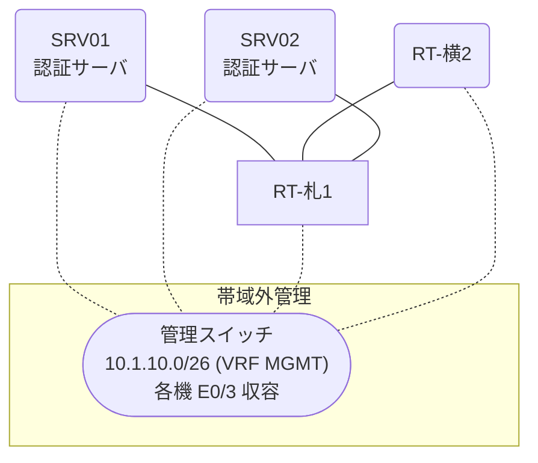

# 問題 20260815-017

> **本問は機器に接続せずに解答すること。追加の show 実行は認めない。**

## トポロジ

あなたの組織は、下記に示されているところのネットワークを運用しています。2 つの拠点のルータが、共通の認証サーバ群を用いて、管理者の認証を行うように構成されています。一方のルータはサーバと直結しており、他方はそのルーターを経由してサーバに到達します。



### 認証サーバの仕様

| 項目 | SRV01 | SRV02 |
|---|---|---|
| アドレス | 10.99.70.2 | 10.99.71.2 |
| 待受ポート | 1812 / 1813 | 1912 / 1913 |
| 共有鍵 | Rad-8102 | Rad-8102 |
| 受理する送信元 | 10.6.0.1 ・ 10.1.0.2 | 同左 |
| 台帳 | noc-taro(15) ・ monitor-op(1) ・ SUZUKI(15) | 同左 |
| 現在の稼働状態 | 保守作業のため停止中 | 稼働中 |

### ルータのアドレス

| ルータ | Loopback0 | 認証サーバ方向のインタフェース |
|---|---|---|
| RT-札1(札幌) | 10.6.0.1 | Ethernet0/0 = 10.99.70.1 |
| RT-横2(横浜) | 10.1.0.2 | Ethernet0/0 = 10.61.12.2 |

## 要件

1. 札幌・横浜 の両拠点で、利用者 noc-taro が権限レベル 15 で機器を操作できること。
2. 認証は認証サーバ群 RADGRP を用いること。
3. 認証サーバ側の設定は変更できない。

## 現在の状態

通信の一部において、想定されていない挙動が、観測されています。示されているところの出力および構成に基づいて、要求されているところの動作が得られていない理由が、判断されなければなりません。

| 拠点 | ユーザ | 結果 |
|---|---|---|
| 札幌 | noc-taro | ログイン不可 |
| 札幌 | monitor-op | ログイン不可 |
| 札幌 | local-admin | ログイン可(権限レベル 15) |
| 札幌 | noc-taro(6 セッション目以降) | ログイン不可 |
| 札幌 | local-admin(コンソールから) | ログイン可(権限レベル 15) |
| 札幌 | noc-taro(ログインに要する時間) | 1 回目 約 8 秒 / 2 回目以降 即時 |
| 横浜 | noc-taro | ログイン可(権限レベル 15) |
| 横浜 | monitor-op | ログイン可(権限レベル 1) |
| 横浜 | local-admin | ログイン不可 |
| 横浜 | monitor-op からの特権昇格 | 昇格可(15) |
| 横浜 | noc-taro(6 セッション目以降) | ログイン可(権限レベル 15) |
| 横浜 | local-admin(コンソールから) | ログイン可(権限レベル 15) |
| 横浜 | noc-taro(ログインに要する時間) | 1 回目 約 4 秒 / 2 回目以降 即時 |

認証サーバがすべて停止した場合:

| 拠点 | ユーザ | 結果 |
|---|---|---|
| 札幌 | local-admin | ログイン可(権限レベル 15) |
| 札幌 | SUZUKI | ログイン可(権限レベル 15) |
| 札幌 | local-admin(コンソールから) | ログイン可(権限レベル 15) |
| 横浜 | local-admin | ログイン可(権限レベル 15) |
| 横浜 | SUZUKI | ログイン可(権限レベル 15) |
| 横浜 | local-admin(コンソールから) | ログイン可(権限レベル 15) |

```
札幌: No authoritative response from any server. (1 回目 約 8 秒 / 2 回目以降 即時)
横浜: User was successfully authenticated. (1 回目 約 4 秒 / 2 回目以降 即時)
```

## 設定抜粋

```
RT-札1# show running-config | section aaa
aaa new-model
!
radius server RAD1
 address ipv4 10.99.70.2 auth-port 1812 acct-port 1813
 key Rad-8102
!
radius server RAD2
 address ipv4 10.99.71.2 auth-port 1912 acct-port 1913
 key Rad-8102
!
aaa group server radius RADGRP
 server name RAD1
 server name RAD2
 deadtime 5
!
aaa authentication login default group RADGRP local
aaa authentication login CONSOLE local
aaa authorization exec default group RADGRP local
aaa authorization exec CONSOLE local
aaa authorization console
!
ip radius source-interface Loopback0
radius-server timeout 2
radius-server retransmit 1
radius-server dead-criteria time 2 tries 1
!
username local-admin privilege 15 secret 5 $1$xxxx
username SUZUKI privilege 15 secret 5 $1$yyyy
!
ip access-list extended UPLINK-ACL
 deny   udp any eq 1812 any
 deny   udp any eq 1912 any
 permit ip any any
!
interface Ethernet0/0
 ip access-group UPLINK-ACL in
!
line con 0
 exec-timeout 0 0
 logging synchronous
 login authentication CONSOLE
 authorization exec CONSOLE
line vty 0 4
 exec-timeout 0 0
 transport input ssh
line vty 5 15
 exec-timeout 0 0
 transport input ssh
```
```
RT-横2# show running-config | section aaa
aaa new-model
!
radius server RAD1
 address ipv4 10.99.70.2 auth-port 1812 acct-port 1813
 key Rad-8102
!
radius server RAD2
 address ipv4 10.99.71.2 auth-port 1912 acct-port 1913
 key Rad-8102
!
aaa group server radius RADGRP
 server name RAD1
 server name RAD2
 deadtime 5
!
aaa authentication login default group RADGRP local
aaa authentication login CONSOLE local
aaa authorization exec default group RADGRP local
aaa authorization exec CONSOLE local
aaa authorization console
!
ip radius source-interface Loopback0
radius-server timeout 2
radius-server retransmit 1
radius-server dead-criteria time 2 tries 1
!
username local-admin privilege 15 secret 5 $1$xxxx
username SUZUKI privilege 15 secret 5 $1$yyyy
!
line con 0
 exec-timeout 0 0
 logging synchronous
 login authentication CONSOLE
 authorization exec CONSOLE
line vty 0 4
 exec-timeout 0 0
 transport input ssh
line vty 5 15
 exec-timeout 0 0
 transport input ssh
```

## 設問

次のうち、正しいものは、どれですか。

## 選択肢
A. コンソール回線に対する認可が有効化されていない。

B. アクセスリストが、認証サーバからの応答を遮断している。

C. 認証サーバの利用者台帳に当該利用者が登録されていない。

D. 作成した方式リストが回線に適用されていない。
