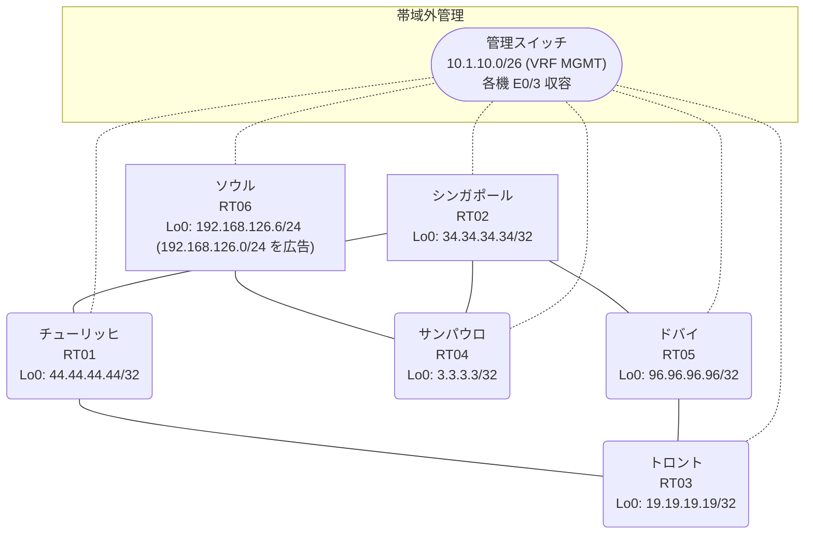

# 問題 20260815-018

> **本問は機器に接続せずに解答すること。追加の show 実行は認めない。**

## シナリオ

あなたは、下記のネットワークの保守を担当する技術者です。あなたの会社のネットワークは、OSPF のドメインと EIGRP のドメインとが、2 つの境界のルータによって接続され、そして、それらは境界において接続されています。顧客のネットワーク `192.168.126.0/24` は、ソウル のサイトにおいて、別のルーティング プロトコルによって学習され、そして、再配送によって、社内へ持ち込まれています。ルーティングの設計の詳細は、示されているところのコンフィギュレーションから、読み取られることが、期待されています。複数のサイトから、`192.168.126.0/24` 宛の通信が、タイムアウトする、ということが、報告されています。サイトの間の通信は、正常です。これは、意図された動作ではありません。示されているところの出力を、参照してください。すべてのサイトから、`192.168.126.0/24` を含むところのすべての宛先へ、到達することができること。フィルタの新設は、変更の凍結により、使用することができません。是正は、管理距離の調整のみによって、実装されなければなりません。スタティック・ルートおよび既定のルートによる迂回は、実施されることはできません。管理のための構成に対して、変更が加えられてはなりません。既存の相互再配送の設計が、削除または停止されてはなりません。`192.168.126.0/24` 宛のトラフィックが RT06 へ配送され、経路の周回が、発生していないこと。



| 拠点 | ルータ | 拠点網 / 広告網 |
|------|--------|------------------|
| サンパウロ | RT04 | 3.3.3.3/32 |
| シンガポール | RT02 | 34.34.34.34/32 |
| ソウル | RT06 | 192.168.126.6/24 (`192.168.126.0/24` を広告) |
| チューリッヒ | RT01 | 44.44.44.44/32 |
| トロント | RT03 | 19.19.19.19/32 |
| ドバイ | RT05 | 96.96.96.96/32 |

リンク一覧:
```
  RT03:E0/0(.1) ── RT05:E0/0(.2)   172.16.90.0/24
  RT03:E0/1(.1) ── RT01:E0/0(.3)   172.16.67.0/24
  RT05:E0/1(.2) ── RT02:E0/0(.4)   172.16.37.0/24
  RT01:E0/1(.3) ── RT02:E0/1(.4)   172.16.135.0/24
  RT02:E0/2(.4) ── RT04:E0/0(.5)   172.16.36.0/24
  RT04:E0/1(.5) ── RT06:E0/0(.6)   172.16.39.0/24
```

## 出力

```
RT02# show ip route
Gateway of last resort is not set
      3.0.0.0/32 is subnetted, 1 subnets
D        3.3.3.3 [90/409600] via 172.16.36.5, 00:04:55, Ethernet0/2
      19.0.0.0/32 is subnetted, 1 subnets
D EX     19.19.19.19 [170/281856] via 172.16.135.3, 00:04:10, Ethernet0/1
                     [170/281856] via 172.16.37.2, 00:04:10, Ethernet0/0
      34.0.0.0/32 is subnetted, 1 subnets
C        34.34.34.34 is directly connected, Loopback0
      44.0.0.0/32 is subnetted, 1 subnets
D EX     44.44.44.44 [170/281856] via 172.16.135.3, 00:04:10, Ethernet0/1
                     [170/281856] via 172.16.37.2, 00:04:10, Ethernet0/0
      96.0.0.0/32 is subnetted, 1 subnets
D EX     96.96.96.96 [170/281856] via 172.16.135.3, 00:04:09, Ethernet0/1
                     [170/281856] via 172.16.37.2, 00:04:09, Ethernet0/0
      172.16.0.0/16 is variably subnetted, 9 subnets, 2 masks
C        172.16.36.0/24 is directly connected, Ethernet0/2
L        172.16.36.4/32 is directly connected, Ethernet0/2
C        172.16.37.0/24 is directly connected, Ethernet0/0
L        172.16.37.4/32 is directly connected, Ethernet0/0
D        172.16.39.0/24 [90/307200] via 172.16.36.5, 00:04:55, Ethernet0/2
D EX     172.16.67.0/24 [170/281856] via 172.16.135.3, 00:04:10, Ethernet0/1
                        [170/281856] via 172.16.37.2, 00:04:10, Ethernet0/0
D EX     172.16.90.0/24 [170/281856] via 172.16.135.3, 00:04:12, Ethernet0/1
                        [170/281856] via 172.16.37.2, 00:04:12, Ethernet0/0
C        172.16.135.0/24 is directly connected, Ethernet0/1
L        172.16.135.4/32 is directly connected, Ethernet0/1
D EX  192.168.126.0/24 [170/281856] via 172.16.37.2, 00:04:10, Ethernet0/0
```
```
RT02# show ip eigrp topology 192.168.126.0 255.255.255.0
EIGRP-IPv4 Topology Entry for AS(41)/ID(34.34.34.34) for 192.168.126.0/24
  State is Passive, Query origin flag is 1, 1 Successor(s), FD is 281856
  Descriptor Blocks:
  172.16.37.2 (Ethernet0/0), from 172.16.37.2, Send flag is 0x0
      Composite metric is (281856/2816), route is External
      Vector metric:
        Minimum bandwidth is 10000 Kbit
        Total delay is 1010 microseconds
        Reliability is 255/255
        Load is 1/255
        Minimum MTU is 1500
        Hop count is 1
        Originating router is 96.96.96.96
      External data:
        AS number of route is 63
        External protocol is OSPF, external metric is 20
        Administrator tag is 0 (0x00000000)
  172.16.36.5 (Ethernet0/2), from 172.16.36.5, Send flag is 0x0
      Composite metric is (307456/281856), route is External
      Vector metric:
        Minimum bandwidth is 10000 Kbit
        Total delay is 2010 microseconds
        Reliability is 255/255
        Load is 1/255
        Minimum MTU is 1500
        Hop count is 2
        Originating router is 192.168.126.6
      External data:
        AS number of route is 0
        External protocol is RIP, external metric is 0
        Administrator tag is 0 (0x00000000)
```
```
RT04# show ip route
Gateway of last resort is not set
      3.0.0.0/32 is subnetted, 1 subnets
C        3.3.3.3 is directly connected, Loopback0
      19.0.0.0/32 is subnetted, 1 subnets
D EX     19.19.19.19 [170/307456] via 172.16.36.4, 00:04:27, Ethernet0/0
      34.0.0.0/32 is subnetted, 1 subnets
D        34.34.34.34 [90/409600] via 172.16.36.4, 00:05:16, Ethernet0/0
      44.0.0.0/32 is subnetted, 1 subnets
D EX     44.44.44.44 [170/307456] via 172.16.36.4, 00:04:27, Ethernet0/0
      96.0.0.0/32 is subnetted, 1 subnets
D EX     96.96.96.96 [170/307456] via 172.16.36.4, 00:05:02, Ethernet0/0
      172.16.0.0/16 is variably subnetted, 8 subnets, 2 masks
C        172.16.36.0/24 is directly connected, Ethernet0/0
L        172.16.36.5/32 is directly connected, Ethernet0/0
D        172.16.37.0/24 [90/307200] via 172.16.36.4, 00:05:16, Ethernet0/0
C        172.16.39.0/24 is directly connected, Ethernet0/1
L        172.16.39.5/32 is directly connected, Ethernet0/1
D EX     172.16.67.0/24 [170/307456] via 172.16.36.4, 00:04:27, Ethernet0/0
D EX     172.16.90.0/24 [170/307456] via 172.16.36.4, 00:05:02, Ethernet0/0
D        172.16.135.0/24 [90/307200] via 172.16.36.4, 00:05:16, Ethernet0/0
D EX  192.168.126.0/24 [170/281856] via 172.16.39.6, 00:04:27, Ethernet0/1
```
```
RT03# show ip route
Gateway of last resort is not set
      3.0.0.0/32 is subnetted, 1 subnets
O E2     3.3.3.3 [110/20] via 172.16.90.2, 00:04:45, Ethernet0/0
                 [110/20] via 172.16.67.3, 00:04:47, Ethernet0/1
      19.0.0.0/32 is subnetted, 1 subnets
C        19.19.19.19 is directly connected, Loopback0
      34.0.0.0/32 is subnetted, 1 subnets
O E2     34.34.34.34 [110/20] via 172.16.90.2, 00:04:45, Ethernet0/0
                     [110/20] via 172.16.67.3, 00:04:47, Ethernet0/1
      44.0.0.0/32 is subnetted, 1 subnets
O        44.44.44.44 [110/11] via 172.16.67.3, 00:04:47, Ethernet0/1
      96.0.0.0/32 is subnetted, 1 subnets
O        96.96.96.96 [110/11] via 172.16.90.2, 00:04:45, Ethernet0/0
      172.16.0.0/16 is variably subnetted, 8 subnets, 2 masks
O E2     172.16.36.0/24 [110/20] via 172.16.90.2, 00:04:45, Ethernet0/0
                        [110/20] via 172.16.67.3, 00:04:47, Ethernet0/1
O E2     172.16.37.0/24 [110/20] via 172.16.90.2, 00:04:45, Ethernet0/0
                        [110/20] via 172.16.67.3, 00:04:47, Ethernet0/1
O E2     172.16.39.0/24 [110/20] via 172.16.90.2, 00:04:45, Ethernet0/0
                        [110/20] via 172.16.67.3, 00:04:47, Ethernet0/1
C        172.16.67.0/24 is directly connected, Ethernet0/1
L        172.16.67.1/32 is directly connected, Ethernet0/1
C        172.16.90.0/24 is directly connected, Ethernet0/0
L        172.16.90.1/32 is directly connected, Ethernet0/0
O E2     172.16.135.0/24 [110/20] via 172.16.90.2, 00:04:45, Ethernet0/0
                         [110/20] via 172.16.67.3, 00:04:47, Ethernet0/1
O E2  192.168.126.0/24 [110/20] via 172.16.67.3, 00:04:47, Ethernet0/1
```
```
RT02# show ip protocols | include Routing Protocol|Distance
Routing Protocol is "application"
    Gateway         Distance      Last Update
  Distance: (default is 4)
Routing Protocol is "eigrp 41"
      Distance: internal 90 external 170
    Gateway         Distance      Last Update
  Distance: internal 90 external 170
```
```
RT03# traceroute 192.168.126.6 probe 1 timeout 1 ttl 1 8
Type escape sequence to abort.
Tracing the route to 192.168.126.6
VRF info: (vrf in name/id, vrf out name/id)
  1 172.16.67.3 1 msec
  2 172.16.135.4 2 msec
  3 172.16.37.2 1 msec
  4 172.16.90.1 1 msec
  5 172.16.67.3 2 msec
  6 172.16.135.4 1 msec
  7 172.16.37.2 2 msec
  8 172.16.90.1 1 msec
```
```
RT03# show running-config | section router
router ospf 63
 router-id 19.19.19.19
 network 19.19.19.19 0.0.0.0 area 0
 network 172.16.67.0 0.0.0.255 area 0
 network 172.16.90.0 0.0.0.255 area 0
```
```
RT05# show running-config | section router
router eigrp 41
 network 172.16.37.0 0.0.0.255
 redistribute ospf 63 metric 1000000 1 255 1 1500
router ospf 63
 router-id 96.96.96.96
 redistribute eigrp 41
 network 96.96.96.96 0.0.0.0 area 0
 network 172.16.90.0 0.0.0.255 area 0
```
```
RT01# show running-config | section router
router eigrp 41
 network 172.16.135.0 0.0.0.255
 redistribute ospf 63 metric 1000000 1 255 1 1500
router ospf 63
 router-id 44.44.44.44
 redistribute eigrp 41
 network 44.44.44.44 0.0.0.0 area 0
 network 172.16.67.0 0.0.0.255 area 0
```
```
RT02# show running-config | section router
router eigrp 41
 network 34.34.34.34 0.0.0.0
 network 172.16.36.0 0.0.0.255
 network 172.16.37.0 0.0.0.255
 network 172.16.135.0 0.0.0.255
```
```
RT04# show running-config | section router
router eigrp 41
 network 3.3.3.3 0.0.0.0
 network 172.16.36.0 0.0.0.255
 network 172.16.39.0 0.0.0.255
```
```
RT06# show running-config | section router
router eigrp 41
 network 172.16.39.0 0.0.0.255
 redistribute rip metric 1000000 1 255 1 1500
router rip
 version 2
 network 192.168.126.0
 no auto-summary
```

## 設問

この問題を解決し、そして、示されているところのすべての要件が満たされることを確実にするために、適用されなければならない構成の変更は、どれとどれですか。(2つを選択してください)

## 選択肢
A. RT02 で「clear ip route *」を実行する

B. RT06 の redistribute rip の seed metric を、より小さい値へ変更する

C. RT01 で、router ospf 63 配下に `distance ospf external 180` を設定する

D. RT05 で、EIGRP→OSPF 再配送で `set tag 311` を付与し、OSPF→EIGRP 再配送で `match tag 311` を deny する

E. RT05 で、router ospf 63 配下に `distance ospf external 180` を設定する

F. RT02 の router eigrp 41 配下に「distance eigrp 90 200」を設定する
