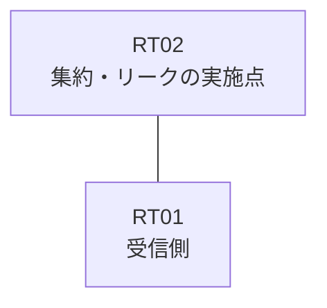

# 問題 20260816-001

> **本問は機器に接続せずに解答すること。追加の show 実行は認めない。**

## シナリオ

あなたは、ネットワークの運用を担当しています。拠点のルータ RT02 は、複数のループバック インターフェイスによって、サービスのためのアドレスのブロック 10.132.223.0/30 を収容しています。RT02 と RT01 は、1本のリンクによって直接に接続されており、そして、EIGRP 65100 が構成されています。いくつかの宛先への通信について、報告が上がっています。示されているところの出力および構成に基づいて、要求されているところの動作が得られていない理由が、判断されなければなりません。RT01 に対して、ブロック 10.132.223.0/30 は、集約のルートとして広告されなければなりません。インタフェースの IP アドレッシングは、変更されてはなりません。集約のルートおよび明細のルートは、いずれも、EIGRP の内部のルートとして受信される必要があります。運用のためのループバック 10.225.243.85 (/32) は、引き続き受信されなければなりません。ただし、監視のためのホストである 10.132.223.2 (/32) の明細のルートは、集約とともに、受信されなければなりません。ブロックの内部の明細のルートは、広告されてはなりません。



| 対象 | 内容 |
|------|------|
| RT02 のループバック | 10.132.223.1, 10.132.223.2, 10.132.223.3 |
| RT02 の運用系ループバック | 10.225.243.85 |
| RT02 ⇔ RT01 のリンク | 10.98.232.0/24（RT02=10.98.232.1 / RT01=10.98.232.2・GigabitEthernet0/1） |

## 出力

```
RT01# show ip route eigrp | begin Gateway
Gateway of last resort is not set
      10.0.0.0/8 is variably subnetted, 2 subnets, 2 masks
D        10.132.223.0/30 [90/409600] via 10.98.232.1, 00:20:22, GigabitEthernet0/1
D        10.225.243.85/32 [90/409600] via 10.98.232.1, 00:20:22, GigabitEthernet0/1
```
```
RT02# show running-config
Building configuration...
!
interface Loopback0
 ip address 10.132.223.1 255.255.255.255
interface Loopback1
 ip address 10.132.223.2 255.255.255.255
interface Loopback2
 ip address 10.132.223.3 255.255.255.255
interface Loopback10
 ip address 10.225.243.85 255.255.255.255
interface GigabitEthernet0/1
 description === to RT01 ===
 ip address 10.98.232.1 255.255.255.252
 ip summary-address eigrp 65100 10.132.223.0 255.255.255.252
!
router eigrp 65100
 network 10.132.223.1 0.0.0.0
 network 10.132.223.2 0.0.0.0
 network 10.132.223.3 0.0.0.0
 network 10.225.243.85 0.0.0.0
 network 10.98.232.0 0.0.0.3
!
ip prefix-list PL-LEAK seq 5 permit 10.132.223.2/32
ip prefix-list PL-MON seq 5 permit 10.132.223.0/30 le 32
ip prefix-list PL01 seq 5 permit 10.132.223.2/32
access-list 15 permit 10.132.223.3
!
route-map LEAK permit 10
 match ip address prefix-list PL-MON
route-map RMAP01 permit 10
 match ip address prefix-list PL01
!
```

## 設問

次のうち、正しいものは、どれですか。

## 選択肢
**A.**
```
ip prefix-list PL-CONN seq 5 permit 10.132.223.0/30 le 32
ip prefix-list PL-NEW seq 5 permit 10.132.223.2/32
route-map RM-CONN permit 10
 match ip address prefix-list PL-CONN
route-map RM-NEW permit 10
 match ip address prefix-list PL-NEW
router eigrp 65100
 no network 10.132.223.1 0.0.0.0
 no network 10.132.223.2 0.0.0.0
 no network 10.132.223.3 0.0.0.0
 redistribute connected route-map RM-CONN
interface GigabitEthernet0/1
 no ip summary-address eigrp 65100 10.132.223.0 255.255.255.252
 ip summary-address eigrp 65100 10.132.223.0 255.255.255.252 leak-map RM-NEW
```

**B.**
```
ip prefix-list PL-NEW seq 5 permit 10.132.223.2/32
ip prefix-list PL-NEW seq 10 permit 10.225.243.85/32
router eigrp 65100
 distribute-list prefix PL-NEW out GigabitEthernet0/1
interface GigabitEthernet0/1
 no ip summary-address eigrp 65100 10.132.223.0 255.255.255.252
```

**C.**
```
ip route 10.132.223.0 255.255.255.252 Null0
router eigrp 65100
 no network 10.132.223.1 0.0.0.0
 no network 10.132.223.3 0.0.0.0
 redistribute static
interface GigabitEthernet0/1
 no ip summary-address eigrp 65100 10.132.223.0 255.255.255.252
```

**D.**
```
interface GigabitEthernet0/1
 no ip summary-address eigrp 65100 10.132.223.0 255.255.255.252
 ip summary-address eigrp 65100 10.132.223.0 255.255.255.252
```

**E.**
```
ip prefix-list PL-NEW seq 5 permit 10.132.223.2/32
route-map RM-NEW permit 10
 match ip address prefix-list PL-NEW
interface GigabitEthernet0/1
 no ip summary-address eigrp 65100 10.132.223.0 255.255.255.252
 ip summary-address eigrp 65100 10.132.223.0 255.255.255.252 leak-map RM-NEW
```
