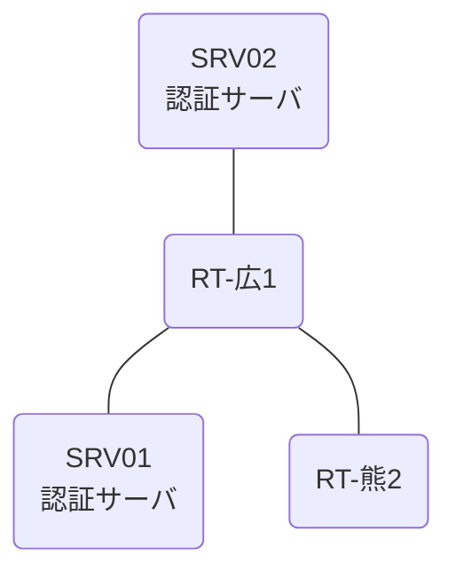

# 問題 20260816-002

> **本問は機器に接続せずに解答すること。追加の show 実行は認めない。**

## トポロジ

あなたは、下記のネットワークの保守を担当する技術者です。2 つの拠点のルータが、共通の認証サーバ群を用いて、管理者の認証を行うように構成されています。一方のルータはサーバと直結しており、他方はそのルーターを経由してサーバに到達します。



### 認証サーバの仕様

| 項目 | SRV01 | SRV02 |
|---|---|---|
| アドレス | 10.99.51.2 | 10.99.52.2 |
| 待受ポート | 1812 / 1813 | 1645 / 1646 |
| 共有鍵 | Rad-8102 | Rad-8102 |
| 受理する送信元 | 10.8.0.1 ・ 10.6.0.2 | 同左 |
| 台帳 | noc-taro(15) ・ helpdesk(1) ・ SUZUKI(15) | 同左 |
| 現在の稼働状態 | 稼働中 | 稼働中 |

### ルータのアドレス

| ルータ | Loopback0 | 認証サーバ方向のインタフェース |
|---|---|---|
| RT-広1(広島) | 10.8.0.1 | Ethernet0/0 = 10.99.51.1 |
| RT-熊2(熊本) | 10.6.0.2 | Ethernet0/0 = 10.45.12.2 |

## 要件

1. 広島・熊本 の両拠点で、利用者 noc-taro が権限レベル 15 で機器を操作できること。
2. 認証は認証サーバ群 AUTH-GRP を用いること。
3. 認証サーバ側の設定は変更できない。

## 現在の状態

ユーザーから、通信に関する事象が、報告されています。あなたは、提示されているところの情報のみを使用して、要求されている状態が満たされていない理由を、特定しなければなりません。

| 拠点 | ユーザ | 結果 |
|---|---|---|
| 広島 | noc-taro | ログイン可(権限レベル 15) |
| 広島 | helpdesk | ログイン可(権限レベル 1) |
| 広島 | emg-admin | ログイン不可 |
| 広島 | helpdesk からの特権昇格 | 昇格可(15) |
| 広島 | noc-taro(6 セッション目以降) | ログイン可(権限レベル 15) |
| 広島 | emg-admin(コンソールから) | ログイン可(権限レベル 15) |
| 広島 | noc-taro(ログインに要する時間) | 即時 |
| 熊本 | noc-taro | ログイン可(権限レベル 15) |
| 熊本 | helpdesk | ログイン可(権限レベル 1) |
| 熊本 | emg-admin | ログイン不可 |
| 熊本 | helpdesk からの特権昇格 | 昇格可(15) |
| 熊本 | noc-taro(6 セッション目以降) | ログイン可(権限レベル 15) |
| 熊本 | emg-admin(コンソールから) | ログイン可(権限レベル 15) |
| 熊本 | noc-taro(ログインに要する時間) | 即時 |

認証サーバがすべて停止した場合:

| 拠点 | ユーザ | 結果 |
|---|---|---|
| 広島 | emg-admin | ログイン可(権限レベル 15) |
| 広島 | SUZUKI | ログイン可(権限レベル 15) |
| 広島 | emg-admin(コンソールから) | ログイン可(権限レベル 15) |
| 熊本 | emg-admin | ログイン可(権限レベル 1) |
| 熊本 | SUZUKI | ログイン可(権限レベル 1) |
| 熊本 | emg-admin(コンソールから) | ログイン可(権限レベル 15) |

```
広島: User was successfully authenticated. (即時)
熊本: User was successfully authenticated. (即時)
```

## 設定抜粋

```
RT-広1# show running-config | section aaa
aaa new-model
!
radius server RAD1
 address ipv4 10.99.51.2 auth-port 1812 acct-port 1813
 key Rad-8102
!
radius server RAD2
 address ipv4 10.99.52.2 auth-port 1645 acct-port 1646
 key Rad-8102
!
aaa group server radius AUTH-GRP
 server name RAD1
 server name RAD2
 deadtime 5
!
aaa authentication login default group AUTH-GRP local
aaa authentication login CONSOLE local
aaa authorization exec default group AUTH-GRP local
aaa authorization exec CONSOLE local
aaa authorization console
!
ip radius source-interface Loopback0
radius-server timeout 5
radius-server retransmit 2
radius-server dead-criteria time 5 tries 1
!
username emg-admin privilege 15 secret 5 $1$xxxx
username SUZUKI privilege 15 secret 5 $1$yyyy
!
line con 0
 exec-timeout 0 0
 logging synchronous
 login authentication CONSOLE
 authorization exec CONSOLE
line vty 0 4
 exec-timeout 0 0
 transport input ssh
line vty 5 15
 exec-timeout 0 0
 transport input ssh
```
```
RT-熊2# show running-config | section aaa
aaa new-model
!
radius server RAD1
 address ipv4 10.99.51.2 auth-port 1812 acct-port 1813
 key Rad-8102
!
radius server RAD2
 address ipv4 10.99.52.2 auth-port 1645 acct-port 1646
 key Rad-8102
!
aaa group server radius AUTH-GRP
 server name RAD1
 server name RAD2
 deadtime 5
!
aaa authentication login default group AUTH-GRP local
aaa authentication login CONSOLE local
aaa authorization exec default group AUTH-GRP if-authenticated
aaa authorization exec CONSOLE local
aaa authorization console
!
ip radius source-interface Loopback0
radius-server timeout 5
radius-server retransmit 2
radius-server dead-criteria time 5 tries 1
!
username emg-admin privilege 15 secret 5 $1$xxxx
username SUZUKI privilege 15 secret 5 $1$yyyy
!
line con 0
 exec-timeout 0 0
 logging synchronous
 login authentication CONSOLE
 authorization exec CONSOLE
line vty 0 4
 exec-timeout 0 0
 transport input ssh
line vty 5 15
 exec-timeout 0 0
 transport input ssh
```

## 設問

次のうち、正しいものは、どれですか。

## 選択肢
A. exec の認可が構成されていない。

B. 方式リストが、一部の vty 回線にしか適用されていない。

C. exec の認可の代替手段が、権限レベルを与えないものになっている。

D. 認証サーバの利用者台帳に当該利用者が登録されていない。
