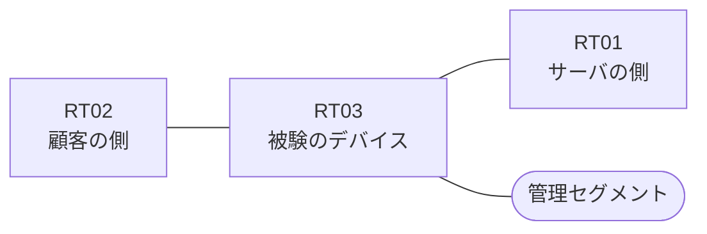

# 問題 20260816-003

> **本問は機器に接続せずに解答すること。追加の show 実行は認めない。**

## トポロジ

あなたは、ネットワークの運用を担当しています。ある企業のネットワークにおいて、RT03 は、顧客の側のネットワークと、サーバの側のネットワークとの間に、配置されています。



| 区間 | 被験デバイス側のインターフェイス | ネットワーク |
|------|----------------------------------|--------------|
| RT02（顧客の側） ⇔ RT03 | `Ethernet1/0` | 10.175.253.0/24 |
| RT03 ⇔ RT01（サーバの側） | `Ethernet1/1` | 10.175.254.0/24 |
| RT03 ⇔ 管理セグメント | `Ethernet1/2` | 10.175.255.0/24 |

## 要件

1. サーバの側のネットワークから、顧客の側のネットワークへ**新たに開始される**通信は、許可されることはできません。
2. RT03 において、`10.175.192.0/24`、`10.175.194.0/24`、`10.175.196.0/24`、`10.175.198.0/24` のネットワークから、サーバである `172.29.90.14` の TCP ポート 3389 への通信は、セッションを確立できなければなりません。
3. 顧客の側のインターフェイスである `Ethernet1/0` と、サーバの側のインターフェイスである `Ethernet1/1` の双方において、着信の方向にアクセス リストが適用されています。
4. 示されているところのアクセス リストの適用は、変更されることはできません。
5. 本作業は、日中の時間帯において実施されるという理由により、対象外であるところのデバイスに対する構成の変更は、許可されていません。

## 現在の状態

ユーザーから、通信に関する事象が、報告されています。あなたは、提示されているところの情報のみを使用して、要求されている状態が満たされていない理由を、特定しなければなりません。

観測 | TCP セッション
--- | ---
送信元が 10.175.192.0/24 のネットワークにあるホストから、172.29.90.14 の TCP ポート 3389 宛ての通信 | 確立できる
送信元が 10.175.194.0/24 のネットワークにあるホストから、172.29.90.14 の TCP ポート 3389 宛ての通信 | 確立できない
送信元が 10.175.196.0/24 のネットワークにあるホストから、172.29.90.14 の TCP ポート 3389 宛ての通信 | 確立できない
送信元が 10.175.198.0/24 のネットワークにあるホストから、172.29.90.14 の TCP ポート 3389 宛ての通信 | 確立できない
送信元が 10.175.193.0/24 のネットワークにあるホストから、172.29.90.14 の TCP ポート 3389 宛ての通信 | 確立できない
送信元が 10.175.195.0/24 のネットワークにあるホストから、172.29.90.14 の TCP ポート 3389 宛ての通信 | 確立できない
送信元が 10.175.250.0/24 のネットワークにあるホストから、172.29.90.14 の TCP ポート 3389 宛ての通信 | 確立できない
送信元が 10.175.192.0/24 のネットワークにあるホストから、172.29.90.14 の TCP ポート 8080 宛ての通信 | 確立できない
送信元が 10.175.192.0/24 のネットワークにあるホストから、172.29.90.114 の TCP ポート 3389 宛ての通信 | 確立できない

```
RT03# show ip access-lists
Extended IP access list 120
    10 permit tcp 10.175.192.0 0.0.0.255 host 172.29.90.14 eq 3389
    20 permit tcp 10.175.194.0 0.0.0.255 host 172.29.90.14 eq 3389
    30 permit tcp 10.175.196.0 0.0.0.255 host 172.29.90.14 eq 3389
    40 permit tcp 10.175.198.0 0.0.0.255 host 172.29.90.14 eq 3389
Extended IP access list 130
    10 permit tcp host 172.29.90.14 eq 3389 10.175.192.0 0.0.1.255 established
```

## 設定抜粋

```
RT03# show running-config | section ^interface
interface Ethernet1/0
 description === to RT02 ===
 ip address 10.175.253.1 255.255.255.0
 ip access-group 120 in
interface Ethernet1/1
 description === to RT01 ===
 ip address 10.175.254.1 255.255.255.0
 ip access-group 130 in
interface Ethernet1/2
 description === management ===
 ip address 10.175.255.1 255.255.255.0
```

## 設問

次のうち、正しいものは、どれですか。

## 選択肢
A. ワイルドカードのビットが過剰であり、対象としていないネットワークまでが一致の対象に含まれている

B. 戻りの通信を許可するアクセス・リストの範囲が、対象としているネットワークの一部しか含んでいない

C. インターフェイスが管理上シャットダウンされている

D. ルーティング・プロトコルの隣接関係が確立されていない

E. established のキーワードが、戻りの側ではなく、通信を開始する側のアクセス・リストに記述されている

F. 宛先として any が指定されているため、当該のサーバ以外への通信までが許可されている
