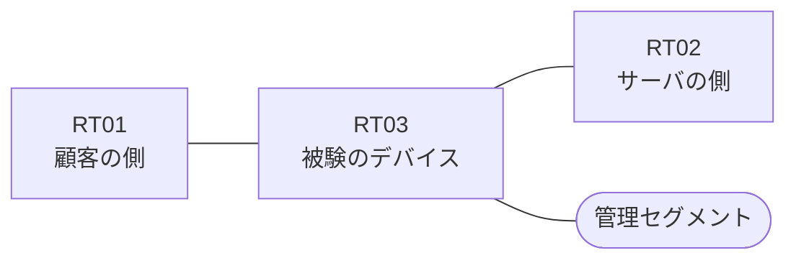

# 問題 20260816-008

> **本問は機器に接続せずに解答すること。追加の show 実行は認めない。**

## シナリオ

あなたは、ネットワークの運用を担当しています。ある企業のネットワークにおいて、RT03 は、顧客の側のネットワークと、サーバの側のネットワークとの間に、配置されています。`10.72.53.0/24` からの通信は、許可されてはなりません。当該のサーバの他のポートへの通信、および当該のサーバ以外の宛先への通信は、許可されてはなりません。管理のための構成に対して、変更が加えられてはなりません。アクセス リストは、顧客の側のインターフェイスである `Ethernet0/0` において、着信の方向に適用される必要があります。RT03 において、`10.72.48.0/24`、`10.72.49.0/24`、`10.72.50.0/24` のネットワークからの通信のみが、サーバである `172.24.88.56` の TCP ポート 443 に到達できなければなりません。拒否のエントリを使用してはなりません。



| 区間 | 被験デバイス側のインターフェイス | ネットワーク |
|------|----------------------------------|--------------|
| RT01（顧客の側） ⇔ RT03 | `Ethernet0/0` | 10.72.253.0/24 |
| RT03 ⇔ RT02（サーバの側） | `Ethernet0/1` | 10.72.254.0/24 |
| RT03 ⇔ 管理セグメント | `Ethernet0/2` | 10.72.255.0/24 |


## 設問

次のうち、正しいものは、どれですか。

## 選択肢
**A.**
```
access-list 150 permit ip 10.72.48.0 0.0.3.255 host 172.24.88.56
```

**B.**
```
access-list 150 permit tcp 10.72.48.0 0.0.0.255 host 172.24.88.56 eq 443
access-list 150 permit tcp 10.72.49.0 0.0.0.255 host 172.24.88.56 eq 443
access-list 150 permit tcp 10.72.50.0 0.0.0.255 host 172.24.88.56 eq 443
```

**C.**
```
access-list 150 permit tcp 10.72.48.0 0.0.3.255 any eq 443
```

**D.**
```
access-list 150 permit tcp 10.72.48.0 0.0.1.255 host 172.24.88.56 eq 443
```

**E.**
```
access-list 150 permit tcp 10.72.48.0 0.0.5.255 host 172.24.88.56 eq 443
```

**F.**
```
access-list 150 deny tcp 10.72.51.0 0.0.0.255 host 172.24.88.56 eq 443
access-list 150 permit tcp 10.72.48.0 0.0.3.255 host 172.24.88.56 eq 443
```

**G.**
```
access-list 150 permit tcp 10.72.48.0 0.0.7.255 host 172.24.88.56 eq 443
```

**H.**
```
access-list 150 permit tcp 10.72.48.0 0.0.3.255 host 172.24.88.56 eq 443
```
