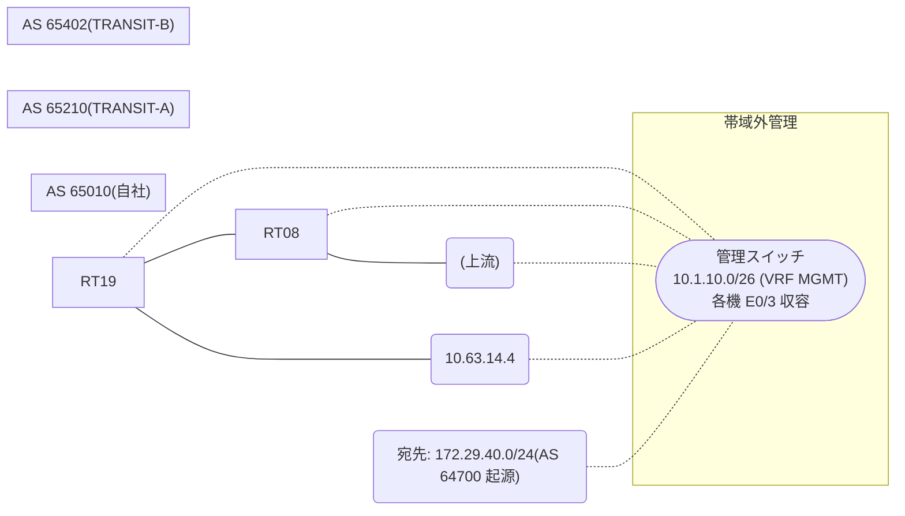

# 問題 20260816-009

> **本問は機器に接続せずに解答すること。追加の show 実行は認めない。**

## トポロジ

あなたは、ネットワークの運用を担当しています。自社のルータ RT19 は、外部のネットワーク 172.29.40.0/24 への到達性を、複数の経路を通じて、確立しています。 TRANSIT-B とも、接続されています。 一部の経路は、自 AS 内の境界ルーターから、iBGP で、学習されています。



## 要件

1. 示されているところの出力、および、構成に基づいて、判断すること。
2. なお、機器の構成は、示されている抜粋のほかは、既定値である。

## 現在の状態

境界ルータ RT08 を経由するところの経路が、優先されるように、意図されています。しかしながら、その経路は、選択されていません。

```
RT19# show ip bgp
BGP table version is 30, local router ID is 231.231.231.231
Status codes: s suppressed, d damped, h history, * valid, > best, i - internal, 
              r RIB-failure, S Stale, m multipath, b backup-path, f RT-Filter, 
              x best-external, a additional-path, c RIB-compressed, 
              t secondary path, L long-lived-stale,
Origin codes: i - IGP, e - EGP, ? - incomplete
RPKI validation codes: V valid, I invalid, N Not found

     Network          Next Hop            Metric LocPrf Weight Path
 * i  172.29.40.0/24   10.63.25.2                    200      0 65210 64700 i
 *>                    10.63.14.4                             0 65402 65402 64700 i
```
```
RT19# show ip bgp 172.29.40.0
BGP routing table entry for 172.29.40.0/24, version 30
Paths: (2 available, best #2, table default)
  Advertised to update-groups:
     1         
  Refresh Epoch 4
  65210 64700
    10.63.25.2 (inaccessible) from 9.5.5.5 (9.5.5.5)
      Origin IGP, localpref 200, valid, internal
      rx pathid: 0, tx pathid: 0
      Updated on Mar 18 2026 03:21:03 UTC
  Refresh Epoch 4
  65402 65402 64700
    10.63.14.4 from 10.63.14.4 (72.72.72.72)
      Origin IGP, localpref 100, valid, external, best
      rx pathid: 0, tx pathid: 0x0
      Updated on Mar 18 2026 03:37:03 UTC
```

## 設定抜粋

```
RT19# show running-config | section router bgp
router bgp 65010
 bgp router-id 231.231.231.231
 bgp log-neighbor-changes
 neighbor 9.5.5.5 remote-as 65010
 neighbor 9.5.5.5 update-source Loopback0
 neighbor 10.63.14.4 remote-as 65402
 !
 address-family ipv4
  neighbor 9.5.5.5 activate
  neighbor 10.63.14.4 activate
 exit-address-family
```
```
RT08# show running-config | section router bgp
router bgp 65010
 bgp router-id 9.5.5.5
 neighbor 231.231.231.231 remote-as 65010
 neighbor 231.231.231.231 update-source Loopback0
 neighbor 10.63.25.2 remote-as 65210
 !
 address-family ipv4
  neighbor 231.231.231.231 activate
  neighbor 10.63.25.2 activate
 exit-address-family
```

## 設問

この事象の原因である可能性が、最も高いものは、どれですか。(1つを選択してください)

## 選択肢
A. weight は、それを設定したルータのローカルでのみ有効であり、iBGP の近隣には伝播しない

B. MED は、異なる隣接 AS から受信した経路の間では、既定では比較されない

C. 設定変更後に BGP セッションの再評価(clear)が行われていない

D. next-hop が IGP で解決できず、その経路はベストパス選択の候補に入っていない
