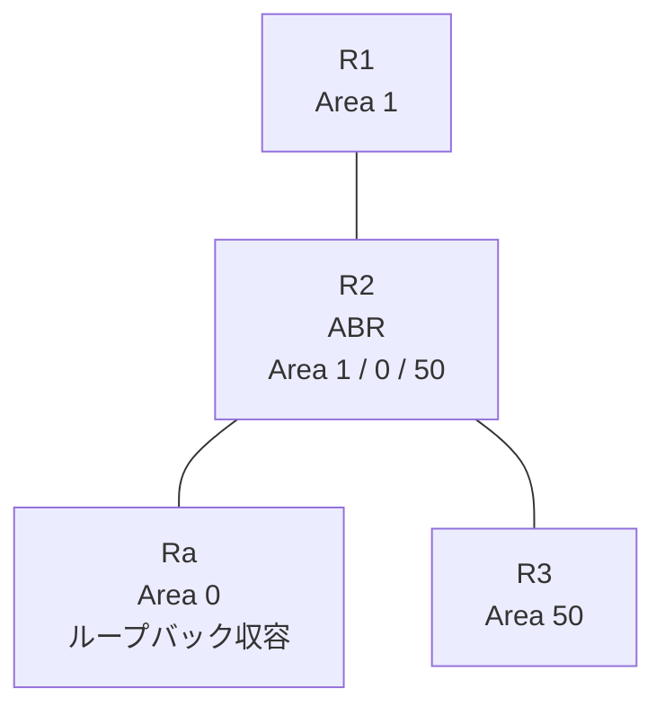

# 問題 20260816-010

> **本問は機器に接続せずに解答すること。追加の show 実行は認めない。**

## シナリオ

あなたは、ネットワークの運用を担当しています。拠点の集約ルータ Ra は、サービスのためのプレフィックスを、4つのループバック インターフェイスによって収容しています。R2 は、エリア 1・エリア 0・エリア 50 を接続するところの ABR であり、そして、すべてのルーターにおいて、OSPFv3 のプロセス 10 が構成されています。通信の一部において、想定されていない挙動が、観測されています。あなたは、示されているところの出力および構成に基づいて、その構成が、下記において記述されているとおりに動作していない理由を、判断する必要があります。管理のための構成に対して、変更が加えられてはなりません。エリア 50 においては、2001:DB8:A:A::/64 を除くいかなるルートの受信にも、影響が及んではなりません。ただし、2001:DB8:A:A::/64 のルートは、障害の対応という理由により、**すべてのエリアにおいて**、一時的に停止されなければなりません。この制御は、エリア 1 に今後追加されるところの、いかなるルータに対しても、等しく適用される必要があります。エリア 1 へ配布されるループバック由来のエリア間のルートは、2001:DB8:A:A::/64 および 2001:DB8:B:B::/64 に限定される必要があります。リンクのネットワークのルートは、引き続き受信される必要があります。



| 区間 | インターフェイス | ネットワーク | エリア |
|------|------------------|--------------|--------|
| R1 ⇔ R2 | E0/0 | 2001:DB8:4:5::/64 | 1 |
| R2 ⇔ Ra | E0/1 | 2001:DB8:5:7::/64 | 0 |
| R2 ⇔ R3 | E0/2 | 2001:DB8:3:E::/64 | 50 |

- R1 の E0/0 セカンダリ: 2001:DB8:2:3::/64（Area 1）
- Ra のループバック: 2001:DB8:9:9::/64, 2001:DB8:A:A::/64, 2001:DB8:B:B::/64, 2001:DB8:C:C::/64（Area 0）

## 出力

```
R2# show running-config
Building configuration...
!
interface Ethernet0/0
 no ip address
 ipv6 address 2001:DB8:4:5::2/64
 ipv6 enable
 ipv6 ospf 10 area 1
!
interface Ethernet0/1
 no ip address
 ipv6 address 2001:DB8:5:7::2/64
 ipv6 enable
 ipv6 ospf 10 area 0
!
interface Ethernet0/2
 no ip address
 ipv6 address 2001:DB8:3:E::2/64
 ipv6 enable
 ipv6 ospf 10 area 50
!
router ospfv3 10
 router-id 2.2.2.2
 !
 address-family ipv6 unicast
  area 0 filter-list prefix PL-TYPE3 out
  area 1 filter-list prefix PL-STOP in
 exit-address-family
!
ipv6 prefix-list PL-CORE seq 5 permit ::/0 ge 1
!
ipv6 prefix-list PL-STOP seq 5 deny 2001:DB8:A:A::/64
ipv6 prefix-list PL-STOP seq 10 permit ::/0 le 128
!
ipv6 prefix-list PL-TYPE3 seq 5 permit 2001:DB8:A::/47 le 64
ipv6 prefix-list PL-TYPE3 seq 10 permit 2001:DB8:5:7::/64
ipv6 prefix-list PL-TYPE3 seq 15 permit 2001:DB8:3:E::/64
!
ipv6 prefix-list PL10 seq 5 permit 2001:DB8:8::/45 le 64
!
```
```
R3# show ipv6 route ospf | include ^O|via
OI  2001:DB8:2:3::/64 [110/20]
     via FE80::A8BB:CCFF:FE01:7620, Ethernet0/0
OI  2001:DB8:4:5::/64 [110/20]
     via FE80::A8BB:CCFF:FE01:7620, Ethernet0/0
OI  2001:DB8:5:7::/64 [110/20]
     via FE80::A8BB:CCFF:FE01:7620, Ethernet0/0
OI  2001:DB8:A:A::/64 [110/21]
     via FE80::A8BB:CCFF:FE01:7620, Ethernet0/0
OI  2001:DB8:B:B::/64 [110/21]
     via FE80::A8BB:CCFF:FE01:7620, Ethernet0/0
```
```
R1# show ipv6 route ospf | include ^O|via
OI  2001:DB8:3:E::/64 [110/20]
     via FE80::A8BB:CCFF:FE01:7600, Ethernet0/0
OI  2001:DB8:5:7::/64 [110/20]
     via FE80::A8BB:CCFF:FE01:7600, Ethernet0/0
OI  2001:DB8:B:B::/64 [110/21]
     via FE80::A8BB:CCFF:FE01:7600, Ethernet0/0
```

## 設問

次のうち、正しいものは、どれですか。

## 選択肢
**A.**
```
R2(config)# ipv6 prefix-list PL-NEW seq 5 permit 2001:DB8:A::/47 le 64
R2(config)# ipv6 prefix-list PL-NEW seq 10 permit 2001:DB8:5:7::/64
R2(config)# ipv6 prefix-list PL-NEW seq 15 permit 2001:DB8:3:E::/64
R2(config)# ipv6 prefix-list PL-STOP2 seq 5 deny 2001:DB8:A:A::/64
R2(config)# ipv6 prefix-list PL-STOP2 seq 10 permit ::/0 le 128
R2(config)# router ospfv3 10
R2(config-router)# address-family ipv6 unicast
R2(config-router-af)# no area 0 filter-list prefix PL-TYPE3 out
R2(config-router-af)# no area 1 filter-list prefix PL-STOP in
R2(config-router-af)# area 0 filter-list prefix PL-STOP2 out
R2(config-router-af)# area 1 filter-list prefix PL-NEW in
R2(config)# no ipv6 prefix-list PL-TYPE3
R2(config)# no ipv6 prefix-list PL-STOP
```

**B.**
```
R2(config)# ipv6 prefix-list PL-NEW seq 5 permit 2001:DB8:A::/47 le 64
R2(config)# ipv6 prefix-list PL-NEW seq 10 permit 2001:DB8:5:7::/64
R2(config)# ipv6 prefix-list PL-NEW seq 15 permit 2001:DB8:3:E::/64
R2(config)# router ospfv3 10
R2(config-router)# address-family ipv6 unicast
R2(config-router-af)# no area 0 filter-list prefix PL-TYPE3 out
R2(config-router-af)# no area 1 filter-list prefix PL-STOP in
R2(config-router-af)# area 1 filter-list prefix PL-NEW in
R2(config)# no ipv6 prefix-list PL-TYPE3
R2(config)# no ipv6 prefix-list PL-STOP
```

**C.**
```
R2(config)# ipv6 prefix-list PL-NEW seq 5 permit 2001:DB8:8::/46 le 64
R2(config)# ipv6 prefix-list PL-NEW seq 10 permit 2001:DB8:5:7::/64
R2(config)# ipv6 prefix-list PL-NEW seq 15 permit 2001:DB8:3:E::/64
R2(config)# ipv6 prefix-list PL-STOP2 seq 5 deny 2001:DB8:A:A::/64
R2(config)# ipv6 prefix-list PL-STOP2 seq 10 permit ::/0 le 128
R2(config)# router ospfv3 10
R2(config-router)# address-family ipv6 unicast
R2(config-router-af)# no area 0 filter-list prefix PL-TYPE3 out
R2(config-router-af)# no area 1 filter-list prefix PL-STOP in
R2(config-router-af)# area 0 filter-list prefix PL-STOP2 out
R2(config-router-af)# area 1 filter-list prefix PL-NEW in
R2(config)# no ipv6 prefix-list PL-TYPE3
R2(config)# no ipv6 prefix-list PL-STOP
```

**D.**
```
R2(config)# ipv6 prefix-list PL-STOP2 seq 5 deny 2001:DB8:A:A::/64
R2(config)# ipv6 prefix-list PL-STOP2 seq 10 permit ::/0 le 128
R2(config)# router ospfv3 10
R2(config-router)# address-family ipv6 unicast
R2(config-router-af)# no area 0 filter-list prefix PL-TYPE3 out
R2(config-router-af)# no area 1 filter-list prefix PL-STOP in
R2(config-router-af)# area 0 filter-list prefix PL-STOP2 out
R2(config)# no ipv6 prefix-list PL-TYPE3
R2(config)# no ipv6 prefix-list PL-STOP
```
