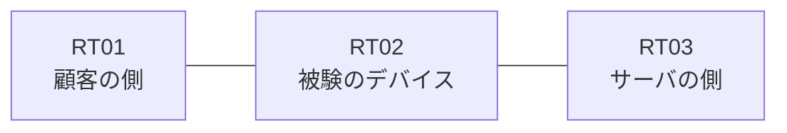

# 問題 20260816-013

> **本問は機器に接続せずに解答すること。追加の show 実行は認めない。**

## シナリオ

あなたの組織は、下記に示されているところのネットワークを運用しています。ある企業のネットワークにおいて、RT02 は、顧客の側のネットワークと、サーバの側のネットワークとの間に配置されており、IPv6 によって運用されています。インタフェースの IP アドレッシングは、変更されることはできません。`2001:DB8:EF:65::/64` からの通信は、許可されてはなりません。RT02 において、`2001:DB8:EF:60::/64`、`2001:DB8:EF:61::/64`、`2001:DB8:EF:62::/64` のネットワークからの通信のみが、`2001:DB8:EF:FF::10` の TCP ポート 22 に到達できなければなりません。対象としていないネットワークが、一致の対象に含まれてはなりません。また、拒否のエントリを使用してはなりません。




## 設問

次のうち、正しいものは、どれですか。

## 選択肢
**A.**
```
sequence 10 permit ipv6 2001:DB8:EF:60::/64 any
sequence 20 permit ipv6 2001:DB8:EF:61::/64 any
sequence 30 permit ipv6 2001:DB8:EF:62::/64 any
```

**B.**
```
sequence 10 permit ipv6 2001:DB8:EF:60::/61 any
```

**C.**
```
sequence 10 permit ipv6 2001:DB8:EF:60::/63 any
```

**D.**
```
sequence 10 deny ipv6 2001:DB8:EF:63::/64 any
sequence 20 permit ipv6 2001:DB8:EF:60::/62 any
```

**E.**
```
sequence 10 permit ipv6 2001:DB8:EF:60::/62 0.0.3.255 any
```

**F.**
```
sequence 10 permit ipv6 2001:DB8:EF:60::/62 any
```
