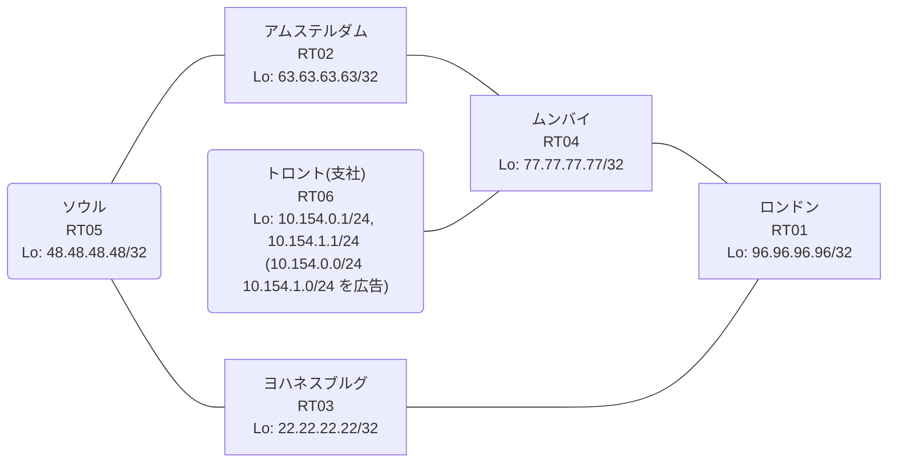

# 問題 20260816-016

> **本問は機器に接続せずに解答すること。追加の show 実行は認めない。**

## シナリオ

あなたの組織は、下記に示されているところのネットワークを運用しています。あなたの会社のネットワークは、支社のドメインと、本社のコアのドメイン(OSPF)とが、2 台の境界のルータによって接続され、そして、それらは境界において接続されています。支社のネットワーク `10.154.0.0/24` および `10.154.1.0/24` は、RT06 によって、広告されています。どちらの境界が失われた場合においても、通信が継続されることができるように、設計されています。ルーティングの設計の詳細は、示されているところの出力から、読み取られることが、期待されています。ユーザーから、通信に関する事象が、報告されています。示されているところの出力および構成に基づいて、要求されているところの動作が得られていない理由が、判断されなければなりません。スタティック ルートおよび既定のルートによる迂回は、実施されてはなりません。インタフェースの IP アドレッシングは、変更されることはできません。二点相互再配送による、冗長の設計が、維持される必要があります。管理のための構成に対して、変更が加えられてはなりません。支社のネットワーク `10.154.0.0/24` / `10.154.1.0/24` への到達可能性が、すべてのサイトにおいて、確保されていること。支社のネットワーク宛のトラフィックが RT06 へ配送され、経路の周回が、発生していないこと。



| 拠点 | ルータ | Loopback / 広告網 |
|------|--------|--------------------|
| アムステルダム | RT02 | 63.63.63.63/32 |
| ソウル | RT05 | 48.48.48.48/32 |
| トロント(支社) | RT06 | 10.154.0.1/24, 10.154.1.1/24 (`10.154.0.0/24` `10.154.1.0/24` を広告) |
| ムンバイ | RT04 | 77.77.77.77/32 |
| ヨハネスブルグ | RT03 | 22.22.22.22/32 |
| ロンドン | RT01 | 96.96.96.96/32 |

リンク一覧:
```
  RT06:E0/0(.2) ── RT04:E0/0(.1)   10.19.181.0/30
  RT04:E0/1(.1) ── RT01:E0/0(.2)   10.206.88.0/30
  RT04:E0/2(.1) ── RT02:E0/0(.2)   10.38.106.0/30
  RT01:E0/1(.1) ── RT03:E0/0(.2)   172.16.20.0/30
  RT03:E0/1(.1) ── RT05:E0/0(.2)   172.16.156.0/30
  RT02:E0/1(.1) ── RT05:E0/1(.2)   172.16.75.0/30
```

## 出力

```
RT04# show ip route
Gateway of last resort is not set
      10.0.0.0/8 is variably subnetted, 8 subnets, 3 masks
C        10.19.181.0/30 is directly connected, Ethernet0/0
L        10.19.181.1/32 is directly connected, Ethernet0/0
C        10.38.106.0/30 is directly connected, Ethernet0/2
L        10.38.106.1/32 is directly connected, Ethernet0/2
R        10.154.0.0/24 [120/1] via 10.19.181.2, 00:00:11, Ethernet0/0
R        10.154.1.0/24 [120/1] via 10.19.181.2, 00:00:11, Ethernet0/0
C        10.206.88.0/30 is directly connected, Ethernet0/1
L        10.206.88.1/32 is directly connected, Ethernet0/1
      22.0.0.0/32 is subnetted, 1 subnets
R        22.22.22.22 [120/5] via 10.38.106.2, 00:00:22, Ethernet0/2
      48.0.0.0/32 is subnetted, 1 subnets
R        48.48.48.48 [120/5] via 10.38.106.2, 00:00:22, Ethernet0/2
      63.0.0.0/32 is subnetted, 1 subnets
R        63.63.63.63 [120/1] via 10.38.106.2, 00:00:22, Ethernet0/2
      77.0.0.0/32 is subnetted, 1 subnets
C        77.77.77.77 is directly connected, Loopback0
      96.0.0.0/32 is subnetted, 1 subnets
R        96.96.96.96 [120/5] via 10.38.106.2, 00:00:22, Ethernet0/2
      172.16.0.0/30 is subnetted, 3 subnets
R        172.16.20.0 [120/5] via 10.38.106.2, 00:00:22, Ethernet0/2
R        172.16.75.0 [120/5] via 10.38.106.2, 00:00:22, Ethernet0/2
R        172.16.156.0 [120/5] via 10.38.106.2, 00:00:22, Ethernet0/2
```
```
RT04# show ip route 96.96.96.96
Routing entry for 96.96.96.96/32
  Known via "rip", distance 120, metric 5
  Tag 310
  Redistributing via rip
  Last update from 10.38.106.2 on Ethernet0/2, 00:00:22 ago
  Routing Descriptor Blocks:
  * 10.38.106.2, from 10.38.106.2, 00:00:22 ago, via Ethernet0/2
      Route metric is 5, traffic share count is 1
      Route tag 310
```
```
RT01# show ip protocols
*** IP Routing is NSF aware ***

Routing Protocol is "application"
  Sending updates every 0 seconds
  Invalid after 0 seconds, hold down 0, flushed after 0
  Outgoing update filter list for all interfaces is not set
  Incoming update filter list for all interfaces is not set
  Maximum path: 32
  Routing for Networks:
  Routing Information Sources:
    Gateway         Distance      Last Update
  Distance: (default is 4)

Routing Protocol is "ospf 1"
  Outgoing update filter list for all interfaces is not set
  Incoming update filter list for all interfaces is not set
  Router ID 96.96.96.96
  It is an autonomous system boundary router
 Redistributing External Routes from,
    rip, includes subnets in redistribution
  Number of areas in this router is 1. 1 normal 0 stub 0 nssa
  Maximum path: 4
  Routing for Networks:
    96.96.96.96 0.0.0.0 area 0
    172.16.20.0 0.0.0.3 area 0
  Routing Information Sources:
    Gateway         Distance      Last Update
    63.63.63.63          110      00:04:20
    48.48.48.48          110      00:04:30
    22.22.22.22          110      00:04:31
  Distance: intra-area 110 inter-area 110 external 180

Routing Protocol is "rip"
  Outgoing update filter list for all interfaces is 10
  Incoming update filter list for all interfaces is not set
  Sending updates every 30 seconds, next due in 5 seconds
  Invalid after 180 seconds, hold down 180, flushed after 240
  Redistributing: ospf 1 (internal, external 1 & 2, nssa-external 1 & 2)
                  rip
  Default version control: send version 2, receive version 2
    Interface                           Send  Recv  Triggered RIP  Key-chain
    Ethernet0/0                         2     2          No        none            
    Loopback0                           2     2          No        none            
  Automatic network summarization is not in effect
  Maximum path: 4
  Routing for Networks:
    10.0.0.0
    96.0.0.0
  Routing Information Sources:
    Gateway         Distance      Last Update
    10.206.88.1          120      00:00:11
  Distance: (default is 120)
```
```
RT01# show access-lists
Standard IP access list 10
    10 deny   any (223 matches)
```
```
RT01# show running-config | section router
router ospf 1
 router-id 96.96.96.96
 redistribute rip route-map RIP2OSPF
 network 96.96.96.96 0.0.0.0 area 0
 network 172.16.20.0 0.0.0.3 area 0
 distance ospf external 180
router rip
 version 2
 redistribute ospf 1 metric 5 route-map OSPF2RIP
 network 10.0.0.0
 network 96.0.0.0
 distribute-list 10 out
 no auto-summary
```

## 設問

次のうち、正しいものは、どれですか。

## 選択肢
A. route-map `OSPF2RIP` の deny エントリが、すべての経路に一致している

B. RT01 からの RIP の広告が、適用されているフィルタによって、すべて抑止されている

C. RT04 の等コスト分散が無効化されており、片方の経路だけが使用されている

D. OSPF→RIP の再配送に seed metric が指定されておらず、無限大のメトリックで広告されない

E. RT04 と RT01 の間のリンクに障害があり、RIP のアップデートが届いていない

F. RT01 の redistribute ospf 1 が構成から欠落している
