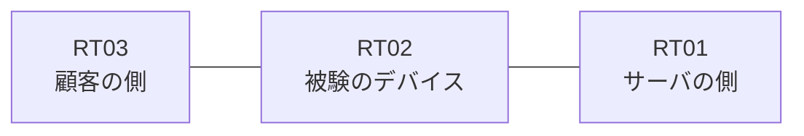

# 問題 20260816-018

> **本問は機器に接続せずに解答すること。追加の show 実行は認めない。**

## トポロジ

あなたは、ネットワークの運用を担当しています。ある企業のネットワークにおいて、RT02 は、顧客の側のネットワークと、サーバの側のネットワークとの間に配置されており、IPv6 によって運用されています。



## 要件

1. `2001:DB8:7A:35::/64` からの通信は、許可されてはなりません。
2. `2001:DB8:7A:33::/64` からの通信は、許可されてはなりません。
3. RT02 において、`2001:DB8:7A:30::/64`、`2001:DB8:7A:31::/64`、`2001:DB8:7A:32::/64` のネットワークからの通信のみが、`2001:DB8:7A:FF::10` の TCP ポート 443 に到達できなければなりません。
4. インタフェースの IP アドレッシングは、変更されてはなりません。
5. 対象としていないネットワークが、一致の対象に含まれてはなりません。また、拒否のエントリを使用してはなりません。

## 現在の状態

```
RT02# show ipv6 access-list
IPv6 access list V6-FILTER-IN
    permit ipv6 2001:DB8:7A:30::/61 any sequence 10
```

## 設定抜粋

```
RT02# show running-config | section ipv6 access-list|traffic-filter
ipv6 access-list V6-FILTER-IN
 sequence 10 permit ipv6 2001:DB8:7A:30::/61 any
interface Ethernet0/0
 ipv6 traffic-filter V6-FILTER-IN in
```

## 設問

示されているところの構成において、破棄されるものは、どれですか。(1つを選択してください)

## 選択肢
A. 送信元が 2001:DB8:7A:FA::/64 のネットワークにあるホストから、2001:DB8:7A:FF::10 の TCP ポート 443 宛ての通信

B. 送信元が 2001:DB8:7A:35::/64 のネットワークにあるホストから、2001:DB8:7A:FF::10 の TCP ポート 443 宛ての通信

C. 送信元が 2001:DB8:7A:30::/64 のネットワークにあるホストから、2001:DB8:7A:FF::10 の TCP ポート 443 宛ての通信

D. 送信元が 2001:DB8:7A:31::/64 のネットワークにあるホストから、2001:DB8:7A:FF::10 の TCP ポート 443 宛ての通信

E. 送信元が 2001:DB8:7A:33::/64 のネットワークにあるホストから、2001:DB8:7A:FF::10 の TCP ポート 443 宛ての通信
