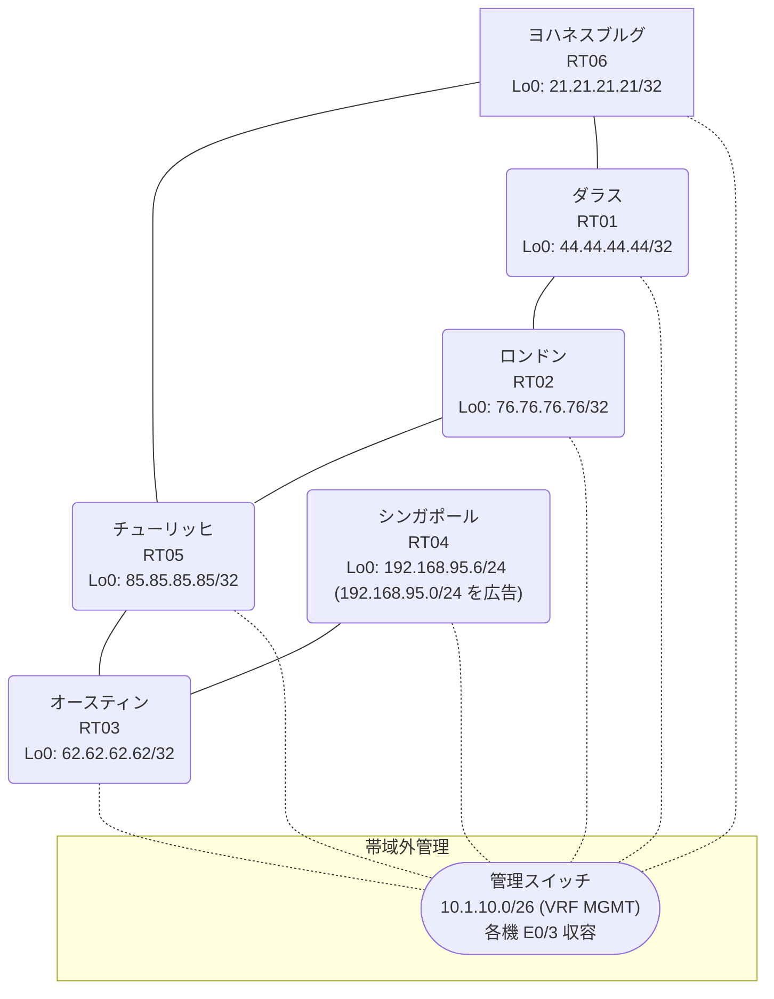

# 問題 20260816-020

> **本問は機器に接続せずに解答すること。追加の show 実行は認めない。**

## トポロジ

あなたの組織は、下記に示されているところのネットワークを運用しています。あなたの会社のネットワークは、OSPF のドメインと EIGRP のドメインとが、2 つの境界のルータによって接続され、そして、それらは境界において接続されています。顧客のネットワーク `192.168.95.0/24` は、シンガポール のサイトにおいて、別のルーティング・プロトコルによって学習され、そして、再配送によって、社内へ持ち込まれています。ルーティングの設計の詳細は、示されているところのコンフィギュレーションから、読み取られることが、期待されています。



| 拠点 | ルータ | 拠点網 / 広告網 |
|------|--------|------------------|
| オースティン | RT03 | 62.62.62.62/32 |
| シンガポール | RT04 | 192.168.95.6/24 (`192.168.95.0/24` を広告) |
| ダラス | RT01 | 44.44.44.44/32 |
| チューリッヒ | RT05 | 85.85.85.85/32 |
| ヨハネスブルグ | RT06 | 21.21.21.21/32 |
| ロンドン | RT02 | 76.76.76.76/32 |

リンク一覧:
```
  RT01:E0/0(.1) ── RT06:E0/0(.2)   172.16.41.0/24
  RT01:E0/1(.1) ── RT02:E0/0(.3)   172.16.178.0/24
  RT06:E0/1(.2) ── RT05:E0/0(.4)   172.16.35.0/24
  RT02:E0/1(.3) ── RT05:E0/1(.4)   172.16.43.0/24
  RT05:E0/2(.4) ── RT03:E0/0(.5)   172.16.28.0/24
  RT03:E0/1(.5) ── RT04:E0/0(.6)   172.16.60.0/24
```

## 要件

1. 是正は、prefix-list と、再配送点における distribute-list によって、実装される必要があります。
2. スタティック ルートおよび既定のルートによる迂回は、実施されてはなりません。
3. `192.168.95.0/24` 宛のパケットが、広告元である RT04 の方向へ転送され、そして、転送のループが存在していないこと。
4. スタティック・ルートおよび既定のルートによる迂回は、実施されることはできません。
5. 既存の相互再配送の設計が、削除または停止されてはなりません。
6. すべてのサイトから、`192.168.95.0/24` を含むところのすべての宛先へ、到達することができること。

## 現在の状態

いくつかの宛先への通信について、報告が上がっています。あなたは、示されているところの出力および構成に基づいて、その構成が、下記において記述されているとおりに動作していない理由を、判断する必要があります。

```
RT05# show ip eigrp topology 192.168.95.0 255.255.255.0
EIGRP-IPv4 Topology Entry for AS(82)/ID(85.85.85.85) for 192.168.95.0/24
  State is Passive, Query origin flag is 1, 1 Successor(s), FD is 281856
  Descriptor Blocks:
  172.16.35.2 (Ethernet0/0), from 172.16.35.2, Send flag is 0x0
      Composite metric is (281856/2816), route is External
      Vector metric:
        Minimum bandwidth is 10000 Kbit
        Total delay is 1010 microseconds
        Reliability is 255/255
        Load is 1/255
        Minimum MTU is 1500
        Hop count is 1
        Originating router is 21.21.21.21
      External data:
        AS number of route is 57
        External protocol is OSPF, external metric is 20
        Administrator tag is 0 (0x00000000)
  172.16.28.5 (Ethernet0/2), from 172.16.28.5, Send flag is 0x0
      Composite metric is (307456/281856), route is External
      Vector metric:
        Minimum bandwidth is 10000 Kbit
        Total delay is 2010 microseconds
        Reliability is 255/255
        Load is 1/255
        Minimum MTU is 1500
        Hop count is 2
        Originating router is 192.168.95.6
      External data:
        AS number of route is 0
        External protocol is RIP, external metric is 0
        Administrator tag is 0 (0x00000000)
```
```
RT01# traceroute 192.168.95.6 probe 1 timeout 1 ttl 1 8
Type escape sequence to abort.
Tracing the route to 192.168.95.6
VRF info: (vrf in name/id, vrf out name/id)
  1 172.16.178.3 1 msec
  2 172.16.43.4 10 msec
  3 172.16.35.2 1 msec
  4 172.16.41.1 2 msec
  5 172.16.178.3 2 msec
  6 172.16.43.4 2 msec
  7 172.16.35.2 22 msec
  8 172.16.41.1 2 msec
```
```
RT05# show ip protocols | include Routing Protocol|Distance
Routing Protocol is "application"
    Gateway         Distance      Last Update
  Distance: (default is 4)
Routing Protocol is "eigrp 82"
      Distance: internal 90 external 170
    Gateway         Distance      Last Update
  Distance: internal 90 external 170
```
```
RT05# show ip route
Gateway of last resort is not set
      21.0.0.0/32 is subnetted, 1 subnets
D EX     21.21.21.21 [170/281856] via 172.16.43.3, 00:04:07, Ethernet0/1
                     [170/281856] via 172.16.35.2, 00:04:07, Ethernet0/0
      44.0.0.0/32 is subnetted, 1 subnets
D EX     44.44.44.44 [170/281856] via 172.16.43.3, 00:04:11, Ethernet0/1
                     [170/281856] via 172.16.35.2, 00:04:11, Ethernet0/0
      62.0.0.0/32 is subnetted, 1 subnets
D        62.62.62.62 [90/409600] via 172.16.28.5, 00:04:59, Ethernet0/2
      76.0.0.0/32 is subnetted, 1 subnets
D EX     76.76.76.76 [170/281856] via 172.16.43.3, 00:04:11, Ethernet0/1
                     [170/281856] via 172.16.35.2, 00:04:11, Ethernet0/0
      85.0.0.0/32 is subnetted, 1 subnets
C        85.85.85.85 is directly connected, Loopback0
      172.16.0.0/16 is variably subnetted, 9 subnets, 2 masks
C        172.16.28.0/24 is directly connected, Ethernet0/2
L        172.16.28.4/32 is directly connected, Ethernet0/2
C        172.16.35.0/24 is directly connected, Ethernet0/0
L        172.16.35.4/32 is directly connected, Ethernet0/0
D EX     172.16.41.0/24 [170/281856] via 172.16.43.3, 00:04:17, Ethernet0/1
                        [170/281856] via 172.16.35.2, 00:04:17, Ethernet0/0
C        172.16.43.0/24 is directly connected, Ethernet0/1
L        172.16.43.4/32 is directly connected, Ethernet0/1
D        172.16.60.0/24 [90/307200] via 172.16.28.5, 00:04:59, Ethernet0/2
D EX     172.16.178.0/24 [170/281856] via 172.16.43.3, 00:04:11, Ethernet0/1
                         [170/281856] via 172.16.35.2, 00:04:11, Ethernet0/0
D EX  192.168.95.0/24 [170/281856] via 172.16.35.2, 00:04:11, Ethernet0/0
```
```
RT01# show ip route
Gateway of last resort is not set
      21.0.0.0/32 is subnetted, 1 subnets
O        21.21.21.21 [110/11] via 172.16.41.2, 00:04:48, Ethernet0/0
      44.0.0.0/32 is subnetted, 1 subnets
C        44.44.44.44 is directly connected, Loopback0
      62.0.0.0/32 is subnetted, 1 subnets
O E2     62.62.62.62 [110/20] via 172.16.178.3, 00:04:54, Ethernet0/1
                     [110/20] via 172.16.41.2, 00:04:48, Ethernet0/0
      76.0.0.0/32 is subnetted, 1 subnets
O        76.76.76.76 [110/11] via 172.16.178.3, 00:04:54, Ethernet0/1
      85.0.0.0/32 is subnetted, 1 subnets
O E2     85.85.85.85 [110/20] via 172.16.178.3, 00:04:54, Ethernet0/1
                     [110/20] via 172.16.41.2, 00:04:48, Ethernet0/0
      172.16.0.0/16 is variably subnetted, 8 subnets, 2 masks
O E2     172.16.28.0/24 [110/20] via 172.16.178.3, 00:04:54, Ethernet0/1
                        [110/20] via 172.16.41.2, 00:04:48, Ethernet0/0
O E2     172.16.35.0/24 [110/20] via 172.16.178.3, 00:04:54, Ethernet0/1
                        [110/20] via 172.16.41.2, 00:04:48, Ethernet0/0
C        172.16.41.0/24 is directly connected, Ethernet0/0
L        172.16.41.1/32 is directly connected, Ethernet0/0
O E2     172.16.43.0/24 [110/20] via 172.16.178.3, 00:04:54, Ethernet0/1
                        [110/20] via 172.16.41.2, 00:04:48, Ethernet0/0
O E2     172.16.60.0/24 [110/20] via 172.16.178.3, 00:04:54, Ethernet0/1
                        [110/20] via 172.16.41.2, 00:04:48, Ethernet0/0
C        172.16.178.0/24 is directly connected, Ethernet0/1
L        172.16.178.1/32 is directly connected, Ethernet0/1
O E2  192.168.95.0/24 [110/20] via 172.16.178.3, 00:04:54, Ethernet0/1
```
```
RT03# show ip route
Gateway of last resort is not set
      21.0.0.0/32 is subnetted, 1 subnets
D EX     21.21.21.21 [170/307456] via 172.16.28.4, 00:05:05, Ethernet0/0
      44.0.0.0/32 is subnetted, 1 subnets
D EX     44.44.44.44 [170/307456] via 172.16.28.4, 00:04:30, Ethernet0/0
      62.0.0.0/32 is subnetted, 1 subnets
C        62.62.62.62 is directly connected, Loopback0
      76.0.0.0/32 is subnetted, 1 subnets
D EX     76.76.76.76 [170/307456] via 172.16.28.4, 00:04:30, Ethernet0/0
      85.0.0.0/32 is subnetted, 1 subnets
D        85.85.85.85 [90/409600] via 172.16.28.4, 00:05:21, Ethernet0/0
      172.16.0.0/16 is variably subnetted, 8 subnets, 2 masks
C        172.16.28.0/24 is directly connected, Ethernet0/0
L        172.16.28.5/32 is directly connected, Ethernet0/0
D        172.16.35.0/24 [90/307200] via 172.16.28.4, 00:05:21, Ethernet0/0
D EX     172.16.41.0/24 [170/307456] via 172.16.28.4, 00:05:05, Ethernet0/0
D        172.16.43.0/24 [90/307200] via 172.16.28.4, 00:05:21, Ethernet0/0
C        172.16.60.0/24 is directly connected, Ethernet0/1
L        172.16.60.5/32 is directly connected, Ethernet0/1
D EX     172.16.178.0/24 [170/307456] via 172.16.28.4, 00:04:30, Ethernet0/0
D EX  192.168.95.0/24 [170/281856] via 172.16.60.6, 00:04:30, Ethernet0/1
```

## 設定抜粋

```
RT01# show running-config | section router
router ospf 57
 router-id 44.44.44.44
 network 44.44.44.44 0.0.0.0 area 0
 network 172.16.41.0 0.0.0.255 area 0
 network 172.16.178.0 0.0.0.255 area 0
```
```
RT06# show running-config | section router
router eigrp 82
 network 172.16.35.0 0.0.0.255
 redistribute ospf 57 metric 1000000 1 255 1 1500
router ospf 57
 router-id 21.21.21.21
 redistribute eigrp 82
 network 21.21.21.21 0.0.0.0 area 0
 network 172.16.41.0 0.0.0.255 area 0
```
```
RT02# show running-config | section router
router eigrp 82
 network 172.16.43.0 0.0.0.255
 redistribute ospf 57 metric 1000000 1 255 1 1500
router ospf 57
 router-id 76.76.76.76
 redistribute eigrp 82
 network 76.76.76.76 0.0.0.0 area 0
 network 172.16.178.0 0.0.0.255 area 0
```
```
RT05# show running-config | section router
router eigrp 82
 network 85.85.85.85 0.0.0.0
 network 172.16.28.0 0.0.0.255
 network 172.16.35.0 0.0.0.255
 network 172.16.43.0 0.0.0.255
```
```
RT03# show running-config | section router
router eigrp 82
 network 62.62.62.62 0.0.0.0
 network 172.16.28.0 0.0.0.255
 network 172.16.60.0 0.0.0.255
```
```
RT04# show running-config | section router
router eigrp 82
 network 172.16.60.0 0.0.0.255
 redistribute rip metric 1000000 1 255 1 1500
router rip
 version 2
 network 192.168.95.0
 no auto-summary
```

## 設問

次のうち、正しいものは、どれですか。

## 選択肢
A. RT05 で `clear ip route *` を実行する

B. RT06 と RT02 の両方で、`PL-NO-FEEDBACK` に `192.168.95.0/24` を deny・他を permit で作成し、router eigrp 82 配下に `distribute-list prefix PL-NO-FEEDBACK out ospf 57` を適用する

C. RT06 でのみ、`PL-NO-FEEDBACK` に `192.168.95.0/24` を deny・他を permit で作成し、router eigrp 82 配下に `distribute-list prefix PL-NO-FEEDBACK out ospf 57` を適用する

D. RT06 と RT02 の両方で、EIGRP→OSPF 再配送で `set tag 926` を付与し、OSPF→EIGRP 再配送で `match tag 926` を deny する

E. RT05 の router eigrp 82 配下に `distance eigrp 90 200` を設定する

F. RT04 の router eigrp 82 配下の `redistribute rip` の seed metric をより小さい値へ変更する
