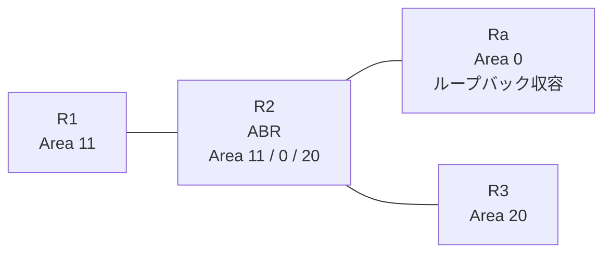

# 問題 20260816-021

> **本問は機器に接続せずに解答すること。追加の show 実行は認めない。**

## トポロジ

あなたは、下記のネットワークの保守を担当する技術者です。拠点の集約ルータ Ra は、サービスのためのプレフィックスを、4つのループバック・インターフェイスによって収容しています。R2 は、エリア 11・エリア 0・エリア 20 を接続するところの ABR であり、そして、すべてのルータにおいて、OSPFv3 のプロセス 10 が構成されています。



| 区間 | インターフェイス | ネットワーク | エリア |
|------|------------------|--------------|--------|
| R1 ⇔ R2 | E0/0 | 2001:DB8:6:D::/64 | 11 |
| R2 ⇔ Ra | E0/1 | 2001:DB8:6:9::/64 | 0 |
| R2 ⇔ R3 | E0/2 | 2001:DB8:1:9::/64 | 20 |

- R1 の E0/0 セカンダリ: 2001:DB8:5:B::/64（Area 11）
- Ra のループバック: 2001:DB8:C:C::/64, 2001:DB8:D:D::/64, 2001:DB8:E:E::/64, 2001:DB8:F:F::/64（Area 0）

## 要件

1. 管理のための構成に対して、変更が加えられてはなりません。
2. R1 の経路テーブルから、2001:DB8:C:C::/64 のルートが、除外されなければなりません。
3. 他のいかなるルータの経路テーブルにも、影響が及んではなりません。
4. エリア 11 へ広告される LSAは、維持される必要があります。

## 現在の状態

通信の一部において、想定されていない挙動が、観測されています。あなたは、提示されているところの情報のみを使用して、要求されている状態が満たされていない理由を、特定しなければなりません。

```
R1# show ipv6 route ospf | include ^O|via
OI  2001:DB8:1:9::/64 [110/20]
     via FE80::A8BB:CCFF:FE01:5300, Ethernet0/0
OI  2001:DB8:6:9::/64 [110/20]
     via FE80::A8BB:CCFF:FE01:5300, Ethernet0/0
OI  2001:DB8:E:E::/64 [110/21]
     via FE80::A8BB:CCFF:FE01:5300, Ethernet0/0
OI  2001:DB8:F:F::/64 [110/21]
     via FE80::A8BB:CCFF:FE01:5300, Ethernet0/0
```
```
R3# show ipv6 route ospf | include ^O|via
OI  2001:DB8:5:B::/64 [110/20]
     via FE80::A8BB:CCFF:FE01:5320, Ethernet0/0
OI  2001:DB8:6:9::/64 [110/20]
     via FE80::A8BB:CCFF:FE01:5320, Ethernet0/0
OI  2001:DB8:6:D::/64 [110/20]
     via FE80::A8BB:CCFF:FE01:5320, Ethernet0/0
OI  2001:DB8:C:C::/64 [110/21]
     via FE80::A8BB:CCFF:FE01:5320, Ethernet0/0
OI  2001:DB8:D:D::/64 [110/21]
     via FE80::A8BB:CCFF:FE01:5320, Ethernet0/0
OI  2001:DB8:E:E::/64 [110/21]
     via FE80::A8BB:CCFF:FE01:5320, Ethernet0/0
OI  2001:DB8:F:F::/64 [110/21]
     via FE80::A8BB:CCFF:FE01:5320, Ethernet0/0
```

## 設定抜粋

```
R2# show running-config
Building configuration...
!
interface Ethernet0/0
 no ip address
 ipv6 address 2001:DB8:6:D::2/64
 ipv6 enable
 ipv6 ospf 10 area 11
!
interface Ethernet0/1
 no ip address
 ipv6 address 2001:DB8:6:9::2/64
 ipv6 enable
 ipv6 ospf 10 area 0
!
interface Ethernet0/2
 no ip address
 ipv6 address 2001:DB8:1:9::2/64
 ipv6 enable
 ipv6 ospf 10 area 20
!
router ospfv3 10
 router-id 2.2.2.2
 !
 address-family ipv6 unicast
 exit-address-family
!
ipv6 prefix-list PL-LO seq 5 permit 2001:DB8:C::/46 le 64
!
ipv6 prefix-list PL-TYPE3 seq 5 deny 2001:DB8:C::/47 le 64
ipv6 prefix-list PL-TYPE3 seq 10 permit ::/0 le 128
!
ipv6 prefix-list PL10 seq 5 permit 2001:DB8:C:C::/64
!
```
```
R1# show running-config | section router ospfv3
router ospfv3 10
 router-id 1.1.1.1
 !
 address-family ipv6 unicast
  distribute-list prefix-list PL-TYPE3 in
 exit-address-family
```

## 設問

次のうち、正しいものは、どれですか。

## 選択肢
**A.**
```
R1(config)# ipv6 prefix-list PL-NEW seq 5 deny 2001:DB8:C:C::/64
R1(config)# ipv6 prefix-list PL-NEW seq 10 permit ::/0 le 128
R1(config)# router ospfv3 10
R1(config-router)# address-family ipv6 unicast
R1(config-router-af)# no distribute-list prefix-list PL-TYPE3 in
R1(config-router-af)# distribute-list prefix-list PL-NEW in
R1(config)# no ipv6 prefix-list PL-TYPE3
```

**B.**
```
R1(config)# ipv6 prefix-list PL-NEW seq 5 deny 2001:DB8:C::/47 le 64
R1(config)# ipv6 prefix-list PL-NEW seq 10 permit ::/0 le 128
R1(config)# router ospfv3 10
R1(config-router)# address-family ipv6 unicast
R1(config-router-af)# no distribute-list prefix-list PL-TYPE3 in
R1(config-router-af)# distribute-list prefix-list PL-NEW in
R1(config)# no ipv6 prefix-list PL-TYPE3
```

**C.**
```
R2(config)# ipv6 prefix-list PL-NEW seq 5 deny 2001:DB8:C:C::/64
R2(config)# ipv6 prefix-list PL-NEW seq 10 permit ::/0 le 128
R1(config)# router ospfv3 10
R1(config-router)# address-family ipv6 unicast
R1(config-router-af)# no distribute-list prefix-list PL-TYPE3 in
R2(config)# router ospfv3 10
R2(config-router)# address-family ipv6 unicast
R2(config-router-af)# area 11 filter-list prefix PL-NEW in
R1(config)# no ipv6 prefix-list PL-TYPE3
```

**D.**
```
R2(config)# ipv6 prefix-list PL-NEW seq 5 deny 2001:DB8:C:C::/64
R2(config)# ipv6 prefix-list PL-NEW seq 10 permit ::/0 le 128
R1(config)# router ospfv3 10
R1(config-router)# address-family ipv6 unicast
R1(config-router-af)# no distribute-list prefix-list PL-TYPE3 in
R2(config)# router ospfv3 10
R2(config-router)# address-family ipv6 unicast
R2(config-router-af)# distribute-list prefix-list PL-NEW in
R1(config)# no ipv6 prefix-list PL-TYPE3
```
