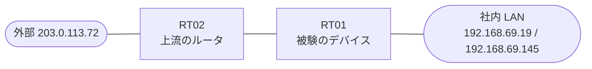

# 問題 20260816-022

> **本問は機器に接続せずに解答すること。追加の show 実行は認めない。**

## シナリオ

あなたは、下記のネットワークの保守を担当する技術者です。あなたの会社の拠点のルーター RT01 は、上流のルーター RT02 を経由して、外部のネットワークへ接続されています。社内の LAN には、管理のステーション 192.168.69.19 およびサーバ 192.168.69.145 が存在し、そして、RT01 と RT02 の間では、ルーティング プロトコルの隣接関係が確立されています。RT01 には、コントロール プレーンを保護するためのサービス ポリシーが、構成されています。導入されているところの保護の構成について、その挙動のレビューが、実施されています。運用のために必要とされる、ルータへの管理のアクセス、および、ルーティング・プロトコルの隣接関係は、影響を受けてはなりません。ルータ自身に宛てられたトラフィックの保護は、control-plane の input のサービス・ポリシーによって、実装されなければなりません。ルーター自身に宛てられた ICMP は、police の統計によって計測されなければなりません。導入の第1段階として、いかなるトラフィックも、破棄されることはできません。ルーティング・プロトコルの種別およびプロセスの配置は、変更されてはなりません。



| 対象 | 内容 |
|------|------|
| RT01 ⇔ RT02（外部側） | Ethernet0/0・10.51.85.0/30（RT01=10.51.85.1 / RT02=10.51.85.2） |
| RT01 ⇔ 社内 LAN | Ethernet0/1・192.168.69.0/24（RT01=192.168.69.1） |
| 管理のステーション（NMS） | 192.168.69.19（SSH / ping の発信元） |
| サーバ | 192.168.69.145 |
| 外部の発信元 | 203.0.113.72 |

## 出力

```
RT01# show policy-map control-plane
Control Plane 

  Service-policy input: COPP-POLICY

    Class-map: CM-ADMIN (match-all)  
      Match: access-group 125
      police:
          cir 8000 bps, bc 1500 bytes
        conformed 17 packets, 2652 bytes; actions:
          drop 
        exceeded 0 packets, 0 bytes; actions:
          transmit 
        conformed 0000 bps, exceeded 0000 bps

    Class-map: CM-PING (match-all)  
      Match: access-group 110
      police:
          cir 8000 bps, bc 1500 bytes
        conformed 235 packets, 26790 bytes; actions:
          transmit 
        exceeded 23 packets, 2622 bytes; actions:
          drop 
        conformed 4000 bps, exceeded 0000 bps

    Class-map: class-default (match-any)  
      Match: any
```
```
RT01# show running-config | section control-plane
control-plane
 service-policy input COPP-POLICY
```
```
RT01# show access-lists
Extended IP access list 110
    10 permit icmp any any
Extended IP access list 125
    10 permit tcp host 192.168.69.19 any eq 22
```
```
RT01# show running-config | section interface
interface Ethernet0/0
 description === to RT02 ===
 ip address 10.51.85.1 255.255.255.252
interface Ethernet0/1
 ip address 192.168.69.1 255.255.255.0
```
```
RT01# show running-config | section line
line con 0
 logging synchronous
line vty 0 4
 login local
 transport input ssh
```

## 設問

192.168.69.19 から、RT01 に宛てられた SSH(TCP ポート 22)のパケットは、示されているところの構成のもとで、どのように扱われますか。(1つを選択してください)

## 選択肢
A. いずれの police を持つ class にも一致せず、class-default において、制限なしに処理される

B. class-default に一致し、すべて破棄される

C. class CM-ADMIN に一致し、レートに適合する分は転送され、そして、超過する分は破棄される

D. class CM-ADMIN に一致し、レートへの適合に関わらず、すべて破棄される

E. class-default に一致して計測されるが、超過する分を含めて、すべて転送される
