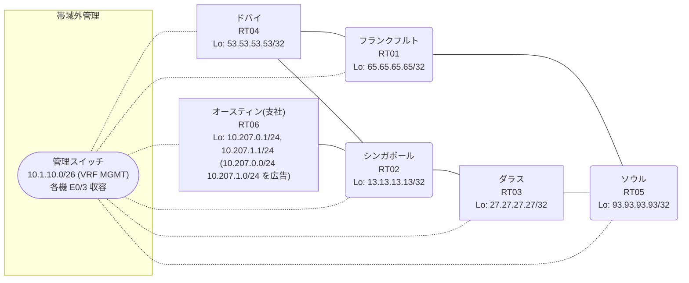

# 問題 20260816-023

> **本問は機器に接続せずに解答すること。追加の show 実行は認めない。**

## トポロジ

あなたは、ネットワークの運用を担当しています。あなたの会社のネットワークは、支社のドメインと、本社のコアのドメイン(OSPF)とが、2 台の境界のルーターによって接続され、そして、それらは境界において接続されています。支社のネットワーク `10.207.0.0/24` および `10.207.1.0/24` は、RT06 によって、広告されています。どちらの境界が失われた場合においても、通信が継続されることができるように、設計されています。ルーティングの設計の詳細は、示されているところの出力から、読み取られることが、期待されています。



| 拠点 | ルータ | Loopback / 広告網 |
|------|--------|--------------------|
| オースティン(支社) | RT06 | 10.207.0.1/24, 10.207.1.1/24 (`10.207.0.0/24` `10.207.1.0/24` を広告) |
| シンガポール | RT02 | 13.13.13.13/32 |
| ソウル | RT05 | 93.93.93.93/32 |
| ダラス | RT03 | 27.27.27.27/32 |
| ドバイ | RT04 | 53.53.53.53/32 |
| フランクフルト | RT01 | 65.65.65.65/32 |

リンク一覧:
```
  RT06:E0/0(.2) ── RT02:E0/0(.1)   10.148.92.0/30
  RT02:E0/1(.1) ── RT03:E0/0(.2)   10.103.68.0/30
  RT02:E0/2(.1) ── RT04:E0/0(.2)   10.182.33.0/30
  RT03:E0/1(.1) ── RT05:E0/0(.2)   172.16.237.0/30
  RT05:E0/1(.1) ── RT01:E0/0(.2)   172.16.182.0/30
  RT04:E0/1(.1) ── RT01:E0/1(.2)   172.16.225.0/30
```

## 要件

1. ルーティング・プロトコルの種別およびプロセスの配置は、変更されることはできません。
2. 支社のネットワーク宛のトラフィックが RT06 へ配送され、経路の周回が、発生していないこと。
3. スタティック ルートおよび既定のルートによる迂回は、実施されてはなりません。
4. すべてのサイトから、支社のネットワーク `10.207.0.0/24` および `10.207.1.0/24` を含むところの、すべての宛先へ、到達することができること。
5. 二点相互再配送による、冗長の設計が、維持される必要があります。

## 現在の状態

一部の通信が、意図されているとおりに動作していない、という報告があります。示されているところの出力および構成に基づいて、要求されているところの動作が得られていない理由が、判断されなければなりません。

```
RT02# show ip route
Gateway of last resort is not set
      10.0.0.0/8 is variably subnetted, 8 subnets, 3 masks
C        10.103.68.0/30 is directly connected, Ethernet0/1
L        10.103.68.1/32 is directly connected, Ethernet0/1
C        10.148.92.0/30 is directly connected, Ethernet0/0
L        10.148.92.1/32 is directly connected, Ethernet0/0
C        10.182.33.0/30 is directly connected, Ethernet0/2
L        10.182.33.1/32 is directly connected, Ethernet0/2
R        10.207.0.0/24 [120/1] via 10.148.92.2, 00:00:14, Ethernet0/0
                       [120/1] via 10.103.68.2, 00:00:25, Ethernet0/1
R        10.207.1.0/24 [120/1] via 10.148.92.2, 00:00:14, Ethernet0/0
                       [120/1] via 10.103.68.2, 00:00:25, Ethernet0/1
      13.0.0.0/32 is subnetted, 1 subnets
C        13.13.13.13 is directly connected, Loopback0
      27.0.0.0/32 is subnetted, 1 subnets
R        27.27.27.27 [120/1] via 10.182.33.2, 00:00:17, Ethernet0/2
                     [120/1] via 10.103.68.2, 00:00:25, Ethernet0/1
      53.0.0.0/32 is subnetted, 1 subnets
R        53.53.53.53 [120/1] via 10.182.33.2, 00:00:17, Ethernet0/2
                     [120/1] via 10.103.68.2, 00:00:25, Ethernet0/1
      65.0.0.0/32 is subnetted, 1 subnets
R        65.65.65.65 [120/1] via 10.182.33.2, 00:00:17, Ethernet0/2
                     [120/1] via 10.103.68.2, 00:00:25, Ethernet0/1
      93.0.0.0/32 is subnetted, 1 subnets
R        93.93.93.93 [120/1] via 10.182.33.2, 00:00:17, Ethernet0/2
                     [120/1] via 10.103.68.2, 00:00:25, Ethernet0/1
      172.16.0.0/30 is subnetted, 3 subnets
R        172.16.182.0 [120/1] via 10.182.33.2, 00:00:17, Ethernet0/2
                      [120/1] via 10.103.68.2, 00:00:25, Ethernet0/1
R        172.16.225.0 [120/1] via 10.182.33.2, 00:00:17, Ethernet0/2
                      [120/1] via 10.103.68.2, 00:00:25, Ethernet0/1
R        172.16.237.0 [120/1] via 10.182.33.2, 00:00:17, Ethernet0/2
                      [120/1] via 10.103.68.2, 00:00:25, Ethernet0/1
```
```
RT03# show ip route 10.207.0.0
Routing entry for 10.207.0.0/24
  Known via "ospf 1", distance 110, metric 20, type extern 2, forward metric 30
  Redistributing via rip
  Advertised by rip metric 1
  Last update from 172.16.237.2 on Ethernet0/1, 00:04:27 ago
  Routing Descriptor Blocks:
  * 172.16.237.2, from 53.53.53.53, 00:04:27 ago, via Ethernet0/1
      Route metric is 20, traffic share count is 1
```
```
RT05# traceroute 10.207.0.1 probe 1 timeout 1 ttl 1 8
Type escape sequence to abort.
Tracing the route to 10.207.0.1
VRF info: (vrf in name/id, vrf out name/id)
  1 172.16.182.2 12 msec
  2 172.16.225.1 2 msec
  3 10.182.33.1 14 msec
  4 10.103.68.2 2 msec
  5 172.16.237.2 2 msec
  6 172.16.182.2 3 msec
  7 172.16.225.1 41 msec
  8 10.182.33.1 2 msec
```

## 設定抜粋

```
RT03# show running-config | section router
router ospf 1
 router-id 27.27.27.27
 redistribute rip
 network 27.27.27.27 0.0.0.0 area 0
 network 172.16.237.0 0.0.0.3 area 0
router rip
 version 2
 redistribute ospf 1 metric 1
 network 10.0.0.0
 network 27.0.0.0
 no auto-summary
```
```
RT04# show running-config | section router
router ospf 1
 router-id 53.53.53.53
 redistribute rip
 network 53.53.53.53 0.0.0.0 area 0
 network 172.16.225.0 0.0.0.3 area 0
router rip
 version 2
 redistribute ospf 1 metric 1
 network 10.0.0.0
 network 53.0.0.0
 no auto-summary
```

## 設問

次のうち、正しいものは、どれですか。

## 選択肢
A. 支社網の経路が収束せず、境界の間で振動している

B. RT06 が支社網を広告しておらず、正規の経路が存在しない

C. RT02 において、再注入された経路の管理距離が、正規の経路のそれより小さい

D. RT02 が、境界で再注入された経路を、RT06 からの正規の経路と等価に扱っている

E. 等コストの複数経路による正常な負荷分散であり、事象は仕様どおりである

F. RT03 と RT04 の間で OSPF の隣接が確立しておらず、経路情報が同期していない
