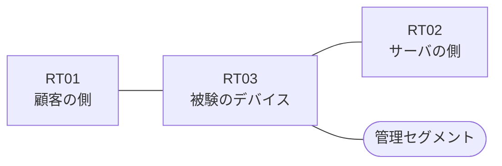

# 問題 20260817-003

> **本問は機器に接続せずに解答すること。追加の show 実行は認めない。**

## トポロジ

あなたは、下記のネットワークの保守を担当する技術者です。ある企業のネットワークにおいて、RT03 は、顧客の側のネットワークと、サーバの側のネットワークとの間に、配置されています。



| 区間 | 被験デバイス側のインターフェイス | ネットワーク |
|------|----------------------------------|--------------|
| RT01（顧客の側） ⇔ RT03 | `Ethernet2/0` | 10.61.253.0/24 |
| RT03 ⇔ RT02（サーバの側） | `Ethernet2/1` | 10.61.254.0/24 |
| RT03 ⇔ 管理セグメント | `Ethernet2/2` | 10.61.255.0/24 |

## 要件

1. 当該のサーバの他のポートへの通信、および当該のサーバ以外の宛先への通信は、許可されてはなりません。
2. アクセス・リストのエントリは、1行で構成される必要があります。
3. アクセス リストは、顧客の側のインターフェイスである `Ethernet2/0` において、着信の方向に適用される必要があります。
4. 本作業は、日中の時間帯において実施されるという理由により、対象外であるところのデバイスに対する構成の変更は、許可されていません。
5. `10.61.1.0/24` からの通信は、許可されてはなりません。
6. `10.61.3.0/24` からの通信は、許可されてはなりません。
7. RT03 において、`10.61.0.0/24`、`10.61.2.0/24`、`10.61.4.0/24`、`10.61.6.0/24` のネットワークからの通信のみが、サーバである `172.17.170.16` の TCP ポート 80 に到達できなければなりません。

## 現在の状態

```
RT03# show logging | include SEC-6
%SEC-6-IPACCESSLOGP: list RT-IN denied tcp 10.61.3.7(19317) -> 172.17.170.16(80), 1 packet
```

## 設定抜粋

```
RT03# show ip access-lists RT-IN
Extended IP access list RT-IN
    10 deny   tcp 10.61.3.0 0.0.0.255 host 172.17.170.16 eq www log
    20 deny   tcp 10.61.1.0 0.0.0.255 host 172.17.170.16 eq www
    30 permit ip any any
```

## 設問

示されているところの記録および構成から読み取ることができるものは、どれですか。(2つを選択してください)

## 選択肢
A. 記録されている通信の宛先ポートは 80 である。

B. 拒否のエントリのうち、`log` のキーワードを伴うものは1つだけである。

C. `10.61.0.7` からの通信は、拒否された。

D. 記録に現れていない通信は、いずれも許可されたものである。

E. `10.61.1.7` からの通信は、許可された。
