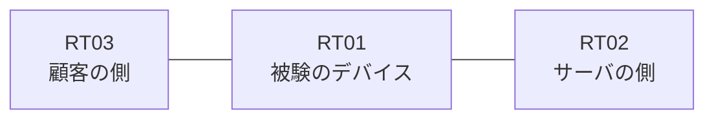

# 問題 20260817-005

> **本問は機器に接続せずに解答すること。追加の show 実行は認めない。**

## トポロジ

あなたは、ネットワークの運用を担当しています。ある企業のネットワークにおいて、RT01 は、顧客の側のネットワークと、サーバの側のネットワークとの間に配置されており、IPv6 によって運用されています。



## 要件

1. 対象としていないネットワークが、一致の対象に含まれてはなりません。また、エントリの行数は、最小でなければなりません。
2. `2001:DB8:E6:65::/64` からの通信は、許可されることはできません。
3. インタフェースの IP アドレッシングは、変更されてはなりません。
4. RT01 において、`2001:DB8:E6:60::/64`、`2001:DB8:E6:61::/64`、`2001:DB8:E6:62::/64` のネットワークからの通信のみが、`2001:DB8:E6:FF::10` の TCP ポート 80 に到達できなければなりません。

## 現在の状態

一部の通信が、意図されているとおりに動作していない、という報告があります。あなたは、提示されているところの情報のみを使用して、要求されている状態が満たされていない理由を、特定しなければなりません。

観測 | サーバへの到達
--- | ---
送信元が 2001:DB8:E6:60::/64 のネットワークにあるホストから、2001:DB8:E6:FF::10 の TCP ポート 80 宛ての通信 | 到達可
送信元が 2001:DB8:E6:61::/64 のネットワークにあるホストから、2001:DB8:E6:FF::10 の TCP ポート 80 宛ての通信 | 到達可
送信元が 2001:DB8:E6:62::/64 のネットワークにあるホストから、2001:DB8:E6:FF::10 の TCP ポート 80 宛ての通信 | 到達可
送信元が 2001:DB8:E6:63::/64 のネットワークにあるホストから、2001:DB8:E6:FF::10 の TCP ポート 80 宛ての通信 | 到達可
送信元が 2001:DB8:E6:65::/64 のネットワークにあるホストから、2001:DB8:E6:FF::10 の TCP ポート 80 宛ての通信 | 到達可
送信元が 2001:DB8:E6:FA::/64 のネットワークにあるホストから、2001:DB8:E6:FF::10 の TCP ポート 80 宛ての通信 | 到達可

```
RT01# show ipv6 neighbors
IPv6 Address                              Age Link-layer Addr State Interface
2001:DB8:E6:60::3                           0 aabb.cc02.4f00  REACH Et0/0
```
```
RT01# show ipv6 access-list

```

## 設定抜粋

```
RT01# show running-config | section ipv6 access-list|traffic-filter
interface Ethernet0/0
 ipv6 traffic-filter V6-FILTER-IN in
```

## 設問

次のうち、正しいものは、どれですか。

## 選択肢
A. 空のアクセス・リストが参照されているため、暗黙の拒否によってすべてが破棄されている

B. シーケンス番号が連続していないため、エントリが評価されていない

C. 参照されているアクセス・リストが定義されていない

D. 先行するエントリが広い範囲を許可しており、後続のエントリが評価されない

E. 末尾に明示の拒否のエントリが記述されているため、近隣探索に対する暗黙の許可が失われ、隣接のアドレスが解決できていない

F. プレフィックスの長さが長く、対象としているネットワークの一部が一致の対象から外れている
