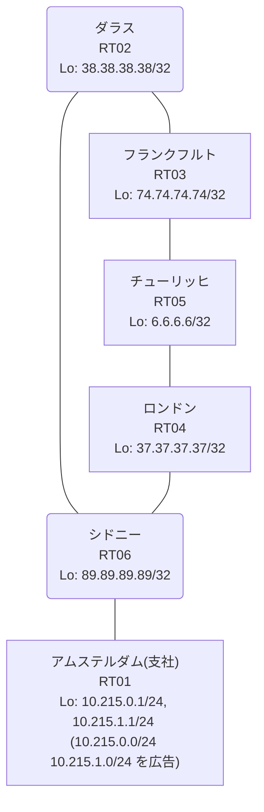

# 問題 20260818-001

> **本問は機器に接続せずに解答すること。追加の show 実行は認めない。**

## シナリオ

あなたは、ネットワークの運用を担当しています。あなたの会社のネットワークは、支社のドメインと、本社のコアのドメイン(OSPF)とが、2 台の境界のルーターによって接続され、そして、それらは境界において接続されています。支社のネットワーク `10.215.0.0/24` および `10.215.1.0/24` は、RT01 によって、広告されています。どちらの境界が失われた場合においても、通信が継続されることができるように、設計されています。ルーティングの設計の詳細は、示されているところの出力から、読み取られることが、期待されています。いくつかの宛先への通信について、報告が上がっています。示されているところの出力および構成に基づいて、要求されているところの動作が得られていない理由が、判断されなければなりません。二点相互再配送による、冗長の設計が、維持されなければなりません。スタティック・ルートおよび既定のルートによる迂回は、実施されてはなりません。支社のネットワーク `10.215.0.0/24` / `10.215.1.0/24` への到達可能性が、すべてのサイトにおいて、確保されていること。インタフェースの IP アドレッシングは、変更されてはなりません。支社のネットワーク宛のパケットが、広告元である RT01 の方向へ転送され、そして、転送のループが存在していないこと。



| 拠点 | ルータ | Loopback / 広告網 |
|------|--------|--------------------|
| アムステルダム(支社) | RT01 | 10.215.0.1/24, 10.215.1.1/24 (`10.215.0.0/24` `10.215.1.0/24` を広告) |
| シドニー | RT06 | 89.89.89.89/32 |
| ダラス | RT02 | 38.38.38.38/32 |
| チューリッヒ | RT05 | 6.6.6.6/32 |
| フランクフルト | RT03 | 74.74.74.74/32 |
| ロンドン | RT04 | 37.37.37.37/32 |

リンク一覧:
```
  RT01:E0/0(.2) ── RT06:E0/0(.1)   10.181.65.0/30
  RT06:E0/1(.1) ── RT02:E0/0(.2)   10.175.173.0/30
  RT06:E0/2(.1) ── RT04:E0/0(.2)   10.154.27.0/30
  RT02:E0/1(.1) ── RT03:E0/0(.2)   172.16.202.0/30
  RT03:E0/1(.1) ── RT05:E0/0(.2)   172.16.11.0/30
  RT04:E0/1(.1) ── RT05:E0/1(.2)   172.16.169.0/30
```

## 出力

```
RT04# show running-config | section router
router ospf 1
 router-id 37.37.37.37
 redistribute rip
 network 37.37.37.37 0.0.0.0 area 0
 network 172.16.169.0 0.0.0.3 area 0
router rip
 version 2
 redistribute ospf 1 metric 1
 network 10.0.0.0
 network 37.0.0.0
 no auto-summary
```
```
RT05# traceroute 10.215.0.1 probe 1 timeout 1 ttl 1 8
Type escape sequence to abort.
Tracing the route to 10.215.0.1
VRF info: (vrf in name/id, vrf out name/id)
  1 172.16.169.1 1 msec
  2 10.154.27.1 1 msec
  3 10.181.65.2 3 msec
```
```
RT06# show ip route
Gateway of last resort is not set
      6.0.0.0/32 is subnetted, 1 subnets
R        6.6.6.6 [120/1] via 10.175.173.2, 00:00:26, Ethernet0/1
                 [120/1] via 10.154.27.2, 00:00:22, Ethernet0/2
      10.0.0.0/8 is variably subnetted, 8 subnets, 3 masks
C        10.154.27.0/30 is directly connected, Ethernet0/2
L        10.154.27.1/32 is directly connected, Ethernet0/2
C        10.175.173.0/30 is directly connected, Ethernet0/1
L        10.175.173.1/32 is directly connected, Ethernet0/1
C        10.181.65.0/30 is directly connected, Ethernet0/0
L        10.181.65.1/32 is directly connected, Ethernet0/0
R        10.215.0.0/24 [120/1] via 10.181.65.2, 00:00:14, Ethernet0/0
                       [120/1] via 10.175.173.2, 00:00:26, Ethernet0/1
R        10.215.1.0/24 [120/1] via 10.181.65.2, 00:00:14, Ethernet0/0
                       [120/1] via 10.175.173.2, 00:00:26, Ethernet0/1
      37.0.0.0/32 is subnetted, 1 subnets
R        37.37.37.37 [120/1] via 10.175.173.2, 00:00:26, Ethernet0/1
                     [120/1] via 10.154.27.2, 00:00:22, Ethernet0/2
      38.0.0.0/32 is subnetted, 1 subnets
R        38.38.38.38 [120/1] via 10.175.173.2, 00:00:26, Ethernet0/1
                     [120/1] via 10.154.27.2, 00:00:22, Ethernet0/2
      74.0.0.0/32 is subnetted, 1 subnets
R        74.74.74.74 [120/1] via 10.175.173.2, 00:00:26, Ethernet0/1
                     [120/1] via 10.154.27.2, 00:00:22, Ethernet0/2
      89.0.0.0/32 is subnetted, 1 subnets
C        89.89.89.89 is directly connected, Loopback0
      172.16.0.0/30 is subnetted, 3 subnets
R        172.16.11.0 [120/1] via 10.175.173.2, 00:00:26, Ethernet0/1
                     [120/1] via 10.154.27.2, 00:00:22, Ethernet0/2
R        172.16.169.0 [120/1] via 10.175.173.2, 00:00:26, Ethernet0/1
                      [120/1] via 10.154.27.2, 00:00:22, Ethernet0/2
R        172.16.202.0 [120/1] via 10.175.173.2, 00:00:26, Ethernet0/1
                      [120/1] via 10.154.27.2, 00:00:22, Ethernet0/2
```
```
RT02# show running-config | section router
router ospf 1
 router-id 38.38.38.38
 redistribute rip
 network 38.38.38.38 0.0.0.0 area 0
 network 172.16.202.0 0.0.0.3 area 0
router rip
 version 2
 redistribute ospf 1 metric 1
 network 10.0.0.0
 network 38.0.0.0
 no auto-summary
```
```
RT04# show ip route 10.215.0.0
Routing entry for 10.215.0.0/24
  Known via "rip", distance 120, metric 2
  Redistributing via ospf 1, rip
  Advertised by ospf 1 subnets
  Last update from 10.154.27.1 on Ethernet0/0, 00:00:07 ago
  Routing Descriptor Blocks:
  * 10.154.27.1, from 10.154.27.1, 00:00:07 ago, via Ethernet0/0
      Route metric is 2, traffic share count is 1
```

## 設問

次のうち、正しいものは、どれですか。

## 選択肢
A. RT06 において、再注入された経路の管理距離が、正規の経路のそれより小さい

B. 支社網の経路が収束せず、境界の間で振動している

C. RT02 と RT04 の間で OSPF の隣接が確立しておらず、経路情報が同期していない

D. RT06 が、境界で再注入された経路を、RT01 からの正規の経路と等価に扱っている

E. 等コストの複数経路による正常な負荷分散であり、事象は仕様どおりである

F. RT01 が支社網を広告しておらず、正規の経路が存在しない
