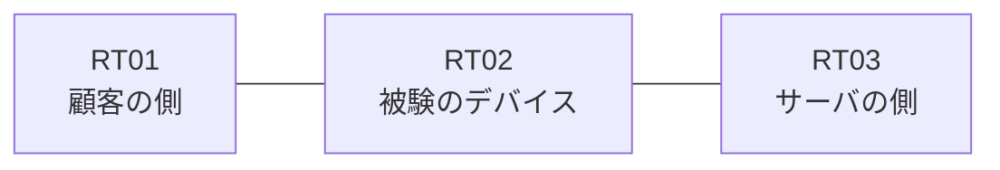

# 問題 20260818-003

> **本問は機器に接続せずに解答すること。追加の show 実行は認めない。**

## トポロジ

あなたは、下記のネットワークの保守を担当する技術者です。ある企業のネットワークにおいて、RT02 は、顧客の側のネットワークと、サーバの側のネットワークとの間に、配置されています。RT02 は、RT03 および RT01 の両方から、ルーティング プロトコルによってルートを学習しています。



| 区間 | 被験デバイス側のインターフェイス | ネットワーク |
|------|----------------------------------|--------------|
| RT01（顧客の側） ⇔ RT02 | — | 10.93.253.0/24 |
| RT02 ⇔ RT03（サーバの側） | — | 10.93.254.0/24 |

## 要件

1. RT02 は、`10.93.0.0/24`、`10.93.1.0/24`、`10.93.2.0/24` のネットワークのルートのみを、ルーティング テーブルに保持しなければなりません。
2. 本作業は、日中の時間帯において実施されるという理由により、対象外であるところのデバイスに対する構成の変更は、許可されていません。
3. プレフィックスの長さが異なるルートは、区別して扱われなければなりません。プレフィックス リストを使用してはなりません。

## 現在の状態

```
RT02# show ip access-lists
Standard IP access list 70
    10 deny   10.93.0.0, wildcard bits 0.0.0.255
    20 permit any
```

## 設定抜粋

```
RT02# show running-config | section access-group|distribute-list|verify unicast|ip nat|access-class|class-map
 distribute-list 70 in
```

## 設問

10.93.254.2 から広告された 10.93.0.0 のルート1本 が処理されるとき、一致のカウンタが増加するのは、どの行ですか。(1つを選択してください)

## 選択肢
A. `10 deny   10.93.0.0, wildcard bits 0.0.0.255` の行

B. `20 permit any` の行

C. いずれの行のカウンタも増加しない(暗黙の拒否によって処理される)
