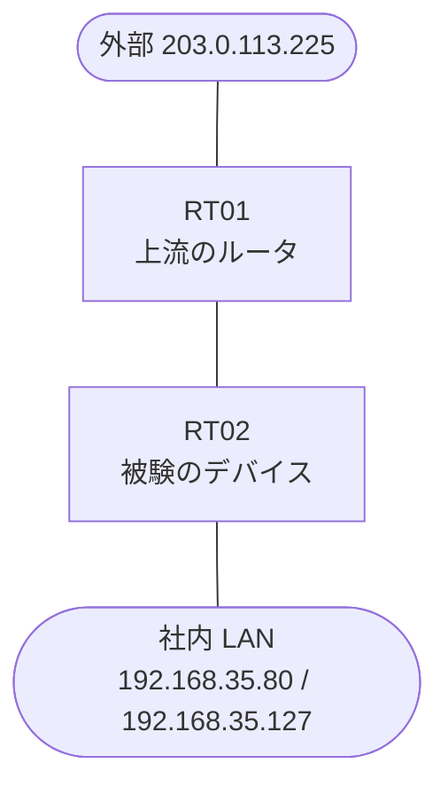

# 問題 20260818-006

> **本問は機器に接続せずに解答すること。追加の show 実行は認めない。**

## トポロジ

あなたは、ネットワークの運用を担当しています。あなたの会社の拠点のルータ RT02 は、上流のルータ RT01 を経由して、外部のネットワークへ接続されています。社内の LAN には、管理のステーション 192.168.35.80 およびサーバ 192.168.35.127 が存在し、そして、RT02 と RT01 の間では、ルーティング・プロトコルの隣接関係が確立されています。RT02 には、コントロール・プレーンを保護するためのサービス・ポリシーが、構成されています。



| 対象 | 内容 |
|------|------|
| RT02 ⇔ RT01（外部側） | Ethernet0/0・10.101.142.0/30（RT02=10.101.142.1 / RT01=10.101.142.2） |
| RT02 ⇔ 社内 LAN | Ethernet0/1・192.168.35.0/24（RT02=192.168.35.1） |
| 管理のステーション（NMS） | 192.168.35.80（SSH / ping の発信元） |
| サーバ | 192.168.35.127 |
| 外部の発信元 | 203.0.113.225 |

## 要件

1. ルータ自身に宛てられたトラフィックの保護は、control-plane の input のサービス・ポリシーによって、実装される必要があります。
2. 上記以外の、ルータ自身に宛てられたトラフィックは、class-default において帯域が制限され、超過は破棄されなければなりません。
3. ルーティング プロトコルの種別およびプロセスの配置は、変更されてはなりません。
4. SSH およびルーティング プロトコルのトラフィックは、明示の class によって分類され、いかなる制限も受けてはなりません。
5. 管理のステーション 192.168.35.80 からの SSH によるアクセス、および、ルーティング・プロトコルの隣接関係は、影響を受けてはなりません。
6. ルータを通過するところのトラフィックの転送に、影響が与えられてはなりません。
7. 特定の用途または発信元ごとの class の追加は、認められていません。

## 現在の状態

通信の一部において、想定されていない挙動が、観測されています。あなたは、示されているところの出力および構成に基づいて、その構成が、下記において記述されているとおりに動作していない理由を、判断する必要があります。

```
RT02# show policy-map control-plane
Control Plane 

  Service-policy input: PM-CPP

    Class-map: CM-ICMP (match-all)  
      Match: access-group 124
      police:
          cir 8000 bps, bc 1500 bytes
        conformed 0 packets, 0 bytes; actions:
          transmit 
        exceeded 0 packets, 0 bytes; actions:
          drop 
        conformed 0000 bps, exceeded 0000 bps

    Class-map: class-default (match-any)  
      Match: any
```

## 設定抜粋

```
RT02# show running-config | section control-plane
control-plane
 service-policy input PM-CPP
```
```
RT02# show access-lists
Extended IP access list 115
    10 permit icmp any any
```
```
RT02# show running-config | section interface
interface Ethernet0/0
 description === to RT01 ===
 ip address 10.101.142.1 255.255.255.252
interface Ethernet0/1
 ip address 192.168.35.1 255.255.255.0
```
```
RT02# show running-config | section line
line con 0
 logging synchronous
line vty 0 4
 login local
 transport input ssh
```

## 設問

次のうち、正しいものは、どれですか。

## 選択肢
**A.**
```
access-list 170 deny icmp any any
access-list 170 permit ip any any
access-list 155 permit icmp any any
class-map match-all CM-LIMIT-NEW
 match access-group 155
policy-map PM-NEW
 class CM-LIMIT-NEW
  police cir 8000 bc 1500
   conform-action transmit
   exceed-action drop
control-plane
 no service-policy input PM-CPP
 service-policy input PM-NEW
interface Ethernet0/0
 ip access-group 170 in
```

**B.**
```
access-list 150 permit icmp host 203.0.113.225 any
access-list 155 permit icmp any any
access-list 160 permit tcp host 192.168.35.80 any eq 22
class-map match-all CM-BLOCK-NEW
 match access-group 150
class-map match-all CM-LIMIT-NEW
 match access-group 155
class-map match-all CM-MGMT-NEW
 match access-group 160
policy-map PM-NEW
 class CM-BLOCK-NEW
  police cir 8000 bc 1500
   conform-action drop
   exceed-action drop
 class CM-LIMIT-NEW
  police cir 8000 bc 1500
   conform-action transmit
   exceed-action drop
 class CM-MGMT-NEW
control-plane
 no service-policy input PM-CPP
 service-policy input PM-NEW
```

**C.**
```
access-list 155 deny icmp host 203.0.113.225 any
access-list 155 permit icmp any any
class-map match-all CM-LIMIT-NEW
 match access-group 155
policy-map PM-NEW
 class CM-LIMIT-NEW
  police cir 8000 bc 1500
   conform-action transmit
   exceed-action drop
control-plane
 no service-policy input PM-CPP
 service-policy input PM-NEW
```

**D.**
```
access-list 160 permit tcp host 192.168.35.80 any eq 22
access-list 160 permit ospf any any
class-map match-all CM-PROTECT-NEW
 match access-group 160
policy-map PM-NEW
 class CM-PROTECT-NEW
 class class-default
  police cir 8000 bc 1500
   conform-action transmit
   exceed-action drop
control-plane
 no service-policy input PM-CPP
 service-policy input PM-NEW
```

**E.**
```
access-list 155 permit icmp any any
class-map match-all CM-LIMIT-NEW
 match access-group 155
policy-map PM-NEW
 class CM-LIMIT-NEW
  police cir 8000 bc 1500
   conform-action transmit
   exceed-action transmit
control-plane
 no service-policy input PM-CPP
 service-policy input PM-NEW
```
