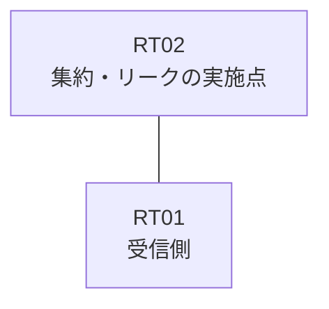

# 問題 20260818-007

> **本問は機器に接続せずに解答すること。追加の show 実行は認めない。**

## トポロジ

あなたは、ネットワークの運用を担当しています。拠点のルータ RT02 は、複数のループバック インターフェイスによって、サービスのためのアドレスのブロック 10.152.195.32/29 を収容しています。RT02 と RT01 は、1本のリンクによって直接に接続されており、そして、EIGRP 100 が構成されています。



| 対象 | 内容 |
|------|------|
| RT02 のループバック | 10.152.195.33, 10.152.195.34, 10.152.195.35, 10.152.195.36 |
| RT02 の運用系ループバック | 10.237.177.121 |
| RT02 ⇔ RT01 のリンク | 10.216.1.0/24（RT02=10.216.1.1 / RT01=10.216.1.2・Ethernet0/0） |

## 要件

1. インタフェースの IP アドレッシングは、変更されてはなりません。
2. ブロックの内部の明細のルートは、広告されてはなりません。
3. ルートの再配送は、いかなる形においても、使用されることはできません。
4. 運用のためのループバック 10.237.177.121 (/32) は、引き続き受信される必要があります。
5. RT01 に対して、ブロック 10.152.195.32/29 は、集約のルートとして広告されなければなりません。
6. ただし、監視のためのホストである 10.152.195.34 (/32) の明細のルートは、集約とともに、受信されなければなりません。

## 現在の状態

通信の一部において、想定されていない挙動が、観測されています。あなたは、示されているところの出力および構成に基づいて、その構成が、下記において記述されているとおりに動作していない理由を、判断する必要があります。


## 設定抜粋

```
RT02# show running-config
Building configuration...
!
interface Loopback0
 ip address 10.152.195.33 255.255.255.255
interface Loopback1
 ip address 10.152.195.34 255.255.255.255
interface Loopback2
 ip address 10.152.195.35 255.255.255.255
interface Loopback3
 ip address 10.152.195.36 255.255.255.255
interface Loopback10
 ip address 10.237.177.121 255.255.255.255
interface Ethernet0/0
 description === to RT01 ===
 ip address 10.216.1.1 255.255.255.252
 ip summary-address eigrp 100 10.152.195.32 255.255.255.248 leak-map LEAK
!
router eigrp 100
 network 10.152.195.33 0.0.0.0
 network 10.152.195.35 0.0.0.0
 network 10.152.195.36 0.0.0.0
 network 10.237.177.121 0.0.0.0
 network 10.216.1.0 0.0.0.3
!
ip prefix-list PL01 seq 5 permit 10.152.195.34/32
access-list 15 permit 10.152.195.35
access-list 30 permit 10.152.195.34
!
route-map LEAK permit 10
 match ip address 30
route-map RMAP01 permit 10
 match ip address prefix-list PL-MON
!
```

## 設問

次のうち、正しいものは、どれですか。

## 選択肢
**A.**
```
RT01# show ip route eigrp | begin Gateway
Gateway of last resort is not set
      10.0.0.0/8 is variably subnetted, 5 subnets, 2 masks
D        10.152.195.32/29 [90/409600] via 10.216.1.1, 00:02:48, Ethernet0/0
D        10.152.195.33/32 [90/409600] via 10.216.1.1, 00:02:48, Ethernet0/0
D        10.152.195.35/32 [90/409600] via 10.216.1.1, 00:02:48, Ethernet0/0
D        10.152.195.36/32 [90/409600] via 10.216.1.1, 00:02:48, Ethernet0/0
D        10.237.177.121/32 [90/409600] via 10.216.1.1, 00:02:48, Ethernet0/0
```
**B.**
```
RT01# show ip route eigrp | begin Gateway
Gateway of last resort is not set
      10.0.0.0/8 is variably subnetted, 3 subnets, 2 masks
D        10.152.195.32/29 [90/409600] via 10.216.1.1, 00:02:48, Ethernet0/0
D        10.152.195.34/32 [90/409600] via 10.216.1.1, 00:02:48, Ethernet0/0
D        10.237.177.121/32 [90/409600] via 10.216.1.1, 00:02:48, Ethernet0/0
```
**C.**
```
RT01# show ip route eigrp | begin Gateway
Gateway of last resort is not set
      10.0.0.0/8 is variably subnetted, 3 subnets, 2 masks
D        10.152.195.32/29 [90/409600] via 10.216.1.1, 00:02:48, Ethernet0/0
D        10.152.195.35/32 [90/409600] via 10.216.1.1, 00:02:48, Ethernet0/0
D        10.237.177.121/32 [90/409600] via 10.216.1.1, 00:02:48, Ethernet0/0
```
**D.**
```
RT01# show ip route eigrp | begin Gateway
Gateway of last resort is not set
      10.0.0.0/8 is variably subnetted, 2 subnets, 2 masks
D        10.152.195.32/29 [90/409600] via 10.216.1.1, 00:02:48, Ethernet0/0
D        10.237.177.121/32 [90/409600] via 10.216.1.1, 00:02:48, Ethernet0/0
```
