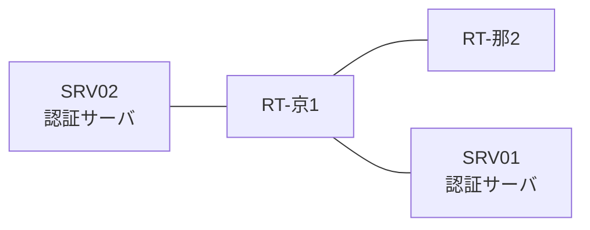

# 問題 20260818-008

> **本問は機器に接続せずに解答すること。追加の show 実行は認めない。**

## トポロジ

あなたの組織は、下記に示されているところのネットワークを運用しています。2 つの拠点のルータが、共通の認証サーバ群を用いて、管理者の認証を行うように構成されています。一方のルータはサーバと直結しており、他方はそのルーターを経由してサーバに到達します。



### 認証サーバの仕様

| 項目 | SRV01 | SRV02 |
|---|---|---|
| アドレス | 10.99.15.2 | 10.99.16.2 |
| 待受ポート | 1812 / 1813 | 1645 / 1646 |
| 共有鍵 | Rad-8102 | Rad-8102 |
| 受理する送信元 | 10.8.0.1 ・ 10.8.0.2 | 同左 |
| 台帳 | noc-hanako(15) ・ desk-01(1) ・ SUZUKI(15) | 同左 |
| 現在の稼働状態 | 保守作業のため停止中 | 稼働中 |

### ルータのアドレス

| ルータ | Loopback0 | 認証サーバ方向のインタフェース |
|---|---|---|
| RT-京1(京都) | 10.8.0.1 | Ethernet0/0 = 10.99.15.1 |
| RT-那2(那覇) | 10.8.0.2 | Ethernet0/0 = 10.97.12.2 |

## 要件

1. 京都・那覇 の両拠点で、利用者 noc-hanako が権限レベル 15 で機器を操作できること。
2. 既定の方式リストは変更しないこと。
3. 認証は認証サーバ群 NOC-RADIUS を用いること。

## 現在の状態

通信の一部において、想定されていない挙動が、観測されています。あなたは、示されているところの出力および構成に基づいて、その構成が、下記において記述されているとおりに動作していない理由を、判断する必要があります。

| 拠点 | ユーザ | 結果 |
|---|---|---|
| 京都 | noc-hanako | ログイン可(権限レベル 15) |
| 京都 | desk-01 | ログイン可(権限レベル 1) |
| 京都 | backup-adm | ログイン不可 |
| 京都 | desk-01 からの特権昇格 | 昇格可(15) |
| 京都 | noc-hanako(6 セッション目以降) | ログイン可(権限レベル 15) |
| 京都 | backup-adm(コンソールから) | ログイン可(権限レベル 15) |
| 京都 | noc-hanako(ログインに要する時間) | 1 回目 約 6 秒 / 2 回目以降 即時 |
| 那覇 | noc-hanako | ログイン不可 |
| 那覇 | desk-01 | ログイン不可 |
| 那覇 | backup-adm | ログイン可(権限レベル 15) |
| 那覇 | noc-hanako(6 セッション目以降) | ログイン不可 |
| 那覇 | backup-adm(コンソールから) | ログイン可(権限レベル 15) |
| 那覇 | noc-hanako(ログインに要する時間) | 1 回目 約 12 秒 / 2 回目以降 即時 |

認証サーバがすべて停止した場合:

| 拠点 | ユーザ | 結果 |
|---|---|---|
| 京都 | backup-adm | ログイン可(権限レベル 15) |
| 京都 | SUZUKI | ログイン可(権限レベル 15) |
| 京都 | backup-adm(コンソールから) | ログイン可(権限レベル 15) |
| 那覇 | backup-adm | ログイン可(権限レベル 15) |
| 那覇 | SUZUKI | ログイン可(権限レベル 15) |
| 那覇 | backup-adm(コンソールから) | ログイン可(権限レベル 15) |


## 設定抜粋

```
RT-京1# show running-config | section aaa
aaa new-model
!
radius server RAD1
 address ipv4 10.99.15.2 auth-port 1812 acct-port 1813
 key Rad-8102
!
radius server RAD2
 address ipv4 10.99.16.2 auth-port 1645 acct-port 1646
 key Rad-8102
!
aaa group server radius NOC-RADIUS
 server name RAD1
 server name RAD2
 deadtime 5
!
aaa authentication login default group NOC-RADIUS local
aaa authentication login CONSOLE local
aaa authorization exec default group NOC-RADIUS local
aaa authorization exec CONSOLE local
aaa authorization console
!
ip radius source-interface Loopback0
radius-server timeout 3
radius-server retransmit 1
radius-server dead-criteria time 3 tries 1
!
username backup-adm privilege 15 secret 5 $1$xxxx
username SUZUKI privilege 15 secret 5 $1$yyyy
!
line con 0
 exec-timeout 0 0
 logging synchronous
 login authentication CONSOLE
 authorization exec CONSOLE
line vty 0 4
 exec-timeout 0 0
 transport input ssh
line vty 5 15
 exec-timeout 0 0
 transport input ssh
```
```
RT-那2# show running-config | section aaa
aaa new-model
!
radius server RAD1
 address ipv4 10.99.15.2 auth-port 1812 acct-port 1813
 key Rad-8102
!
radius server RAD2
 address ipv4 10.99.16.2 auth-port 1645 acct-port 1646
 key Rad-8102
!
aaa group server radius NOC-RADIUS
 server name RAD1
 server name RAD2
 deadtime 5
!
aaa authentication login default group NOC-RADIUS local
aaa authentication login CONSOLE local
aaa authorization exec default group NOC-RADIUS local
aaa authorization exec CONSOLE local
aaa authorization console
!
ip radius source-interface Loopback0
radius-server timeout 3
radius-server retransmit 1
radius-server dead-criteria time 3 tries 1
!
username backup-adm privilege 15 secret 5 $1$xxxx
username SUZUKI privilege 15 secret 5 $1$yyyy
!
ip access-list extended EDGE-FILTER
 deny   udp any eq 1645 any
 deny   udp any eq 1812 any
 permit ip any any
!
interface Ethernet0/0
 ip access-group EDGE-FILTER in
!
line con 0
 exec-timeout 0 0
 logging synchronous
 login authentication CONSOLE
 authorization exec CONSOLE
line vty 0 4
 exec-timeout 0 0
 transport input ssh
line vty 5 15
 exec-timeout 0 0
 transport input ssh
```

## 設問

次のうち、正しいものは、どれですか。

## 選択肢
**A.**
```
京都: User was successfully authenticated. (1 回目 約 6 秒 / 2 回目以降 即時)
那覇: User was successfully authenticated. (1 回目 約 6 秒 / 2 回目以降 即時)
```
**B.**
```
京都: User was successfully authenticated. (1 回目 約 6 秒 / 2 回目以降 即時)
那覇: No authoritative response from any server. (1 回目 約 12 秒 / 2 回目以降 即時)
```
**C.**
```
京都: User authentication request was rejected by server. (1 回目 約 6 秒 / 2 回目以降 即時)
那覇: User authentication request was rejected by server. (1 回目 約 6 秒 / 2 回目以降 即時)
```
**D.**
```
京都: User was successfully authenticated. (1 回目 約 6 秒 / 2 回目以降 即時)
那覇: User was successfully authenticated. (1 回目 約 6 秒 / 2 回目以降 約 6 秒)
```
