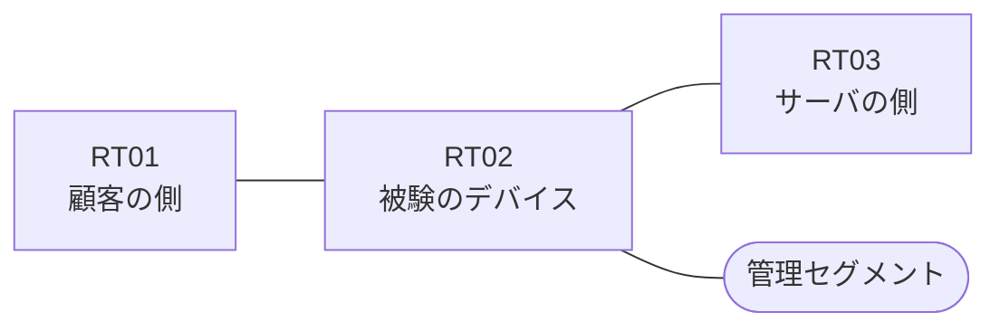

# 問題 20260818-009

> **本問は機器に接続せずに解答すること。追加の show 実行は認めない。**

## トポロジ

あなたは、下記のネットワークの保守を担当する技術者です。ある企業のネットワークにおいて、RT02 は、顧客の側のネットワークと、サーバの側のネットワークとの間に、配置されています。



| 区間 | 被験デバイス側のインターフェイス | ネットワーク |
|------|----------------------------------|--------------|
| RT01（顧客の側） ⇔ RT02 | `Ethernet0/0` | 10.29.253.0/24 |
| RT02 ⇔ RT03（サーバの側） | `Ethernet0/1` | 10.29.254.0/24 |
| RT02 ⇔ 管理セグメント | `Ethernet0/2` | 10.29.255.0/24 |

## 要件

1. 本作業は、日中の時間帯において実施されるという理由により、対象外であるところのデバイスに対する構成の変更は、許可されていません。
2. RT02 において、`10.29.224.0/24`、`10.29.225.0/24`、`10.29.226.0/24` のネットワークから、サーバである `172.19.146.97` の TCP ポート 443 への通信は、セッションを確立できなければなりません。
3. サーバの側から**新たに開始される**通信は、許可されることはできません。
4. 当該のサーバの他のポートからの通信、および `172.19.146.157` からの通信は、許可されることはできません。
5. 往路のアクセス・リストは `Ethernet0/0` に適用済みです。サーバの側のインターフェイスである `Ethernet0/1` に、着信の方向で適用するアクセス・リストを構成します。

## 現在の状態

```
RT02# show ip access-lists
Extended IP access list 101
    10 permit tcp 10.29.224.0 0.0.0.255 host 172.19.146.97 eq 443
    20 permit tcp 10.29.225.0 0.0.0.255 host 172.19.146.97 eq 443
    30 permit tcp 10.29.226.0 0.0.0.255 host 172.19.146.97 eq 443
```

## 設定抜粋

```
RT02# show running-config | section ^interface
interface Ethernet0/0
 description === to RT01 ===
 ip address 10.29.253.1 255.255.255.0
 ip access-group 101 in
interface Ethernet0/1
 description === to RT03 ===
 ip address 10.29.254.1 255.255.255.0
interface Ethernet0/2
 description === management ===
 ip address 10.29.255.1 255.255.255.0
```

## 設問

示されているところのすべての要件を満たすものは、どれですか。(1つを選択してください)

## 選択肢
**A.**
```
access-list 130 permit tcp 10.29.224.0 0.0.7.255 host 172.19.146.97 eq 443 established
```

**B.**
```
access-list 130 permit ip host 172.19.146.97 10.29.224.0 0.0.7.255
```

**C.**
```
access-list 130 permit tcp host 172.19.146.97 eq 443 10.29.224.0 0.0.7.255 established
```

**D.**
```
access-list 130 permit tcp host 172.19.146.97 any established
```

**E.**
```
access-list 130 permit tcp host 172.19.146.97 eq 443 10.29.224.0 0.0.7.255
```

**F.**
```
access-list 130 permit tcp any eq 443 10.29.224.0 0.0.7.255 established
```
