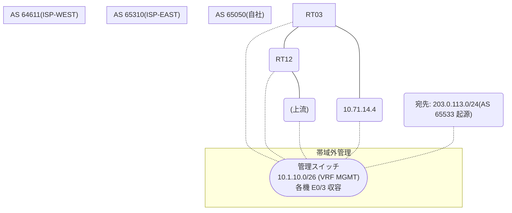

# 問題 20260818-010

> **本問は機器に接続せずに解答すること。追加の show 実行は認めない。**

## トポロジ

あなたの組織は、下記に示されているところのネットワークを運用しています。自社のルータ RT03 は、外部のネットワーク 203.0.113.0/24 への到達性を、複数の経路を通じて、確立しています。 ISP-WEST とも、接続されています。 一部の経路は、自 AS 内の境界ルーターから、iBGP で、学習されています。



## 要件

1. next hop 10.71.25.2 の経路が、ベストパスとして、選出されること。
2. BGP の設定は、変更が、承認されていない。
3. なお、設定の投入後、変更は、適切に、反映されているものとする。

## 現在の状態

現在、203.0.113.0/24 への転送は、要件に適合しないところの経路を、使用しています。

```
RT03# show ip bgp
BGP table version is 46, local router ID is 228.228.228.228
Status codes: s suppressed, d damped, h history, * valid, > best, i - internal, 
              r RIB-failure, S Stale, m multipath, b backup-path, f RT-Filter, 
              x best-external, a additional-path, c RIB-compressed, 
              t secondary path, L long-lived-stale,
Origin codes: i - IGP, e - EGP, ? - incomplete
RPKI validation codes: V valid, I invalid, N Not found

     Network          Next Hop            Metric LocPrf Weight Path
 * i  203.0.113.0      10.71.25.2                    200      0 65310 65533 i
 *>                    10.71.14.4                             0 64611 64611 65533 i
```
```
RT03# show ip bgp 203.0.113.0
BGP routing table entry for 203.0.113.0/24, version 46
Paths: (2 available, best #2, table default)
  Advertised to update-groups:
     2         
  Refresh Epoch 4
  65310 65533
    10.71.25.2 (inaccessible) from 2.5.5.5 (2.5.5.5)
      Origin IGP, localpref 200, valid, internal
      rx pathid: 0, tx pathid: 0
      Updated on Jul 7 2026 18:50:03 UTC
  Refresh Epoch 4
  64611 64611 65533
    10.71.14.4 from 10.71.14.4 (174.174.174.174)
      Origin IGP, localpref 100, valid, external, best
      rx pathid: 0, tx pathid: 0x0
      Updated on Jul 7 2026 18:58:03 UTC
```

## 設定抜粋

```
RT03# show running-config | section router bgp
router bgp 65050
 bgp router-id 228.228.228.228
 bgp log-neighbor-changes
 neighbor 2.5.5.5 remote-as 65050
 neighbor 2.5.5.5 update-source Loopback0
 neighbor 10.71.14.4 remote-as 64611
 !
 address-family ipv4
  neighbor 2.5.5.5 activate
  neighbor 10.71.14.4 activate
 exit-address-family
```
```
RT12# show running-config | section router bgp
router bgp 65050
 bgp router-id 2.5.5.5
 neighbor 228.228.228.228 remote-as 65050
 neighbor 228.228.228.228 update-source Loopback0
 neighbor 10.71.25.2 remote-as 65310
 !
 address-family ipv4
  neighbor 228.228.228.228 activate
  neighbor 10.71.25.2 activate
 exit-address-family
```

## 設問

示されているところのすべての要件が満たされることを確実にするために、適用されなければならない構成は、どれですか。(1つを選択してください)

## 選択肢
**A.**
```
! RT12(境界)にて
router bgp 65050
 address-family ipv4
  neighbor 228.228.228.228 next-hop-self
```

**B.**
```
router bgp 65050
 address-family ipv4
  neighbor 2.5.5.5 weight 30000
```

**C.**
```
clear ip bgp * soft
```

**D.**
```
! RT12(境界)にて
router ospf 1
 network 10.71.25.0 0.0.0.255 area 0
```

**E.**
```
route-map RM-PRIMARY-IN permit 10
 set local-preference 200
router bgp 65050
 address-family ipv4
  neighbor 2.5.5.5 route-map RM-PRIMARY-IN in
```
