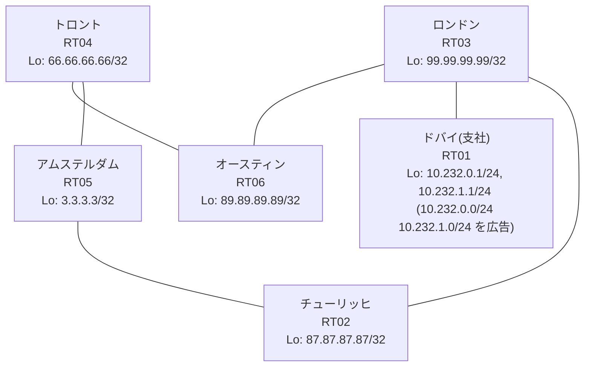

# 問題 20260818-011

> **本問は機器に接続せずに解答すること。追加の show 実行は認めない。**

## シナリオ

あなたの組織は、下記に示されているところのネットワークを運用しています。あなたの会社のネットワークは、支社のドメインと、本社のコアのドメイン(OSPF)とが、2 台の境界のルーターによって接続され、そして、それらは境界において接続されています。支社のネットワーク `10.232.0.0/24` および `10.232.1.0/24` は、RT01 によって、広告されています。どちらの境界が失われた場合においても、通信が継続されることができるように、設計されています。ルーティングの設計の詳細は、示されているところの出力から、読み取られることが、期待されています。いくつかの宛先への通信について、報告が上がっています。あなたは、提示されているところの情報のみを使用して、要求されている状態が満たされていない理由を、特定しなければなりません。二点相互再配送による、冗長の設計が、維持されなければなりません。インタフェースの IP アドレッシングは、変更されてはなりません。経路は、最短の転送パスを取ること。フィルターおよび route-map の新設は、変更の凍結により、使用することができません。スタティック・ルートおよび既定のルートによる迂回は、実施されてはなりません。支社のネットワーク `10.232.0.0/24` / `10.232.1.0/24` への到達可能性が、すべてのサイトにおいて、確保されていること。支社のネットワーク宛のトラフィックが RT01 へ配送され、経路の周回が、発生していないこと。ルーティング プロトコルの種別およびプロセスの配置は、変更されてはなりません。



| 拠点 | ルータ | Loopback / 広告網 |
|------|--------|--------------------|
| アムステルダム | RT05 | 3.3.3.3/32 |
| オースティン | RT06 | 89.89.89.89/32 |
| チューリッヒ | RT02 | 87.87.87.87/32 |
| トロント | RT04 | 66.66.66.66/32 |
| ドバイ(支社) | RT01 | 10.232.0.1/24, 10.232.1.1/24 (`10.232.0.0/24` `10.232.1.0/24` を広告) |
| ロンドン | RT03 | 99.99.99.99/32 |

リンク一覧:
```
  RT01:E0/0(.2) ── RT03:E0/0(.1)   10.199.155.0/30
  RT03:E0/1(.1) ── RT02:E0/0(.2)   10.157.114.0/30
  RT03:E0/2(.1) ── RT06:E0/0(.2)   10.24.218.0/30
  RT02:E0/1(.1) ── RT05:E0/0(.2)   172.16.95.0/30
  RT05:E0/1(.1) ── RT04:E0/0(.2)   172.16.59.0/30
  RT06:E0/1(.1) ── RT04:E0/1(.2)   172.16.47.0/30
```

## 出力

```
RT02# show ip route 10.232.0.0
Routing entry for 10.232.0.0/24
  Known via "rip", distance 120, metric 2
  Redistributing via ospf 1, rip
  Advertised by ospf 1 subnets route-map RIP2OSPF
  Last update from 10.157.114.1 on Ethernet0/0, 00:00:17 ago
  Routing Descriptor Blocks:
  * 10.157.114.1, from 10.157.114.1, 00:00:17 ago, via Ethernet0/0
      Route metric is 2, traffic share count is 1
```
```
RT06# show ip route
Gateway of last resort is not set
      3.0.0.0/32 is subnetted, 1 subnets
O        3.3.3.3 [110/21] via 172.16.47.2, 00:04:07, Ethernet0/1
      10.0.0.0/8 is variably subnetted, 6 subnets, 3 masks
C        10.24.218.0/30 is directly connected, Ethernet0/0
L        10.24.218.2/32 is directly connected, Ethernet0/0
O E2     10.157.114.0/30 [110/20] via 172.16.47.2, 00:04:04, Ethernet0/1
O E2     10.199.155.0/30 [110/20] via 172.16.47.2, 00:04:04, Ethernet0/1
O E2     10.232.0.0/24 [110/20] via 172.16.47.2, 00:04:04, Ethernet0/1
O E2     10.232.1.0/24 [110/20] via 172.16.47.2, 00:04:04, Ethernet0/1
      66.0.0.0/32 is subnetted, 1 subnets
O        66.66.66.66 [110/11] via 172.16.47.2, 00:04:07, Ethernet0/1
      87.0.0.0/32 is subnetted, 1 subnets
O        87.87.87.87 [110/31] via 172.16.47.2, 00:04:04, Ethernet0/1
      89.0.0.0/32 is subnetted, 1 subnets
C        89.89.89.89 is directly connected, Loopback0
      99.0.0.0/32 is subnetted, 1 subnets
O E2     99.99.99.99 [110/20] via 172.16.47.2, 00:04:04, Ethernet0/1
      172.16.0.0/16 is variably subnetted, 4 subnets, 2 masks
C        172.16.47.0/30 is directly connected, Ethernet0/1
L        172.16.47.1/32 is directly connected, Ethernet0/1
O        172.16.59.0/30 [110/20] via 172.16.47.2, 00:04:07, Ethernet0/1
O        172.16.95.0/30 [110/30] via 172.16.47.2, 00:04:07, Ethernet0/1
```
```
RT02# show running-config | section router
router ospf 1
 router-id 87.87.87.87
 redistribute rip route-map RIP2OSPF
 network 87.87.87.87 0.0.0.0 area 0
 network 172.16.95.0 0.0.0.3 area 0
 distance ospf external 180
router rip
 version 2
 redistribute ospf 1 metric 5 route-map OSPF2RIP
 network 10.0.0.0
 network 87.0.0.0
 no auto-summary
```
```
RT03# show ip route 3.3.3.3
Routing entry for 3.3.3.3/32
  Known via "rip", distance 120, metric 5
  Tag 90
  Redistributing via rip
  Last update from 10.157.114.2 on Ethernet0/1, 00:00:12 ago
  Routing Descriptor Blocks:
  * 10.157.114.2, from 10.157.114.2, 00:00:12 ago, via Ethernet0/1
      Route metric is 5, traffic share count is 1
      Route tag 90
    10.24.218.2, from 10.24.218.2, 00:00:29 ago, via Ethernet0/2
      Route metric is 5, traffic share count is 1
      Route tag 90
```
```
RT06# traceroute 10.232.0.1 probe 1 timeout 1 ttl 1 8
Type escape sequence to abort.
Tracing the route to 10.232.0.1
VRF info: (vrf in name/id, vrf out name/id)
  1 172.16.47.2 0 msec
  2 172.16.59.1 2 msec
  3 172.16.95.1 1 msec
  4 10.157.114.1 3 msec
  5 10.199.155.2 2 msec
```

## 設問

次のうち、正しいものは、どれですか。

## 選択肢
A. RT02 の `distance ospf external 180` を削除し、両方の境界の構成を一致させる

B. RT06 の route-map `OSPF2RIP` に、再注入を拒否する deny エントリを追加する

C. RT06 で `clear ip ospf process` を実行する

D. RT06 の `redistribute rip` を削除する

E. RT06 の router ospf 1 配下に `distance ospf external 180` を設定する

F. RT05 と RT04 の router ospf 1 配下に `distance ospf external 180` を設定する
