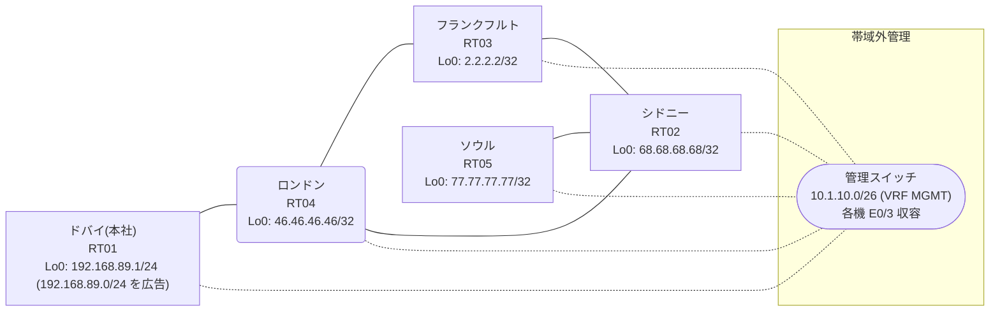

# 問題 20260819-001

> **本問は機器に接続せずに解答すること。追加の show 実行は認めない。**

## シナリオ

あなたの組織は、下記に示されているところのネットワークを運用しています。本社の顧客のネットワークは、BGP AS 64710 の RT01 によって、広告されています。あなたの会社の内部は、BGP / EIGRP / OSPF という 3 つのドメインから構成されています。サイトと、ルータおよびアドレスとの対応は、下記の表に示されているとおりです。本日の作業の時間帯において、下記の選択肢に示されている変更が、適用されました。作業の完了の直後から、複数のサイトにおいて、`192.168.89.0/24` 宛の通信が、タイムアウトしています。管理のための構成に対して、変更が加えられてはなりません。顧客のネットワーク `192.168.89.0/24` を含むすべての宛先への到達可能性が、すべてのサイトにおいて、確保されていること。既存の再配送の設計が、変更または撤去されてはなりません。スタティック・ルートによる回避も、許可されていません。`192.168.89.0/24` 宛のトラフィックが RT01 へ配送され、経路の周回が、発生していないこと。



| 拠点 | ルータ | 拠点網 / 広告網 |
|------|--------|------------------|
| シドニー | RT02 | 68.68.68.68/32 |
| ソウル | RT05 | 77.77.77.77/32 |
| ドバイ(本社) | RT01 | 192.168.89.1/24 (`192.168.89.0/24` を広告) |
| フランクフルト | RT03 | 2.2.2.2/32 |
| ロンドン | RT04 | 46.46.46.46/32 |

リンク一覧:
```
  RT01:E0/0(.1) ── RT04:E0/0(.2)   10.203.144.0/30
  RT04:E0/1(.1) ── RT02:E0/0(.2)   10.182.142.0/30
  RT04:E0/2(.1) ── RT03:E0/0(.2)   10.33.91.0/30
  RT02:E0/1(.1) ── RT03:E0/1(.2)   10.188.249.0/30
  RT02:E0/2(.1) ── RT05:E0/0(.2)   10.5.77.0/30
```

## 出力

```
RT04# show ip route
Gateway of last resort is not set
      2.0.0.0/32 is subnetted, 1 subnets
O        2.2.2.2 [110/11] via 10.33.91.2, 00:03:47, Ethernet0/2
      10.0.0.0/8 is variably subnetted, 8 subnets, 2 masks
O        10.5.77.0/30 [110/30] via 10.33.91.2, 00:03:47, Ethernet0/2
C        10.33.91.0/30 is directly connected, Ethernet0/2
L        10.33.91.1/32 is directly connected, Ethernet0/2
C        10.182.142.0/30 is directly connected, Ethernet0/1
L        10.182.142.1/32 is directly connected, Ethernet0/1
O        10.188.249.0/30 [110/20] via 10.33.91.2, 00:03:47, Ethernet0/2
C        10.203.144.0/30 is directly connected, Ethernet0/0
L        10.203.144.2/32 is directly connected, Ethernet0/0
      46.0.0.0/32 is subnetted, 1 subnets
C        46.46.46.46 is directly connected, Loopback0
      68.0.0.0/32 is subnetted, 1 subnets
O        68.68.68.68 [110/21] via 10.33.91.2, 00:03:47, Ethernet0/2
      77.0.0.0/32 is subnetted, 1 subnets
O        77.77.77.77 [110/31] via 10.33.91.2, 00:03:43, Ethernet0/2
O E2  192.168.89.0/24 [110/20] via 10.33.91.2, 00:03:43, Ethernet0/2
```
```
RT04# show route-map
route-map RM-LEGACY1, deny, sequence 10
  Match clauses:
    ip address prefix-lists: PL-LEGACY1 
  Set clauses:
  Policy routing matches: 0 packets, 0 bytes
route-map RM-LEGACY1, permit, sequence 20
  Match clauses:
  Set clauses:
  Policy routing matches: 0 packets, 0 bytes
```
```
RT04# show ip prefix-list
ip prefix-list PL-LEGACY1: 2 entries
   seq 5 deny 68.68.68.68/32
   seq 10 permit 0.0.0.0/0 le 32
```
```
RT04# show access-lists
Standard IP access list 48
    10 deny   68.68.68.68
    20 permit any
```
```
RT04# show ip bgp
BGP table version is 10, local router ID is 46.46.46.46
Status codes: s suppressed, d damped, h history, * valid, > best, i - internal, 
              r RIB-failure, S Stale, m multipath, b backup-path, f RT-Filter, 
              x best-external, a additional-path, c RIB-compressed, 
              t secondary path, L long-lived-stale,
Origin codes: i - IGP, e - EGP, ? - incomplete
RPKI validation codes: V valid, I invalid, N Not found

     Network          Next Hop            Metric LocPrf Weight Path
 *>   2.2.2.2/32       10.33.91.2              11         32768 ?
 *>   10.5.77.0/30     10.33.91.2              30         32768 ?
 *>   10.33.91.0/30    0.0.0.0                  0         32768 ?
 *>   10.188.249.0/30  10.33.91.2              20         32768 ?
 *>   46.46.46.46/32   0.0.0.0                  0         32768 i
 *>   68.68.68.68/32   10.33.91.2              21         32768 ?
 *>   77.77.77.77/32   10.33.91.2              31         32768 ?
 r>i  192.168.89.0     10.203.144.1             0    100      0 i
```
```
RT04# show ip protocols | include Routing Protocol|Distance
Routing Protocol is "application"
    Gateway         Distance      Last Update
  Distance: (default is 4)
Routing Protocol is "eigrp 862"
      Distance: internal 90 external 170
    Gateway         Distance      Last Update
  Distance: internal 90 external 170
Routing Protocol is "bgp 64710"
    Gateway         Distance      Last Update
  Distance: external 20 internal 200 local 200
Routing Protocol is "ospf 51"
    Gateway         Distance      Last Update
  Distance: (default is 110)
```
```
RT05# traceroute 192.168.89.1 probe 1 timeout 1 ttl 1 8
Type escape sequence to abort.
Tracing the route to 192.168.89.1
VRF info: (vrf in name/id, vrf out name/id)
  1 10.5.77.1 1 msec
  2 10.182.142.1 1 msec
  3 10.33.91.2 23 msec
  4 10.188.249.1 1 msec
  5 10.182.142.1 3 msec
  6 10.33.91.2 2 msec
  7 10.188.249.1 2 msec
  8 10.182.142.1 2 msec
```
```
RT04# show running-config | section router
router eigrp 862
 timers active-time 5
 network 10.182.142.0 0.0.0.3
 redistribute bgp 64710 metric 100000 100 255 1 1500
 redistribute ospf 51 metric 100000 100 255 1 1500
 passive-interface Loopback0
router ospf 51
 router-id 46.46.46.46
 network 10.33.91.0 0.0.0.3 area 0
 network 46.46.46.46 0.0.0.0 area 0
router bgp 64710
 bgp router-id 46.46.46.46
 bgp log-neighbor-changes
 bgp redistribute-internal
 network 46.46.46.46 mask 255.255.255.255
 redistribute ospf 51
 neighbor 10.203.144.1 remote-as 64710
```
```
RT02# show running-config | section router
router eigrp 862
 network 10.182.142.0 0.0.0.3
 redistribute ospf 51 metric 100000 100 255 1 1500
router ospf 51
 router-id 68.68.68.68
 redistribute eigrp 862
 network 10.5.77.0 0.0.0.3 area 0
 network 10.188.249.0 0.0.0.3 area 0
 network 68.68.68.68 0.0.0.0 area 0
```
```
RT03# show running-config | section router
router ospf 51
 router-id 2.2.2.2
 timers throttle spf 50 200 5000
 passive-interface Loopback0
 network 2.2.2.2 0.0.0.0 area 0
 network 10.33.91.0 0.0.0.3 area 0
 network 10.188.249.0 0.0.0.3 area 0
```
```
RT01# show running-config | section router
router bgp 64710
 bgp router-id 192.168.89.1
 bgp log-neighbor-changes
 network 192.168.89.0
 neighbor 10.203.144.2 remote-as 64710
```

## 設問

示されているところの変更のうち、この事象の原因であるものは、どれですか。(1つを選択してください)

## 選択肢
A. RT03: 対向リンクのインタフェースに description を追加

B. RT02: router ospf 51 配下に「redistribute eigrp 862 subnets」を追加

C. RT04: router bgp 64710 配下に「bgp log-neighbor-changes」を追加

D. RT01: 時刻同期(NTP)のサーバ参照設定を追加

E. RT04: router bgp 64710 配下に「network 46.46.46.46 mask 255.255.255.255」を追加

F. RT03: router ospf 51 配下に「network 2.2.2.2 0.0.0.0 area 0」を追加
