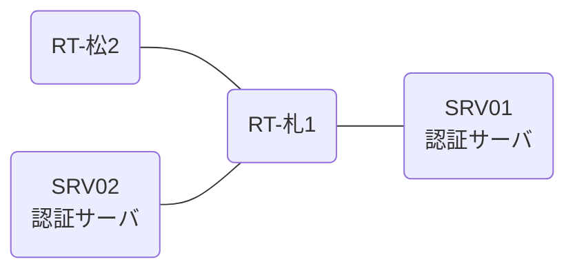

# 問題 20260819-002

> **本問は機器に接続せずに解答すること。追加の show 実行は認めない。**

## トポロジ

あなたの組織は、下記に示されているところのネットワークを運用しています。2 つの拠点のルータが、共通の認証サーバ群を用いて、管理者の認証を行うように構成されています。一方のルータはサーバと直結しており、他方はそのルーターを経由してサーバに到達します。



### 認証サーバの仕様

| 項目 | SRV01 | SRV02 |
|---|---|---|
| アドレス | 10.99.22.2 | 10.99.23.2 |
| 待受ポート | 1812 / 1813 | 11812 / 11813 |
| 共有鍵 | Ccnp-Aaa-77 | Ccnp-Aaa-77 |
| 受理する送信元 | 10.6.0.1 ・ 10.1.0.2 | 同左 |
| 台帳 | adm-kato(15) ・ watch-op(1) ・ SUZUKI(15) | 同左 |
| 現在の稼働状態 | 稼働中 | 稼働中 |

### ルータのアドレス

| ルータ | Loopback0 | 認証サーバ方向のインタフェース |
|---|---|---|
| RT-札1(札幌) | 10.6.0.1 | Ethernet0/0 = 10.99.22.1 |
| RT-松2(松山) | 10.1.0.2 | Ethernet0/0 = 10.24.12.2 |

## 要件

1. 札幌・松山 の両拠点で、利用者 adm-kato が権限レベル 15 で機器を操作できること。
2. 運用者の遠隔からの接続が失われないこと。
3. 認証は認証サーバ群 AAA-SRV を用いること。
4. 緊急時にコンソールから操作できる経路を失わないこと。

## 現在の状態

一部の通信が、意図されているとおりに動作していない、という報告があります。示されているところの出力および構成に基づいて、要求されているところの動作が得られていない理由が、判断されなければなりません。

```
RT-松2# debug radius authentication
RADIUS: Pick NAS IP for u=0x7605 tableid=0 cfg_addr=10.1.0.2
RADIUS(00000000): Send Access-Request to 10.99.22.2:1812 id 1645/119, len 60
RADIUS:  NAS-IP-Address      [4]   6   10.1.0.2
RADIUS:  User-Name           [1]   10  "adm-kato"
RADIUS:  User-Password       [2]   18  *
RADIUS(00000000): Started 5 sec timeout
RADIUS(00000000): Request timed out!
RADIUS: Retransmit to (10.99.22.2:1812,1813) for id 1645/119
RADIUS(00000000): Started 5 sec timeout
RADIUS(00000000): Request timed out!
RADIUS: Fail-over to (10.99.23.2:11812,11813) for id 1645/119
RADIUS(00000000): Started 5 sec timeout
RADIUS(00000000): Request timed out!
RADIUS: Retransmit to (10.99.23.2:11812,11813) for id 1645/119
RADIUS(00000000): Started 5 sec timeout
RADIUS(00000000): Request timed out!
RADIUS: No response from server
```

## 設問

次のうち、正しいものは、どれですか。

## 選択肢
A. 1 台目の認証サーバとして 10.99.22.2 のポート 1812 が設定されている。

B. 1 台目の認証サーバとして 10.99.22.2 のポート 1645 が設定されている。

C. 認証要求の送信元となるインタフェースは、明示的に指定されていない。

D. 要求のタイムアウトは 7 秒に設定されている。
