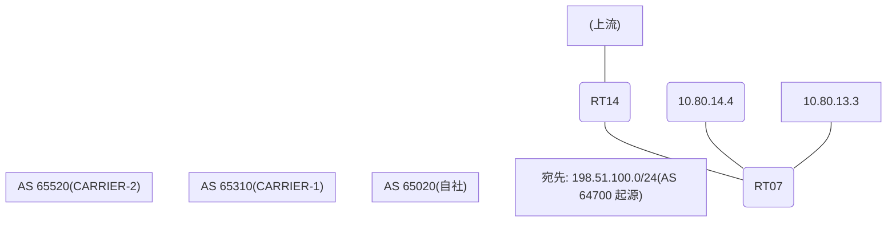

# 問題 20260819-004

> **本問は機器に接続せずに解答すること。追加の show 実行は認めない。**

## トポロジ

あなたの組織は、下記に示されているところのネットワークを運用しています。自社のルータ RT07 は、外部のネットワーク 198.51.100.0/24 への到達性を、複数の経路を通じて、確立しています。 CARRIER-1 とは、接続されています。 CARRIER-2 とも、接続されています。 一部の経路は、自 AS 内の境界ルータから、iBGP で、学習されています。



## 要件

1. 示されているところの出力、および、構成に基づいて、判断すること。
2. なお、機器の構成は、示されている抜粋のほかは、既定値である。

## 現在の状態

運用チームは、AS 全体のトラフィックを CARRIER-1 経由とすることを意図して、境界ルータ RT14 に、示されているところの設定を、投入しました。しかしながら、RT07 のベストパスは、変更されていません。

```
RT07# show ip bgp
BGP table version is 24, local router ID is 43.43.43.43
Status codes: s suppressed, d damped, h history, * valid, > best, i - internal, 
              r RIB-failure, S Stale, m multipath, b backup-path, f RT-Filter, 
              x best-external, a additional-path, c RIB-compressed, 
              t secondary path, L long-lived-stale,
Origin codes: i - IGP, e - EGP, ? - incomplete
RPKI validation codes: V valid, I invalid, N Not found

     Network          Next Hop            Metric LocPrf Weight Path
 *>   198.51.100.0     10.80.14.4                             0 65520 64700 i
 *                     10.80.13.3                             0 65310 65310 64700 64700 i
 * i                   7.5.5.5                       100      0 65310 64700 i
```
```
RT07# show ip bgp 198.51.100.0
BGP routing table entry for 198.51.100.0/24, version 24
Paths: (3 available, best #1, table default)
  Advertised to update-groups:
     5         
  Refresh Epoch 2
  65520 64700
    10.80.14.4 from 10.80.14.4 (69.69.69.69)
      Origin IGP, localpref 100, valid, external, best
      rx pathid: 0, tx pathid: 0x0
      Updated on Mar 26 2026 16:46:03 UTC
  Refresh Epoch 1
  65310 65310 64700 64700
    10.80.13.3 from 10.80.13.3 (184.184.184.184)
      Origin IGP, localpref 100, valid, external
      rx pathid: 0, tx pathid: 0
      Updated on Mar 26 2026 15:27:56 UTC
  Refresh Epoch 2
  65310 64700
    7.5.5.5 (metric 11) from 7.5.5.5 (7.5.5.5)
      Origin IGP, localpref 100, valid, internal
      rx pathid: 0, tx pathid: 0
      Updated on Mar 26 2026 14:29:07 UTC
```

## 設定抜粋

```
RT07# show running-config | section router bgp
router bgp 65020
 bgp router-id 43.43.43.43
 bgp log-neighbor-changes
 neighbor 7.5.5.5 remote-as 65020
 neighbor 7.5.5.5 update-source Loopback0
 neighbor 10.80.13.3 remote-as 65310
 neighbor 10.80.14.4 remote-as 65520
 !
 address-family ipv4
  neighbor 7.5.5.5 activate
  neighbor 10.80.13.3 activate
  neighbor 10.80.14.4 activate
 exit-address-family
```
```
RT14# show running-config | section router bgp
router bgp 65020
 bgp router-id 7.5.5.5
 neighbor 43.43.43.43 remote-as 65020
 neighbor 43.43.43.43 update-source Loopback0
 neighbor 10.80.25.2 remote-as 65310
 !
 address-family ipv4
  neighbor 43.43.43.43 activate
  neighbor 43.43.43.43 next-hop-self
  neighbor 10.80.25.2 activate
  neighbor 10.80.25.2 weight 35000
 exit-address-family
```

## 設問

この事象の原因である可能性が、最も高いものは、どれですか。(1つを選択してください)

## 選択肢
A. LOCAL_PREF は iBGP でのみ交換される属性であり、eBGP の近隣には送信されない

B. 設定変更後に BGP セッションの再評価(clear)が行われていない

C. MED は、異なる隣接 AS から受信した経路の間では、既定では比較されない

D. weight は、それを設定したルータのローカルでのみ有効であり、iBGP の近隣には伝播しない
