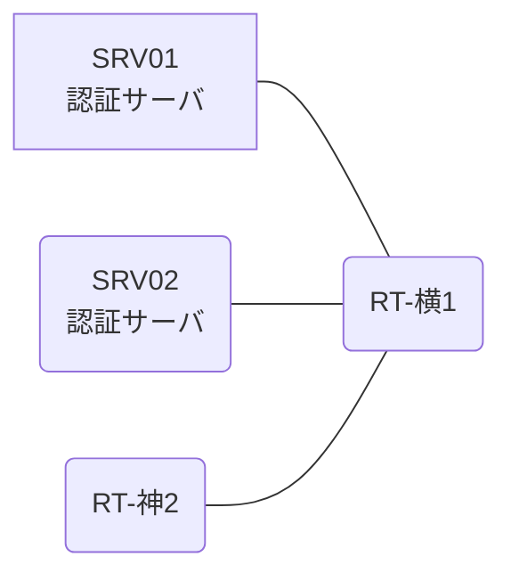

# 問題 20260819-005

> **本問は機器に接続せずに解答すること。追加の show 実行は認めない。**

## トポロジ

あなたは、ネットワークの運用を担当しています。2 つの拠点のルータが、共通の認証サーバ群を用いて、管理者の認証を行うように構成されています。一方のルータはサーバと直結しており、他方はそのルーターを経由してサーバに到達します。



### 認証サーバの仕様

| 項目 | SRV01 | SRV02 |
|---|---|---|
| アドレス | 10.99.184.2 | 10.99.185.2 |
| 待受ポート | 1812 / 1813 | 1912 / 1913 |
| 共有鍵 | K-9931 | K-9931 |
| 受理する送信元 | 10.3.0.1 ・ 10.7.0.2 | 同左 |
| 台帳 | ope-suzuki(15) ・ monitor-op(1) ・ SUZUKI(15) | 同左 |
| 現在の稼働状態 | 保守作業のため停止中 | 稼働中 |

### ルータのアドレス

| ルータ | Loopback0 | 認証サーバ方向のインタフェース |
|---|---|---|
| RT-横1(横浜) | 10.3.0.1 | Ethernet0/0 = 10.99.184.1 |
| RT-神2(神戸) | 10.7.0.2 | Ethernet0/0 = 10.74.12.2 |

## 要件

1. 横浜・神戸 の両拠点で、利用者 ope-suzuki が権限レベル 15 で機器を操作できること。
2. 認証は認証サーバ群 AUTH-GRP を用いること。
3. 認証サーバ側の設定は変更できない。

## 現在の状態

特権レベルへの昇格が試行された際の、デバッグの出力が、採取されました。

```
RT-横1# debug aaa authentication
AAA/AUTHEN/START (2176533209): port='tty3' list='' action=LOGIN service=ENABLE
AAA/AUTHEN/START (2176533209): non-console enable - default to enable password
AAA/AUTHEN/START (2176533209): Method=ENABLE
AAA/AUTHEN (2176533209): status = GETPASS
AAA/AUTHEN/CONT (2176533209): continue_login (user='(undef)')
AAA/AUTHEN (2176533209): status = GETPASS
AAA/AUTHEN/CONT (2176533209): Method=ENABLE
AAA/AUTHEN (2176533209): status = PASS
```

## 設定抜粋

```
RT-横1# show running-config | section aaa
aaa new-model
!
aaa group server radius AUTH-GRP
 server name RAD1
 server name RAD2
 deadtime 5
!
aaa authentication login default group AUTH-GRP local
aaa authorization exec default group AUTH-GRP local
```

## 設問

示されているところの出力について、正しい記述は、どれですか。(2つを選択してください)

## 選択肢
A. method1 として認証サーバ群 AUTH-GRP への問い合わせが行われ、サーバから拒否されている。

B. method2 として enable パスワードによる認証が試行され、成功している。

C. method1 として enable パスワードによる認証が行われている。

D. 特権レベルへの昇格は成功している。
