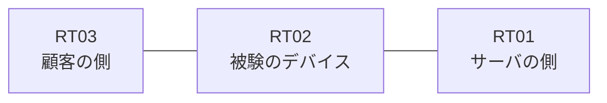

# 問題 20260819-008

> **本問は機器に接続せずに解答すること。追加の show 実行は認めない。**

## シナリオ

あなたは、ネットワークの運用を担当しています。ある企業のネットワークにおいて、RT02 は、顧客の側のネットワークと、サーバの側のネットワークとの間に配置されており、IPv6 によって運用されています。`2001:DB8:4F:65::/64` からの通信は、許可されることはできません。RT02 において、`2001:DB8:4F:60::/64`、`2001:DB8:4F:61::/64`、`2001:DB8:4F:62::/64` のネットワークからの通信が、`2001:DB8:4F:FF::10` の TCP ポート 80 に到達できなければなりません。ルーティング プロトコルの種別およびプロセスの配置は、変更されてはなりません。アクセス リストのエントリは、1行で構成されなければなりません。




## 設問

次のうち、正しいものは、どれですか。

## 選択肢
**A.**
```
sequence 10 permit ipv6 2001:DB8:4F:60::/61 any
```

**B.**
```
sequence 10 permit ipv6 2001:DB8:4F:60::/62 0.0.3.255 any
```

**C.**
```
sequence 10 permit ipv6 2001:DB8:4F:60::/63 any
```

**D.**
```
sequence 10 deny ipv6 2001:DB8:4F:63::/64 any
sequence 20 permit ipv6 2001:DB8:4F:60::/62 any
```

**E.**
```
sequence 10 permit ipv6 2001:DB8:4F:60::/62 any
```

**F.**
```
sequence 10 permit ipv6 2001:DB8:4F:60::/64 any
sequence 20 permit ipv6 2001:DB8:4F:61::/64 any
sequence 30 permit ipv6 2001:DB8:4F:62::/64 any
```
