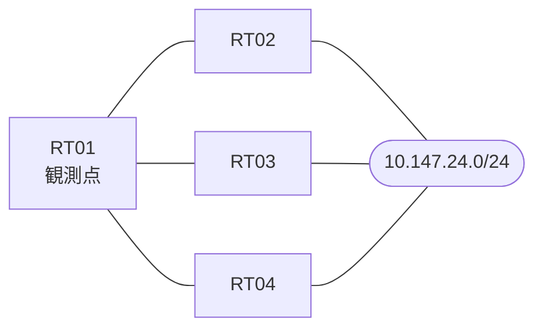

# 問題 20260819-010

> **本問は機器に接続せずに解答すること。追加の show 実行は認めない。**

## シナリオ

あなたは、ネットワークの運用を担当しています。拠点のルータ RT01 は、複数の隣接するルータを経由して、10.147.24.0/24 への経路を学習しています。ネットワークは単一の EIGRP のオートノマス システム(100)として運用されており、そして、冗長なパスの活用が検討されています。経路の選好に関する挙動のレビューが、実施されています。既存の隣接関係は、維持されなければなりません。スタティック ルートおよび既定のルートによる迂回は、実施されてはなりません。RT01 における 10.147.24.0/24 への転送のパスは、運用の設計の意図と一致していなければなりません。現在の最良の経路のメトリックは、悪化させられてはなりません。構成の変更は、1 箇所に限られなければなりません。



| 対象 | 内容 |
|------|------|
| RT01 ⇔ RT02 | Ethernet0/0・10.221.2.0/24（RT01 側の delay = 100） |
| RT01 ⇔ RT03 | Ethernet0/1・10.221.3.0/24（RT01 側の delay = 400） |
| RT01 ⇔ RT04 | Ethernet0/2・10.221.4.0/24（RT01 側の delay = 100） |
| 宛先 | 10.147.24.0/24（すべての隣接から到達可能） |

## 出力

```
RT01# show ip eigrp topology all-links
EIGRP-IPv4 Topology Table for AS(100)/ID(71.0.0.1)
Codes: P - Passive, A - Active, U - Update, Q - Query, R - Reply,
       r - reply Status, s - sia Status 

P 10.221.2.0/24, 1 successors, FD is 281600, serno 2
        via Connected, Ethernet0/0
P 10.221.3.0/24, 1 successors, FD is 358400, serno 3
        via Connected, Ethernet0/1
P 10.147.24.0/24, 1 successors, FD is 435200, serno 7, refcount 1
        via 10.221.2.2 (435200/409600), Ethernet0/0
        via 10.221.4.4 (460800/435200), Ethernet0/2
        via 10.221.3.3 (512000/409600), Ethernet0/1
```
```
RT01# show running-config | section router eigrp
router eigrp 100
 eigrp router-id 71.0.0.1
 network 10.221.0.0 0.0.255.255
 no auto-summary
```
```
RT01# show running-config | section interface
interface Ethernet0/0
 description === to RT02 ===
 ip address 10.221.2.1 255.255.255.0
 delay 100
interface Ethernet0/1
 description === to RT03 ===
 ip address 10.221.3.1 255.255.255.0
 delay 400
interface Ethernet0/2
 description === to RT04 ===
 ip address 10.221.4.1 255.255.255.0
 delay 100
```

## 設問

RT04(10.221.4.4)経由の経路も転送に利用されることが期待されていましたが、そうなっていません。この事象の原因として、最も適切なものは、どれですか。(1つを選択してください)

## 選択肢
A. 当該の経路はフィージブル・サクセサであるが、その FD が variance × サクセサの FD の範囲を超えているため

B. 当該の経路の隣接関係が確立されていないため

C. 当該の経路の RD が、現在のサクセサの FD 以上であり、フィージビリティの条件を満たさないため

D. アドミニストレーティブ・ディスタンスが、他方の経路より大きいため

E. 当該の経路の最小の帯域幅が、他方の経路より小さいため
