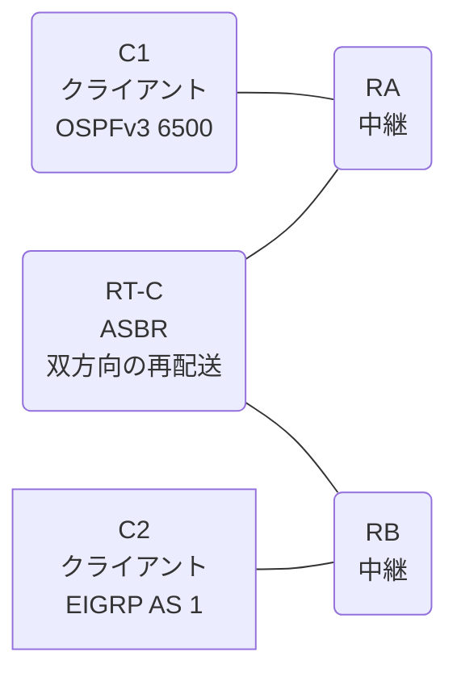

# 問題 20260820-001

> **本問は機器に接続せずに解答すること。追加の show 実行は認めない。**

## トポロジ

あなたの組織は、下記に示されているところのネットワークを運用しています。クライアントである C1 は OSPFv3 の ドメイン に、そして、C2 は EIGRP の ドメイン に、それぞれ収容されています。RT-C は、2 つの ドメイン の境界に位置しており、双方向の 再配送 が構成されています。



| ルータ | 位置づけ | 参加プロトコル |
|--------|----------|----------------|
| C1 | クライアント | OSPFv3 6500 area 0 |
| RA | 中継 | OSPFv3 6500 area 0 |
| RT-C | **ASBR(2 つの ドメイン の 境界)** | 双方向の 再配送 |
| RB | 中継 | EIGRP WAN AS 1 |
| C2 | クライアント | EIGRP WAN AS 1 |

リンク一覧:
```
  (a) C1:Et0/0                ── RA:Et0/1           2001:DB8:B:20::/64     C1 = 2001:DB8:B:20::2
  (b) RA:Et0/0                ── RT-C:Ethernet0/0   2001:DB8:1C:1:1::/64
  (c) RT-C:GigabitEthernet0/1 ── RB:Et0/0           2001:DB8:B:2A::/64
  (d) RB:Et0/1                ── C2:Et0/0           2001:DB8:20:20::/64    C2 = 2001:DB8:20:20::2
```

OSPFv3 の ドメイン には、RA によって注入されたところの 外部の ルート `2001:DB8:AA:1A::/64` が存在する。

## 要件

1. C1 と C2 は、相互に 通信 できなければなりません。
2. いずれの ドメイン の ルータ の 経路テーブル にも、対向する ドメイン の トランジット の リンク の ネットワークが、現れてはなりません。
3. ルーティング プロトコルの種別およびプロセスの配置は、変更されてはなりません。

## 現在の状態

ユーザーから、通信に関する事象が、報告されています。あなたは、提示されているところの情報のみを使用して、要求されている状態が満たされていない理由を、特定しなければなりません。

```
C1# show ipv6 route ospf | include ^O|via
OE2 2001:DB8:B:2A::/64 [110/20]
     via FE80::A8BB:CCFF:FE01:7A00, Ethernet0/0
OE2 2001:DB8:20:20::/64 [110/20]
     via FE80::A8BB:CCFF:FE01:7A00, Ethernet0/0
OE2 2001:DB8:AA:1A::/64 [110/20]
     via FE80::A8BB:CCFF:FE01:7A00, Ethernet0/0
```
```
RB# show ipv6 route eigrp | include ^D|^EX|via
(no entries)
```
```
C1# ping 2001:DB8:20:20::2
Type escape sequence to abort.
Sending 5, 100-byte ICMP Echos to 2001:DB8:20:20::2, timeout is 2 seconds:
.....
Success rate is 0 percent (0/5)

C2# ping 2001:DB8:B:20::2
Type escape sequence to abort.
Sending 5, 100-byte ICMP Echos to 2001:DB8:B:20::2, timeout is 2 seconds:

% No valid route for destination
Success rate is 0 percent (0/1)
```

## 設定抜粋

```
RT-C# show running-config
Building configuration...
!
interface Ethernet0/0
 description === to RA ===
 no ip address
 ipv6 address 2001:DB8:1C:1:1::1/64
 ipv6 enable
 ipv6 ospf 6500 area 0
!
interface GigabitEthernet0/1
 description === to RB ===
 no ip address
 ipv6 address 2001:DB8:B:2A::1/64
 ipv6 enable
!
router eigrp WAN
 !
 address-family ipv6 unicast autonomous-system 1
  !
  af-interface Ethernet0/0
   shutdown
  exit-af-interface
  !
  topology base
   redistribute ospf 6500 match internal metric 100000 100 255 1 1500 route-map RM_OSPF include-connected
  exit-af-topology
  eigrp router-id 6.9.8.5
 exit-address-family
!
router ospfv3 6500
 router-id 2.6.9.7
 !
 address-family ipv6 unicast
  redistribute eigrp 1 route-map RM-EIGRP include-connected
 exit-address-family
!
ipv6 prefix-list E5400 seq 5 permit 2001:DB8:1C:1:1::/64
ipv6 prefix-list PL-CORE seq 5 permit ::/0 le 64
ipv6 prefix-list PL-EIGRP seq 5 permit 2001:DB8:B:20::/64
ipv6 prefix-list PL-EIGRP seq 10 permit 2001:DB8:20:20::/64
ipv6 prefix-list PL-OSPF seq 5 permit 2001:DB8:B:2A::/64
ipv6 prefix-list PL-OSPF seq 10 permit 2001:DB8:20:20::/64
ipv6 prefix-list PL-REDIST seq 5 permit 2001:DB8:1C:1:1::/64
ipv6 prefix-list PL-REDIST seq 10 permit 2001:DB8:B:20::/64
!
route-map OMAP01 permit 10
 match ipv6 address prefix-list PL-CORE
route-map RM-EIGRP permit 10
 match ipv6 address prefix-list PL-OSPF
route-map RM-OSPF permit 10
 match ipv6 address prefix-list PL-REDIST
!
```

## 設問

次のうち、正しいものは、どれですか。

## 選択肢
**A.**
```
no ipv6 prefix-list PL-OSPF
no ipv6 prefix-list PL-REDIST
```

**B.**
```
router eigrp WAN
 address-family ipv6 unicast autonomous-system 1
  topology base
   no redistribute ospf 6500
   redistribute ospf 6500 match internal include-connected
  exit-af-topology
 exit-address-family
exit
router ospfv3 6500
 address-family ipv6 unicast
  no redistribute eigrp 1
  redistribute eigrp 1 include-connected
 exit-address-family
exit
```

**C.**
```
! --- RA ---
ipv6 route 2001:DB8:20:20::/64 2001:DB8:1C:1:1::1
! --- RB ---
ipv6 route 2001:DB8:B:20::/64 2001:DB8:B:2A::1
! --- C1 ---
ipv6 route ::/0 2001:DB8:B:20::1
! --- C2 ---
ipv6 route ::/0 2001:DB8:20:20::1
```

**D.**
```
no ipv6 prefix-list PL-OSPF
ipv6 prefix-list PL-OSPF seq 5 permit 2001:DB8:20:20::/64
no ipv6 prefix-list PL-REDIST
ipv6 prefix-list PL-REDIST seq 5 permit 2001:DB8:B:20::/64
router eigrp WAN
 address-family ipv6 unicast autonomous-system 1
  topology base
   no redistribute ospf 6500
   redistribute ospf 6500 match internal metric 100000 100 255 1 1500 route-map RM-OSPF include-connected
  exit-af-topology
 exit-address-family
exit
```

**E.**
```
router eigrp WAN
 address-family ipv6 unicast autonomous-system 1
  topology base
   no redistribute ospf 6500
   redistribute ospf 6500 match internal metric 100000 100 255 1 1500 route-map RM-OSPF include-connected
  exit-af-topology
 exit-address-family
exit
```
