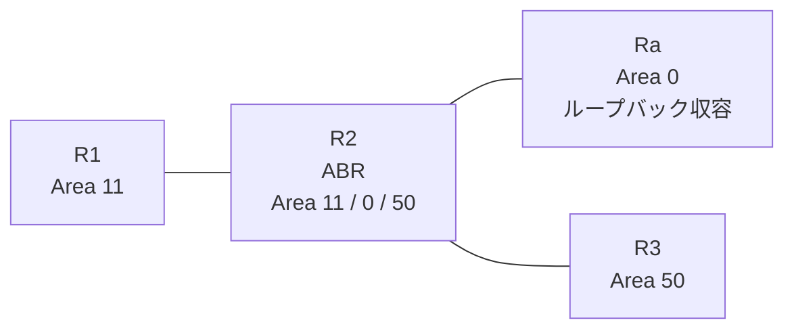

# 問題 20260820-005

> **本問は機器に接続せずに解答すること。追加の show 実行は認めない。**

## シナリオ

あなたは、下記のネットワークの保守を担当する技術者です。拠点の集約ルーター Ra は、サービスのためのプレフィックスを、4つのループバック インターフェイスによって収容しています。R2 は、エリア 11・エリア 0・エリア 50 を接続するところの ABR であり、そして、すべてのルーターにおいて、OSPFv3 のプロセス 100 が構成されています。いくつかの宛先への通信について、報告が上がっています。あなたは、提示されているところの情報のみを使用して、要求されている状態が満たされていない理由を、特定しなければなりません。エリア 50 のルータの経路テーブルは、いかなる影響も受けてはなりません。エリア 11 のルータの経路テーブルには、ループバックに由来するエリア間のルートとして、2001:DB8:8:8::/64 および 2001:DB8:9:9::/64 のみが存在しなければなりません。リンクのネットワークのルートは、引き続き受信されなければなりません。ルーティング・プロトコルの種別およびプロセスの配置は、変更されてはなりません。この制御は、エリア 11 に今後追加されるところの、いかなるルータに対しても、等しく適用されなければなりません。



| 区間 | インターフェイス | ネットワーク | エリア |
|------|------------------|--------------|--------|
| R1 ⇔ R2 | E0/0 | 2001:DB8:6::/64 | 11 |
| R2 ⇔ Ra | E0/1 | 2001:DB8:7:3::/64 | 0 |
| R2 ⇔ R3 | E0/2 | 2001:DB8:0:F::/64 | 50 |

- R1 の E0/0 セカンダリ: 2001:DB8:5:4::/64（Area 11）
- Ra のループバック: 2001:DB8:8:8::/64, 2001:DB8:9:9::/64, 2001:DB8:A:A::/64, 2001:DB8:B:B::/64（Area 0）

## 出力

```
R2# show running-config
Building configuration...
!
interface Ethernet0/0
 no ip address
 ipv6 address 2001:DB8:6::2/64
 ipv6 enable
 ipv6 ospf 100 area 11
!
interface Ethernet0/1
 no ip address
 ipv6 address 2001:DB8:7:3::2/64
 ipv6 enable
 ipv6 ospf 100 area 0
!
interface Ethernet0/2
 no ip address
 ipv6 address 2001:DB8:0:F::2/64
 ipv6 enable
 ipv6 ospf 100 area 50
!
router ospfv3 100
 router-id 2.2.2.2
 !
 address-family ipv6 unicast
 exit-address-family
!
ipv6 prefix-list PL-AREA10 seq 5 permit 2001:DB8:A:A::/64
!
ipv6 prefix-list PL10 seq 5 permit ::/0 ge 1
!
```

## 設問

次のうち、正しいものは、どれですか。

## 選択肢
**A.**
```
R1# show ipv6 route ospf | include ^O|via
OI  2001:DB8:0:F::/64 [110/20]
     via FE80::A8BB:CCFF:FE01:3900, Ethernet0/0
OI  2001:DB8:7:3::/64 [110/20]
     via FE80::A8BB:CCFF:FE01:3900, Ethernet0/0
OI  2001:DB8:8:8::/64 [110/21]
     via FE80::A8BB:CCFF:FE01:3900, Ethernet0/0
OI  2001:DB8:9:9::/64 [110/21]
     via FE80::A8BB:CCFF:FE01:3900, Ethernet0/0
OI  2001:DB8:A:A::/64 [110/21]
     via FE80::A8BB:CCFF:FE01:3900, Ethernet0/0
OI  2001:DB8:B:B::/64 [110/21]
     via FE80::A8BB:CCFF:FE01:3900, Ethernet0/0
```
**B.**
```
R1# show ipv6 route ospf | include ^O|via
OI  2001:DB8:0:F::/64 [110/20]
     via FE80::A8BB:CCFF:FE01:3900, Ethernet0/0
OI  2001:DB8:7:3::/64 [110/20]
     via FE80::A8BB:CCFF:FE01:3900, Ethernet0/0
OI  2001:DB8:8:8::/64 [110/21]
     via FE80::A8BB:CCFF:FE01:3900, Ethernet0/0
OI  2001:DB8:9:9::/64 [110/21]
     via FE80::A8BB:CCFF:FE01:3900, Ethernet0/0
```
**C.**
```
R1# show ipv6 route ospf | include ^O|via
OI  2001:DB8:A:A::/64 [110/21]
     via FE80::A8BB:CCFF:FE01:3900, Ethernet0/0
```
