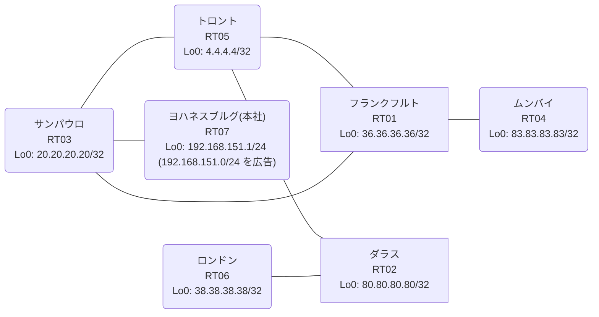

# 問題 20260822-001

> **本問は機器に接続せずに解答すること。追加の show 実行は認めない。**

## トポロジ

あなたは、下記のネットワークの保守を担当する技術者です。本社の顧客のネットワークは、BGP AS 64966 の RT07 によって、広告されています。あなたの会社の内部は、BGP / EIGRP / OSPF という 3 つのドメインから構成されています。サイトと、ルータおよびアドレスとの対応は、下記の表に示されているとおりです。



| 拠点 | ルータ | 拠点網 / 広告網 |
|------|--------|------------------|
| サンパウロ | RT03 | 20.20.20.20/32 |
| ダラス | RT02 | 80.80.80.80/32 |
| トロント | RT05 | 4.4.4.4/32 |
| フランクフルト | RT01 | 36.36.36.36/32 |
| ムンバイ | RT04 | 83.83.83.83/32 |
| ヨハネスブルグ(本社) | RT07 | 192.168.151.1/24 (`192.168.151.0/24` を広告) |
| ロンドン | RT06 | 38.38.38.38/32 |

リンク一覧:
```
  RT07:E0/0(.1) ── RT03:E0/0(.2)   10.77.117.0/30
  RT03:E0/1(.1) ── RT01:E0/0(.2)   10.137.192.0/30
  RT03:E0/2(.1) ── RT05:E0/0(.2)   10.110.71.0/30
  RT01:E0/1(.1) ── RT05:E0/1(.2)   10.204.10.0/30
  RT05:E0/2(.1) ── RT02:E0/0(.2)   10.1.102.0/30
  RT02:E0/1(.1) ── RT06:E0/0(.2)   10.159.72.0/30
  RT01:E0/2(.1) ── RT04:E0/0(.2)   10.92.53.0/30
```

## 要件

1. `192.168.151.0/24` 宛のパケットが、広告元である RT07 の方向へ転送され、そして、転送のループが存在していないこと。
2. 既存の再配送の設計が、変更または撤去されてはなりません。スタティック ルートによる回避も、許可されていません。
3. すべてのルータが、`192.168.151.0/24` を含むところのすべての宛先へ、到達することができること。
4. 管理距離の変更は、監査のポリシーによって、禁止されているところのものです。
5. インタフェースの IP アドレッシングは、変更されてはなりません。

## 現在の状態

通信の一部において、想定されていない挙動が、観測されています。あなたは、示されているところの出力および構成に基づいて、その構成が、下記において記述されているとおりに動作していない理由を、判断する必要があります。

```
RT03# show ip protocols | include Routing Protocol|Distance
Routing Protocol is "application"
    Gateway         Distance      Last Update
  Distance: (default is 4)
Routing Protocol is "eigrp 189"
      Distance: internal 90 external 170
    Gateway         Distance      Last Update
  Distance: internal 90 external 170
Routing Protocol is "bgp 64966"
    Gateway         Distance      Last Update
  Distance: external 20 internal 200 local 200
Routing Protocol is "ospf 69"
    Gateway         Distance      Last Update
  Distance: (default is 110)
```
```
RT03# show route-map
route-map RM-STG1, deny, sequence 10
  Match clauses:
    ip address prefix-lists: PL-STG1 
  Set clauses:
  Policy routing matches: 0 packets, 0 bytes
route-map RM-STG1, permit, sequence 20
  Match clauses:
  Set clauses:
  Policy routing matches: 0 packets, 0 bytes
```
```
RT03# show access-lists
Standard IP access list 70
    10 deny   83.83.83.83
    20 permit any
```
```
RT03# show ip prefix-list
ip prefix-list PL-STG1: 2 entries
   seq 5 deny 83.83.83.83/32
   seq 10 permit 0.0.0.0/0 le 32
```
```
RT04# traceroute 192.168.151.1 probe 1 timeout 1 ttl 1 8
Type escape sequence to abort.
Tracing the route to 192.168.151.1
VRF info: (vrf in name/id, vrf out name/id)
  1 10.92.53.1 4 msec
  2 10.137.192.1 2 msec
  3 10.110.71.2 2 msec
  4 10.204.10.1 8 msec
  5 10.137.192.1 2 msec
  6 10.110.71.2 2 msec
  7 10.204.10.1 3 msec
  8 10.137.192.1 10 msec
```
```
RT03# show ip bgp
BGP table version is 14, local router ID is 20.20.20.20
Status codes: s suppressed, d damped, h history, * valid, > best, i - internal, 
              r RIB-failure, S Stale, m multipath, b backup-path, f RT-Filter, 
              x best-external, a additional-path, c RIB-compressed, 
              t secondary path, L long-lived-stale,
Origin codes: i - IGP, e - EGP, ? - incomplete
RPKI validation codes: V valid, I invalid, N Not found

     Network          Next Hop            Metric LocPrf Weight Path
 *>   4.4.4.4/32       10.110.71.2             11         32768 ?
 *>   10.1.102.0/30    10.110.71.2             20         32768 ?
 *>   10.92.53.0/30    10.110.71.2             30         32768 ?
 *>   10.110.71.0/30   0.0.0.0                  0         32768 ?
 *>   10.159.72.0/30   10.110.71.2             30         32768 ?
 *>   10.204.10.0/30   10.110.71.2             20         32768 ?
 *>   20.20.20.20/32   0.0.0.0                  0         32768 i
 *>   36.36.36.36/32   10.110.71.2             21         32768 ?
 *>   38.38.38.38/32   10.110.71.2             31         32768 ?
 *>   80.80.80.80/32   10.110.71.2             21         32768 ?
 *>   83.83.83.83/32   10.110.71.2             31         32768 ?
 r>i  192.168.151.0    10.77.117.1              0    100      0 i
```
```
RT03# show ip route
Gateway of last resort is not set
      4.0.0.0/32 is subnetted, 1 subnets
O        4.4.4.4 [110/11] via 10.110.71.2, 00:05:01, Ethernet0/2
      10.0.0.0/8 is variably subnetted, 10 subnets, 2 masks
O        10.1.102.0/30 [110/20] via 10.110.71.2, 00:04:41, Ethernet0/2
C        10.77.117.0/30 is directly connected, Ethernet0/0
L        10.77.117.2/32 is directly connected, Ethernet0/0
O        10.92.53.0/30 [110/30] via 10.110.71.2, 00:04:38, Ethernet0/2
C        10.110.71.0/30 is directly connected, Ethernet0/2
L        10.110.71.1/32 is directly connected, Ethernet0/2
C        10.137.192.0/30 is directly connected, Ethernet0/1
L        10.137.192.1/32 is directly connected, Ethernet0/1
O        10.159.72.0/30 [110/30] via 10.110.71.2, 00:04:37, Ethernet0/2
O        10.204.10.0/30 [110/20] via 10.110.71.2, 00:05:00, Ethernet0/2
      20.0.0.0/32 is subnetted, 1 subnets
C        20.20.20.20 is directly connected, Loopback0
      36.0.0.0/32 is subnetted, 1 subnets
O        36.36.36.36 [110/21] via 10.110.71.2, 00:04:55, Ethernet0/2
      38.0.0.0/32 is subnetted, 1 subnets
O        38.38.38.38 [110/31] via 10.110.71.2, 00:04:27, Ethernet0/2
      80.0.0.0/32 is subnetted, 1 subnets
O        80.80.80.80 [110/21] via 10.110.71.2, 00:04:37, Ethernet0/2
      83.0.0.0/32 is subnetted, 1 subnets
O        83.83.83.83 [110/31] via 10.110.71.2, 00:04:33, Ethernet0/2
O E2  192.168.151.0/24 [110/20] via 10.110.71.2, 00:04:09, Ethernet0/2
```

## 設定抜粋

```
RT03# show running-config | section router
router eigrp 189
 timers active-time 5
 network 10.137.192.0 0.0.0.3
 redistribute bgp 64966 metric 100000 100 255 1 1500
 redistribute ospf 69 metric 100000 100 255 1 1500
 passive-interface Loopback0
router ospf 69
 router-id 20.20.20.20
 network 10.110.71.0 0.0.0.3 area 0
 network 20.20.20.20 0.0.0.0 area 0
router bgp 64966
 bgp router-id 20.20.20.20
 bgp log-neighbor-changes
 bgp redistribute-internal
 network 20.20.20.20 mask 255.255.255.255
 redistribute ospf 69
 neighbor 10.77.117.1 remote-as 64966
```
```
RT01# show running-config | section router
router eigrp 189
 network 10.137.192.0 0.0.0.3
 redistribute ospf 69 metric 100000 100 255 1 1500
router ospf 69
 router-id 36.36.36.36
 redistribute eigrp 189
 network 10.92.53.0 0.0.0.3 area 0
 network 10.204.10.0 0.0.0.3 area 0
 network 36.36.36.36 0.0.0.0 area 0
```
```
RT05# show running-config | section router
router ospf 69
 router-id 4.4.4.4
 passive-interface Loopback0
 network 4.4.4.4 0.0.0.0 area 0
 network 10.1.102.0 0.0.0.3 area 0
 network 10.110.71.0 0.0.0.3 area 0
 network 10.204.10.0 0.0.0.3 area 0
```
```
RT07# show running-config | section router
router bgp 64966
 bgp router-id 192.168.151.1
 bgp log-neighbor-changes
 network 192.168.151.0
 neighbor 10.77.117.2 remote-as 64966
```

## 設問

次のうち、正しいものは、どれですか。

## 選択肢
**A.**
```
! RT01 側で両方向の redistribute に deny route-map を適用
route-map RM-BLK deny 10
 match ip address prefix-list PL-BLK
route-map RM-BLK permit 20
```

**B.**
```
clear ip bgp *
clear ip route *
```

**C.**
```
ip prefix-list PL-X seq 5 deny 192.168.151.0/24
ip prefix-list PL-X seq 10 permit 0.0.0.0/0 le 32
route-map RM-INJ permit 10
 match ip address prefix-list PL-X
router eigrp 189
 redistribute bgp 64966 route-map RM-INJ
```

**D.**
```
router bgp 64966
 distance bgp 20 105 105
end
clear ip route *
```

**E.**
```
router bgp 64966
 no bgp redistribute-internal
```

**F.**
```
ip prefix-list PL-BLOCK seq 5 deny 192.168.151.0/24
ip prefix-list PL-BLOCK seq 10 permit 0.0.0.0/0 le 32
router ospf 69
 distribute-list prefix PL-BLOCK in
```
