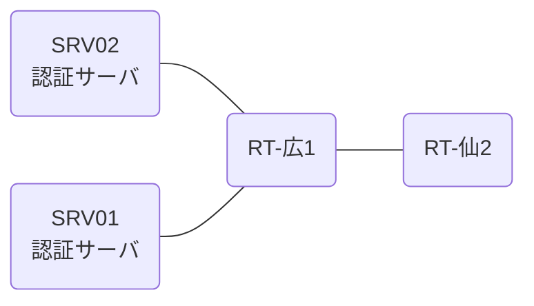

# 問題 20260822-002

> **本問は機器に接続せずに解答すること。追加の show 実行は認めない。**

## シナリオ

あなたの組織は、下記に示されているところのネットワークを運用しています。2 つの拠点のルータが、共通の認証サーバ群を用いて、管理者の認証を行うように構成されています。一方のルータはサーバと直結しており、他方はそのルーターを経由してサーバに到達します。ユーザーから、通信に関する事象が、報告されています。あなたは、提示されているところの情報のみを使用して、要求されている状態が満たされていない理由を、特定しなければなりません。広島・仙台 の両拠点で、利用者 noc-taro が権限レベル 15 で機器を操作できること。緊急時にコンソールから操作できる経路を失わないこと。認証は認証サーバ群 AUTH-GRP を用いること。運用者の遠隔からの接続が失われないこと。



### 認証サーバの仕様

| 項目 | SRV01 | SRV02 |
|---|---|---|
| アドレス | 10.99.88.2 | 10.99.89.2 |
| 待受ポート | 1812 / 1813 | 1912 / 1913 |
| 共有鍵 | K-9931 | K-9931 |
| 受理する送信元 | 10.9.0.1 ・ 10.7.0.2 | 同左 |
| 台帳 | noc-taro(15) ・ monitor-op(1) ・ SUZUKI(15) | 同左 |
| 現在の稼働状態 | 保守作業のため停止中 | 稼働中 |

### ルータのアドレス

| ルータ | Loopback0 | 認証サーバ方向のインタフェース |
|---|---|---|
| RT-広1(広島) | 10.9.0.1 | Ethernet0/0 = 10.99.88.1 |
| RT-仙2(仙台) | 10.7.0.2 | Ethernet0/0 = 10.15.12.2 |

## 出力

```
RT-広1# show running-config | section aaa
aaa new-model
!
radius server RAD1
 address ipv4 10.99.88.2 auth-port 1812 acct-port 1813
 key K-9931
!
radius server RAD2
 address ipv4 10.99.89.2 auth-port 1912 acct-port 1913
 key K-9931
!
aaa group server radius AUTH-GRP
 server name RAD1
 server name RAD2
 deadtime 5
!
aaa authentication login default local
aaa authentication login CONSOLE local
aaa authorization exec default group AUTH-GRP local
aaa authorization exec CONSOLE local
aaa authorization console
!
ip radius source-interface Loopback0
radius-server timeout 5
radius-server retransmit 1
radius-server dead-criteria time 5 tries 1
!
username break-glass privilege 15 secret 5 $1$xxxx
username SUZUKI privilege 15 secret 5 $1$yyyy
!
line con 0
 exec-timeout 0 0
 logging synchronous
 login authentication CONSOLE
 authorization exec CONSOLE
line vty 0 4
 exec-timeout 0 0
 login authentication VTY-AUTH1
 transport input ssh
line vty 5 15
 exec-timeout 0 0
 transport input ssh
```
```
RT-仙2# show running-config | section aaa
aaa new-model
!
radius server RAD1
 address ipv4 10.99.88.2 auth-port 1812 acct-port 1813
 key K-9931
!
radius server RAD2
 address ipv4 10.99.89.2 auth-port 1912 acct-port 1913
 key K-9931
!
aaa group server radius AUTH-GRP
 server name RAD1
 server name RAD2
 deadtime 5
!
aaa authentication login default group AUTH-GRP local
aaa authentication login CONSOLE local
aaa authorization exec default group AUTH-GRP local
aaa authorization exec CONSOLE local
aaa authorization console
!
ip radius source-interface Loopback0
radius-server timeout 5
radius-server retransmit 1
radius-server dead-criteria time 5 tries 1
!
username break-glass privilege 15 secret 5 $1$xxxx
username SUZUKI privilege 15 secret 5 $1$yyyy
!
line con 0
 exec-timeout 0 0
 logging synchronous
 login authentication CONSOLE
 authorization exec CONSOLE
line vty 0 4
 exec-timeout 0 0
 transport input ssh
line vty 5 15
 exec-timeout 0 0
 transport input ssh
```

## 設問

次のうち、正しいものは、どれですか。

## 選択肢
**A.**
```
広島: User was successfully authenticated. (1 回目 約 10 秒 / 2 回目以降 即時)
仙台: User was successfully authenticated. (1 回目 約 10 秒 / 2 回目以降 即時)
```
**B.**
```
広島: User authentication request was rejected by server. (1 回目 約 10 秒 / 2 回目以降 即時)
仙台: User authentication request was rejected by server. (1 回目 約 10 秒 / 2 回目以降 即時)
```
**C.**
```
広島: No authoritative response from any server. (1 回目 約 20 秒 / 2 回目以降 即時)
仙台: User was successfully authenticated. (1 回目 約 10 秒 / 2 回目以降 即時)
```
**D.**
```
広島: User was successfully authenticated. (1 回目 約 10 秒 / 2 回目以降 約 10 秒)
仙台: User was successfully authenticated. (1 回目 約 10 秒 / 2 回目以降 即時)
```
